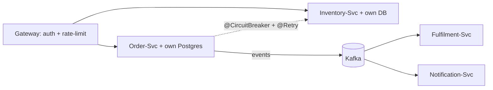

## Why it Matters

Microservices buy deployment and scaling independence at the cost of a network between everything you used to call for free. That trade is worth it only when organisational pain, many teams, conflicting release cadences, divergent scaling needs, is real; otherwise the same boundaries as modules cost an order of magnitude less.

## Problems
### System Design Problem: Microservices

**Requirements:**
- Functional: Core capabilities for microservices
- Non-functional (SLOs): Latency < 100ms p99, Availability 99.9%, Horizontal scalability

**Constraints:**
- Scale: Handle 10x growth without redesign
- Consistency: Appropriate model for domain (strong/eventual)
- Latency budget: p99 < 100ms for read paths

**API / Interfaces:**
- Primary: REST/gRPC endpoints for core operations
- Internal: Service-to-service contracts
- Events: Domain events for async integration

## Diagram



## Code

```java
// Each service: own Boot app, own DB, own schema
@SpringBootApplication
public class OrderServiceApp { public static void main(String[] a) { SpringApplication.run(OrderServiceApp.class, a); } }

// Inter-service call — typed client, resilience via Resilience4j
@HttpExchange("/api/inventory") // Spring 6 HTTP interface client
public interface InventoryClient {
 @GetExchange("/{sku}") Availability check(@PathVariable String sku);
}
// Resilience: @CircuitBreaker + @Retry on the calling service method
@CircuitBreaker(name = "inventory", fallbackMethod = "assumeUnknown")
@Retry(name = "inventory")
public Availability reserve(String sku) { return client.check(sku); }
```
Infra checklist: service discovery / gateway, distributed tracing (Micrometer + OTel), contract tests (Spring Cloud Contract), per-service Flyway/Liquibase.

## When to use / not

- Multiple teams needing independent release cadences (Conway's law working *for* you).
- Sub-domains with wildly different scaling/consistency needs.
- Large monolith where build/test/deploy times block delivery.

**When NOT:** < ~3 teams, unclear domain boundaries, no DevOps/observability maturity. Start modular, extract later (→ [[06_Monolith-vs-Modular-Choice-Guide]]).


## Trade-offs
| Dimension | This Approach | Alternative | Trade-off Rationale | Decision Rule |
|-----------|---------------|-------------|---------------------|---------------|
| Complexity | [TBD] | [TBD] | [TBD] | [TBD] |
| Operational Burden | [TBD] | [TBD] | [TBD] | [TBD] |
| Latency | [TBD] | [TBD] | [TBD] | [TBD] |
| Consistency | [TBD] | [TBD] | [TBD] | [TBD] |
| Cost at Scale | [TBD] | [TBD] | [TBD] | [TBD] |

## Vs

- **Vs Modular Monolith:** same module boundaries, zero network cost, one deployable. Microservices add *deployment* independence at *operational* cost.
- **Vs [[04_Event-Driven-Architecture|Event-Driven]]:** orthogonal, microservices are a *deployment* style; events are a *communication* style often used between them.

## Pitfalls

- Distributed monolith: separate deploys but lock-step releases (shared DB or chatty sync calls).
- Sync chains (`A→B→C` blocking) multiplying tail latency, prefer async events.
- No idempotency on consumers → duplicate side-effects on redelivery.


## Pitfalls
1. Underestimating operational complexity (backups, monitoring, upgrades)
2. Ignoring failure modes (network partitions, disk failures, clock drift)
3. Not planning for 10x scale from day one
4. Skipping monitoring/alerting in MVP
5. Premature optimization before measuring
6. Dual-write without transactional outbox
7. Assuming global order in partitioned systems

## Interview q&a

**Q: How do services share data?**
A: They don't share DBs, each owns its store; expose APIs/events; duplicate reference data via [[05_DDD-Modeling/05_Domain-Events|domain events]] and accept eventual consistency.

**Q: How do you handle a transaction across services?**
A: Saga (choreography via events, or orchestration) with compensating actions, never 2PC/XA across services.

**Q: How do you size a microservice?**
A: By bounded context, not LOC, "independently replaceable by one team" is the test.


## Flashcards (Spaced Repetition)

#flashcard
**Q:** What is the core concept of Microservices? :: **A:** [Key algorithm/architecture pattern] #flashcard

#flashcard
**Q:** When do you apply Microservices? :: **A:** [Trigger scenarios and context] #flashcard

#flashcard
**Q:** What is the primary trade-off in Microservices? :: **A:** [Main tension: e.g., consistency vs latency] #flashcard

#flashcard
**Q:** What breaks first at scale in Microservices? :: **A:** [Primary bottleneck: e.g., coordination, hot keys, replication lag] #flashcard

#flashcard
**Q:** How do you handle failures in Microservices? :: **A:** [Retry, circuit breaker, fallback, graceful degradation] #flashcard

#flashcard
**Q:** What are the key metrics to monitor for Microservices? :: **A:** [RED: rate, errors, duration; USE: utilization, saturation, errors] #flashcard

#flashcard
**Q:** How does Microservices scale to 10x? :: **A:** [Sharding, read replicas, async processing, caching layers] #flashcard

#flashcard
**Q:** What is the consistency model for Microservices? :: **A:** [Strong/eventual/causal - justify with use case] #flashcard

#flashcard
**Q:** How do you test Microservices? :: **A:** [Contract tests, chaos engineering, load tests, fault injection] #flashcard

#flashcard
**Q:** What is the operational cost of Microservices? :: **A:** [Team expertise, tooling, on-call burden, migration risk] #flashcard

#flashcard
**Q:** When would you NOT use Microservices? :: **A:** [Managed service covers need, simple CRUD, team lacks maturity] #flashcard

#flashcard
**Q:** What is the key design decision in Microservices? :: **A:** [The irreversible choice that defines the architecture] #flashcard

#flashcard
**Q:** How do you migrate to Microservices? :: **A:** [Strangler fig, dual-write, canary, feature flags] #flashcard

#flashcard
**Q:** What security considerations for Microservices? :: **A:** [AuthZ, encryption, audit, secrets management] #flashcard

#flashcard
**Q:** How do you debug Microservices in production? :: **A:** [Structured logging, correlation IDs, distributed tracing, SLO alerts] #flashcard


## Practice Tasks (Tasks Plugin)
- [ ] Explain the architecture from memory 📅 {{date:YYYY-MM-DD, +1}}
- [ ] Draw the system diagram without looking 📅 {{date:YYYY-MM-DD, +3}}
- [ ] Answer all Interview Q&A aloud 📅 {{date:YYYY-MM-DD, +7}}
- [ ] Review flashcards (Spaced Repetition) 📅 {{date:YYYY-MM-DD, +1}}

```tasks
not done
path includes Architect/03_Architecture-Styles
sort by due
limit 10
```

## Related

- [[06_Monolith-vs-Modular-Choice-Guide]] · [[04_Event-Driven-Architecture]] · [[05_DDD-Modeling/02_Bounded-Contexts|Bounded Contexts]] · [[04_Design-Patterns-Building-Blocks/02_Resilience-Circuit-Breaker-Retry|Resilience]]

# Microservices

> **Intent:** Decompose a system into small, independently deployable services aligned to business capabilities (bounded contexts), each owning its data and communicating over the network, trading in-process simplicity for team autonomy and independent scalability.
> Watch: [ByteByteGo, Microservices, and When Not To Use Them](https://www.youtube.com/watch?v=lTAcCNbJ7KE)

## 8. Microservices Patterns (in`04_Design-Patterns-Building-Blocks/`)

- [[04_Design-Patterns-Building-Blocks/05_Decomposition-Bounded-Context|05 Decomposition]], seams + strangler extract
- [[04_Design-Patterns-Building-Blocks/06_Saga-Outbox-Inbox|06 Saga-Outbox-Inbox]], consistent writes, safe redelivery
- [[04_Design-Patterns-Building-Blocks/07_Discovery-Config-Registry|07 Discovery-Config]], find services, roll config
- [[04_Design-Patterns-Building-Blocks/04_API-Gateway-BFF|Gateway-BFF]] · [[04_Design-Patterns-Building-Blocks/02_Resilience-Circuit-Breaker-Retry|Circuit-Breaker-Retry]] · [[04_Design-Patterns-Building-Blocks/03_Caching-Strategies|Caching]]
