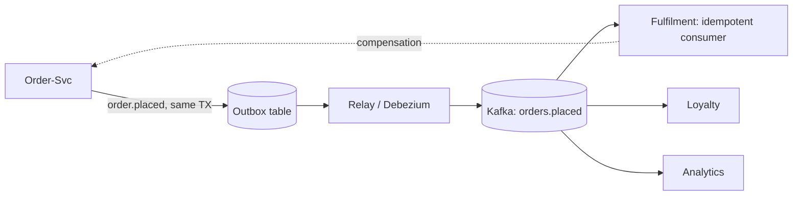

## Why it Matters

Coupling through a log instead of a call: producers state facts, consumers react on their own schedule, so a flash sale is absorbed by broker buffers and a new consumer is added by subscribing. The price is eventual consistency and debugging that spans many apps, you adopt EDA when temporal decoupling and elasticity outweigh request/reply reasoning.

## Problems
### System Design Problem: Event-Driven Architecture

**Requirements:**
- Functional: Core capabilities for event driven architecture
- Non-functional (SLOs): Latency < 100ms p99, Availability 99.9%, Horizontal scalability

**Constraints:**
- Scale: Handle 10x growth without redesign
- Consistency: Appropriate model for domain (strong/eventual)
- Latency budget: p99 < 100ms for read paths

**API / Interfaces:**
- Primary: REST/gRPC endpoints for core operations
- Internal: Service-to-service contracts
- Events: Domain events for async integration

## Diagram



## Code

```java
// Producer — publish a domain event after commit (outbox pattern ideal)
@Transactional
public Order place(CreateOrderCmd cmd) {
 Order o = repo.save(Order.place(cmd.items()));
 events.publish(new OrderPlaced(o.id(), o.total())); // routed to Kafka topic
 return o;
}
// Consumer — idempotent, retryable
@KafkaListener(topics = "orders.placed", groupId = "fulfilment")
public void on(OrderPlaced e, Acknowledgment ack) {
 if (processed.contains(e.orderId())) { ack.acknowledge(); return; } // idempotency
 fulfil(e); ack.acknowledge();
}
// Spring config: exactly-once-ish via transactions + idempotent consumer,
// DLQ via DeadLetterPublishingRecoverer for poison messages
```
Prefer `orders.placed` (past-tense fact) over `fulfilOrder` (command) for true decoupling.

## When to use / not

- Workflows spanning services where immediate consistency isn't required (order → payment → fulfilment).
- Fan-out (one fact, many reactions: email, analytics, loyalty).
- Spiky load needing buffering/back-pressure via broker.

**When NOT:** request/reply UX flows needing instant answers, strict ordering across aggregates, or teams without broker-ops maturity.


## Trade-offs
| Dimension | This Approach | Alternative | Trade-off Rationale | Decision Rule |
|-----------|---------------|-------------|---------------------|---------------|
| Complexity | [TBD] | [TBD] | [TBD] | [TBD] |
| Operational Burden | [TBD] | [TBD] | [TBD] | [TBD] |
| Latency | [TBD] | [TBD] | [TBD] | [TBD] |
| Consistency | [TBD] | [TBD] | [TBD] | [TBD] |
| Cost at Scale | [TBD] | [TBD] | [TBD] | [TBD] |

## Vs

- **Vs REST/RPC:** sync = simple reasoning, temporal coupling; events = resilience + decoupling, harder to trace.
- **Vs [[06_Data-Architecture/03_Event-Sourcing-CQRS|Event Sourcing]]:** EDA moves *notifications* between services; event sourcing persists *state changes* as the source of truth. Often combined.

## Pitfalls

- Fat events vs thin events: fat (payload included) reduces chattiness but couples schemas, version with Schema Registry.
- Publishing before DB commit (ghost events), use transactional outbox.
- No DLQ/monitoring, poison message silently blocks a partition.


## Pitfalls
1. Equating architecture with microservices/K8s — service count ≠ architecture
2. Diagrams without decisions (no ADR = no traceability)
3. 60-page doc nobody reads — risk-driven beats completeness-driven
4. Slack decisions becoming load-bearing without record
5. Underestimating operational complexity (backups, monitoring, upgrades)
6. Ignoring failure modes (network partitions, disk failures, clock drift)
7. Not planning for 10x scale from day one

## Interview q&a

**Q: At-least-once or exactly-once?**
A: Assume at-least-once from Kafka; get effectively-once via idempotent consumers (dedup keys) + transactional outbox on produce.

**Q: Choreography vs orchestration?**
A: Choreography (each service reacts) suits simple flows; orchestration (a saga orchestrator drives steps) suits complex, visible workflows, see [[03_Microservices]].


## Flashcards (Spaced Repetition)

#flashcard
**Q:** What is the core concept of Event Driven Architecture? :: **A:** [Key algorithm/architecture pattern] #flashcard

#flashcard
**Q:** When do you apply Event Driven Architecture? :: **A:** [Trigger scenarios and context] #flashcard

#flashcard
**Q:** What is the primary trade-off in Event Driven Architecture? :: **A:** [Main tension: e.g., consistency vs latency] #flashcard

#flashcard
**Q:** What breaks first at scale in Event Driven Architecture? :: **A:** [Primary bottleneck: e.g., coordination, hot keys, replication lag] #flashcard

#flashcard
**Q:** How do you handle failures in Event Driven Architecture? :: **A:** [Retry, circuit breaker, fallback, graceful degradation] #flashcard

#flashcard
**Q:** What are the key metrics to monitor for Event Driven Architecture? :: **A:** [RED: rate, errors, duration; USE: utilization, saturation, errors] #flashcard

#flashcard
**Q:** How does Event Driven Architecture scale to 10x? :: **A:** [Sharding, read replicas, async processing, caching layers] #flashcard

#flashcard
**Q:** What is the consistency model for Event Driven Architecture? :: **A:** [Strong/eventual/causal - justify with use case] #flashcard

#flashcard
**Q:** How do you test Event Driven Architecture? :: **A:** [Contract tests, chaos engineering, load tests, fault injection] #flashcard

#flashcard
**Q:** What is the operational cost of Event Driven Architecture? :: **A:** [Team expertise, tooling, on-call burden, migration risk] #flashcard

#flashcard
**Q:** When would you NOT use Event Driven Architecture? :: **A:** [Managed service covers need, simple CRUD, team lacks maturity] #flashcard

#flashcard
**Q:** What is the key design decision in Event Driven Architecture? :: **A:** [The irreversible choice that defines the architecture] #flashcard

#flashcard
**Q:** How do you migrate to Event Driven Architecture? :: **A:** [Strangler fig, dual-write, canary, feature flags] #flashcard

#flashcard
**Q:** What security considerations for Event Driven Architecture? :: **A:** [AuthZ, encryption, audit, secrets management] #flashcard

#flashcard
**Q:** How do you debug Event Driven Architecture in production? :: **A:** [Structured logging, correlation IDs, distributed tracing, SLO alerts] #flashcard


## Practice Tasks (Tasks Plugin)
- [ ] Explain the architecture from memory 📅 {{date:YYYY-MM-DD, +1}}
- [ ] Draw the system diagram without looking 📅 {{date:YYYY-MM-DD, +3}}
- [ ] Answer all Interview Q&A aloud 📅 {{date:YYYY-MM-DD, +7}}
- [ ] Review flashcards (Spaced Repetition) 📅 {{date:YYYY-MM-DD, +1}}

```tasks
not done
path includes Architect/03_Architecture-Styles
sort by due
limit 10
```

## Related

- [[03_Microservices]] · [[05_DDD-Modeling/05_Domain-Events|Domain Events]] · [[06_Data-Architecture/03_Event-Sourcing-CQRS|Event Sourcing & CQRS]]

# Event-Driven Architecture (EDA)

> **Intent:** Decouple producers from consumers via asynchronous events on a broker, components react to facts (`OrderPlaced`) rather than calling each other, gaining temporal decoupling, elasticity, and natural audit trails.
> Watch: [Event-Driven Architecture in 7 Minutes](https://www.youtube.com/watch?v=gOuAqRaDdHA)
