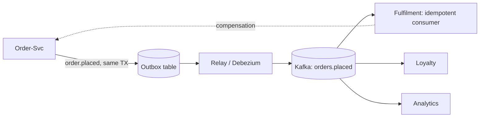

## Why it Matters

Coupling through a log instead of a call: producers state facts, consumers react on their own schedule, so a flash sale is absorbed by broker buffers and a new consumer is added by subscribing. The price is eventual consistency and debugging that spans many apps, you adopt EDA when temporal decoupling and elasticity outweigh request/reply reasoning.

## Diagram



## Code

```java
// Producer — publish a domain event after commit (outbox pattern ideal)
@Transactional
public Order place(CreateOrderCmd cmd) {
 Order o = repo.save(Order.place(cmd.items()));
 events.publish(new OrderPlaced(o.id(), o.total())); // routed to Kafka topic
 return o;
}
// Consumer — idempotent, retryable
@KafkaListener(topics = "orders.placed", groupId = "fulfilment")
public void on(OrderPlaced e, Acknowledgment ack) {
 if (processed.contains(e.orderId())) { ack.acknowledge(); return; } // idempotency
 fulfil(e); ack.acknowledge();
}
// Spring config: exactly-once-ish via transactions + idempotent consumer,
// DLQ via DeadLetterPublishingRecoverer for poison messages
```
Prefer `orders.placed` (past-tense fact) over `fulfilOrder` (command) for true decoupling.

## When to use / not

- Workflows spanning services where immediate consistency isn't required (order → payment → fulfilment).
- Fan-out (one fact, many reactions: email, analytics, loyalty).
- Spiky load needing buffering/back-pressure via broker.

**When NOT:** request/reply UX flows needing instant answers, strict ordering across aggregates, or teams without broker-ops maturity.

## Trade-offs

| Pros | Cons |
|---|---|
| Loose coupling, easy to add consumers | Eventual consistency everywhere |
| Buffering absorbs spikes | Debugging spans broker + many apps |
| Natural audit/event log | Schema evolution discipline required |
| Scales consumers independently | Ordering/duplicates/redelivery semantics bite |

## Vs

- **Vs REST/RPC:** sync = simple reasoning, temporal coupling; events = resilience + decoupling, harder to trace.
- **Vs [[06_Data-Architecture/03_Event-Sourcing-CQRS|Event Sourcing]]:** EDA moves *notifications* between services; event sourcing persists *state changes* as the source of truth. Often combined.

## Pitfalls

- Fat events vs thin events: fat (payload included) reduces chattiness but couples schemas, version with Schema Registry.
- Publishing before DB commit (ghost events), use transactional outbox.
- No DLQ/monitoring, poison message silently blocks a partition.

## Interview q&a

**Q: At-least-once or exactly-once?**
A: Assume at-least-once from Kafka; get effectively-once via idempotent consumers (dedup keys) + transactional outbox on produce.

**Q: Choreography vs orchestration?**
A: Choreography (each service reacts) suits simple flows; orchestration (a saga orchestrator drives steps) suits complex, visible workflows, see [[03_Microservices]].

## Related

- [[03_Microservices]] · [[05_DDD-Modeling/05_Domain-Events|Domain Events]] · [[06_Data-Architecture/03_Event-Sourcing-CQRS|Event Sourcing & CQRS]]

# Event-Driven Architecture (EDA)

> **Intent:** Decouple producers from consumers via asynchronous events on a broker, components react to facts (`OrderPlaced`) rather than calling each other, gaining temporal decoupling, elasticity, and natural audit trails.
> Watch: [Event-Driven Architecture in 7 Minutes](https://www.youtube.com/watch?v=gOuAqRaDdHA)
