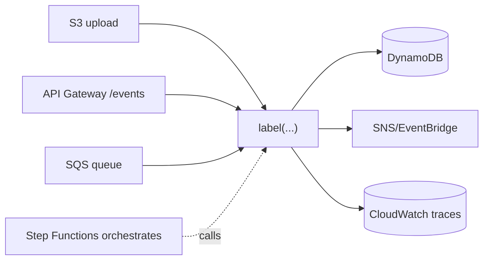

## Why it Matters

Serverless converts ops cost into per-invocation cost and makes elasticity someone else's problem. That is a winning trade for spiky, rare or glue workloads, and a losing one for sustained throughput and sub-100ms latency paths, the bill and the cold starts will tell you which side you are on.

## Problems
### System Design Problem: Serverless

**Requirements:**
- Functional: Core capabilities for serverless
- Non-functional (SLOs): Latency < 100ms p99, Availability 99.9%, Horizontal scalability

**Constraints:**
- Scale: Handle 10x growth without redesign
- Consistency: Appropriate model for domain (strong/eventual)
- Latency budget: p99 < 100ms for read paths

**API / Interfaces:**
- Primary: REST/gRPC endpoints for core operations
- Internal: Service-to-service contracts
- Events: Domain events for async integration

## Diagram



## Code

```java
// Spring Cloud Function — same code runs on Lambda, Azure Functions, Cloud Run, or locally
@Bean
Function<OrderPlaced, ShipmentLabel> label() {
 return e -> shipping.labelFor(e.orderId()); // pure, stateless, cheap to cold-start
}

// Cold-start hygiene that matters more than the framework choice:
// - no spring-boot-starter-web on a function runtime (it boots a server you never use)
// - -Dspring.main.lazy-initialization=true, trim starters, GraalVM native image
// - keep functions small, stateless, IDEMPOTENT — retried triggers must be safe to re-run
```
```java
// Idempotency is the correctness contract of serverless, not an optimisation:
// every trigger (S3 event, queue message, webhook) is at-least-once delivery.
boolean alreadyHandled = seen.putIfAbsent(e.eventId(), true) != null;
if (alreadyHandled) return Label.skipped(); // dedupe key → no double shipment
```
State goes to managed stores (DynamoDB/S3/queues), never to the function's own memory, a frozen warm instance is not a database.

## When to use / not

- Spiky/rare workloads (webhooks, nightly jobs, image processing) where idle servers waste money.
- Event handlers (S3 upload → thumbnail; queue → notification).
- MVPs needing zero ops.

**When NOT:** sustained high throughput (cheaper on containers), <100 ms latency-sensitive paths with heavy frameworks, long-running connections (websockets), or workloads needing VPC + provisioned DB tuning.


## Trade-offs
| Dimension | This Approach | Alternative | Trade-off Rationale | Decision Rule |
|-----------|---------------|-------------|---------------------|---------------|
| Complexity | Not specified | Not specified | Not specified | Not specified |
| Operational Burden | Not specified | Not specified | Not specified | Not specified |
| Latency | Not specified | Not specified | Not specified | Not specified |
| Consistency | Not specified | Not specified | Not specified | Not specified |
| Cost at Scale | Not specified | Not specified | Not specified | Not specified |

## Vs

- **Vs Containers/K8s:** containers = steady-state control + cost; serverless = elasticity − control.
- **Vs EDA:** serverless *consumes* events; EDA is the pattern, FaaS one runtime for it.

## Pitfalls

- "Lambda pinball": chains of functions calling functions, latency + cost explode; orchestrate with Step Functions instead.
- Hidden VPC + NAT costs dwarfing compute savings.
- No idempotency on retried triggers → double-charges/emails.


## Pitfalls
1. Underestimating operational complexity (backups, monitoring, upgrades)
2. Ignoring failure modes (network partitions, disk failures, clock drift)
3. Not planning for 10x scale from day one
4. Skipping monitoring/alerting in MVP
5. Premature optimization before measuring
6. Dual-write without transactional outbox
7. Assuming global order in partitioned systems

## Interview q&a

**Q: How do you tame JVM cold starts on Lambda?**
A: GraalVM native, SnapStart, provisioned concurrency for hot paths, trim starters, lazy init.

**Q: Where does Spring fit in serverless?**
A: Spring Cloud Function for portable function signatures; avoid full Boot web stack per function.


## Flashcards (Spaced Repetition)

#flashcard
**Q:** What is the core concept of Serverless? :: **A:** [Key algorithm/architecture pattern] #flashcard

#flashcard
**Q:** When do you apply Serverless? :: **A:** [Trigger scenarios and context] #flashcard

#flashcard
**Q:** What is the primary trade-off in Serverless? :: **A:** [Main tension: e.g., consistency vs latency] #flashcard

#flashcard
**Q:** What breaks first at scale in Serverless? :: **A:** [Primary bottleneck: e.g., coordination, hot keys, replication lag] #flashcard

#flashcard
**Q:** How do you handle failures in Serverless? :: **A:** [Retry, circuit breaker, fallback, graceful degradation] #flashcard

#flashcard
**Q:** What are the key metrics to monitor for Serverless? :: **A:** [RED: rate, errors, duration; USE: utilization, saturation, errors] #flashcard

#flashcard
**Q:** How does Serverless scale to 10x? :: **A:** [Sharding, read replicas, async processing, caching layers] #flashcard

#flashcard
**Q:** What is the consistency model for Serverless? :: **A:** [Strong/eventual/causal - justify with use case] #flashcard

#flashcard
**Q:** How do you test Serverless? :: **A:** [Contract tests, chaos engineering, load tests, fault injection] #flashcard

#flashcard
**Q:** What is the operational cost of Serverless? :: **A:** [Team expertise, tooling, on-call burden, migration risk] #flashcard

#flashcard
**Q:** When would you NOT use Serverless? :: **A:** [Managed service covers need, simple CRUD, team lacks maturity] #flashcard

#flashcard
**Q:** What is the key design decision in Serverless? :: **A:** [The irreversible choice that defines the architecture] #flashcard

#flashcard
**Q:** How do you migrate to Serverless? :: **A:** [Strangler fig, dual-write, canary, feature flags] #flashcard

#flashcard
**Q:** What security considerations for Serverless? :: **A:** [AuthZ, encryption, audit, secrets management] #flashcard

#flashcard
**Q:** How do you debug Serverless in production? :: **A:** [Structured logging, correlation IDs, distributed tracing, SLO alerts] #flashcard


## Practice Tasks (Tasks Plugin)
- [ ] Explain the architecture from memory 📅 {{date:YYYY-MM-DD, +1}}
- [ ] Draw the system diagram without looking 📅 {{date:YYYY-MM-DD, +3}}
- [ ] Answer all Interview Q&A aloud 📅 {{date:YYYY-MM-DD, +7}}
- [ ] Review flashcards (Spaced Repetition) 📅 {{date:YYYY-MM-DD, +1}}

```tasks
not done
path includes Architect/03_Architecture-Styles
sort by due
limit 10
```

## Related

- 04_Event-Driven-Architecture · 03_Microservices

# Serverless (FaaS + Managed Services)

> **Intent:** Run code as short-lived functions triggered by events, with the platform owning provisioning, scaling, and patching, you pay per invocation and operate (almost) nothing.

## 2. Spring Example
```java
// Spring Cloud Function, same code runs on Lambda, Cloud Run, or locally
@Bean Function<OrderPlaced, ShipmentLabel> label() {
 return e -> shipping.labelFor(e.orderId());
}
// Cold-start tips: spring-cloud-function + GraalVM native image,
// -Dspring.main.lazy-initialization=true, keep deps lean (no spring-boot-starter-web on Lambda)
```
Rule: keep functions small, stateless, idempotent; push state to managed stores (DynamoDB/S3/queues).
