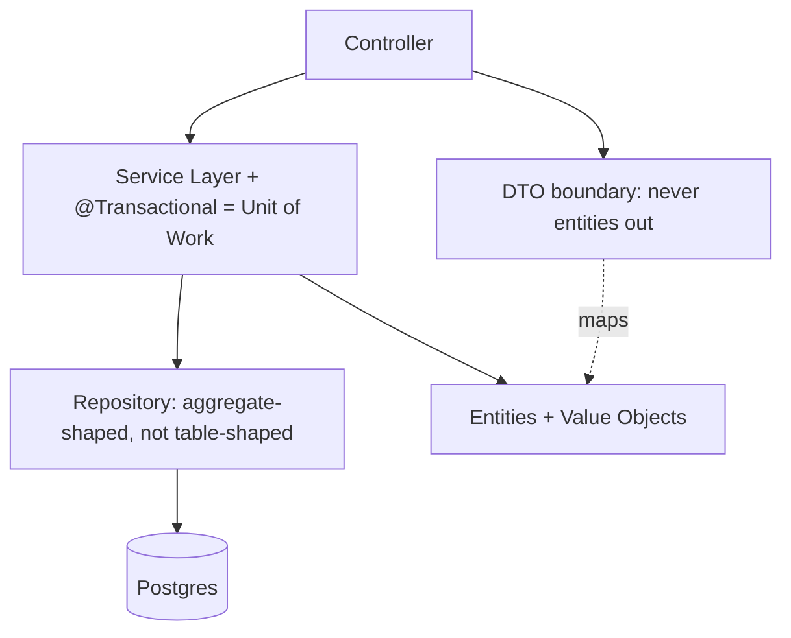

## Why it Matters

These are the load-bearing vocabulary of business systems, names that let a design review be about "is the repository use-case shaped?" rather than re-litigating structure. Applied deliberately they make invariants and transaction boundaries visible in code; applied as dogma they become layers of indirection nobody benefits from.

## Diagram



## Code

```java
// Repository + Specification (composable queries)
interface OrderRepo extends JpaRepository<Order, Long>, JpaSpecificationExecutor<Order> {}
class Specs {
 static Specification<Order> byStatus(String s) {
 return (r, q, cb) -> cb.equal(r.get("status"), s);
 }
}
// Unit of Work = @Transactional service method
@Service class Fulfilment {
 @Transactional public void ship(long id) { // one UoW: load, mutate, save, publish
 Order o = orders.findById(id).orElseThrow();
 o.ship(); // domain invariant inside entity
 }
}
// DTO boundary — never expose entities
record OrderDto(long id, String status, Money total) {
 static OrderDto from(Order o) { return new OrderDto(o.id(), o.status().name(), o.total()); }
}
```

## When to use / not

| Pattern | Use when |
|---|---|
| Repository | You want collection-like domain access, hiding query tech |
| Unit of Work | Multiple writes must commit/roll back atomically |
| DTO + Mapper | API shape differs from domain/entity shape |
| Service Layer | Cross-entity orchestration + transaction boundary needed |
| Specification | Query logic must compose/reuse (dynamic filters) |

## Trade-offs

| Pros | Cons |
|---|---|
| Shared vocabulary across teams | Pattern zealotry (DTO for everything, generic everything) |
| Spring implements most out-of-box | Leaky abstractions (Specification tied to JPA) |
| Test seams at every boundary | Over-layering CRUD apps |

## Vs

- **Vs [[02_Resilience-Circuit-Breaker-Retry|Resilience patterns]]:** enterprise patterns structure *correctness*; resilience patterns structure *failure*.
- **Vs [[05_DDD-Modeling/04_Tactical-Aggregates-Entities-VO|DDD tactical]]:** repositories/aggregates overlap, DDD adds the rule "one repository per aggregate".

## Pitfalls

- `GenericService<T>` / `BaseController<T>` abstraction fever, kills readability.
- Specifications encoding business *decisions* (belongs in domain, not query DSL).
- Transaction spanning remote calls, UoW is for one transactional resource.

## Interview q&a

**Q: Repository vs DAO?**
A: DAO is data-access-shaped (table-centric CRUD); Repository is domain-shaped (collection of aggregates, ubiquitous-language methods like `overdue()`).

**Q: When do DTOs earn their keep?**
A: When API and domain evolve at different speeds, or entities carry lazy/cyclic graphs unsafe for serialisation.

## Related

- [[02_Resilience-Circuit-Breaker-Retry]] · [[05_DDD-Modeling/04_Tactical-Aggregates-Entities-VO|Aggregates & Entities]]

# Enterprise Patterns (Fowler p of EAA, Spring Edition)

> **Intent:** Catalogue the recurring building blocks of business systems, Repository, Unit of Work, DTO/Mapper, Service Layer, Specification, and show their canonical Spring forms so you apply them deliberately, not accidentally.
