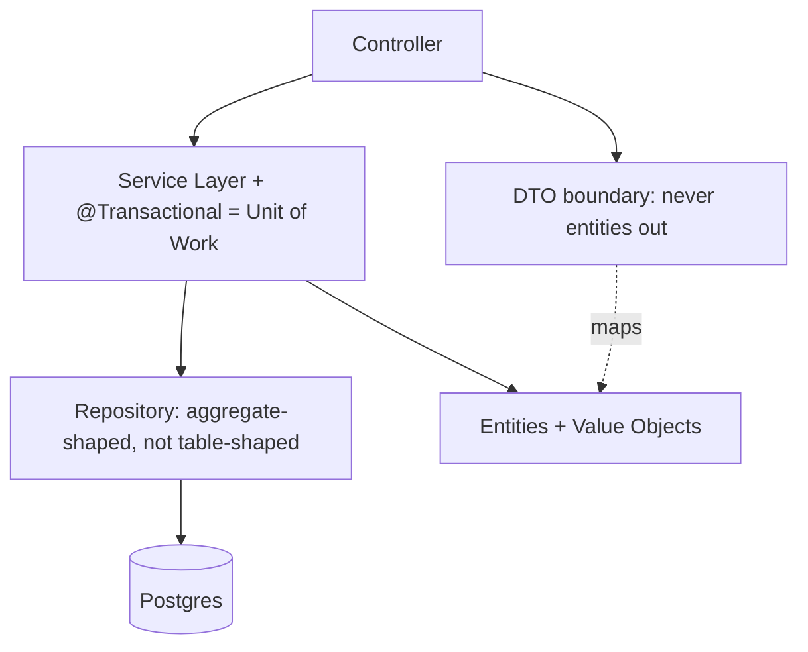

## Why it Matters

These are the load-bearing vocabulary of business systems, names that let a design review be about "is the repository use-case shaped?" rather than re-litigating structure. Applied deliberately they make invariants and transaction boundaries visible in code; applied as dogma they become layers of indirection nobody benefits from.

## Problems
### System Design Problem: Enterprise Patterns

**Requirements:**
- Functional: Core capabilities for enterprise patterns
- Non-functional (SLOs): Latency < 100ms p99, Availability 99.9%, Horizontal scalability

**Constraints:**
- Scale: Handle 10x growth without redesign
- Consistency: Appropriate model for domain (strong/eventual)
- Latency budget: p99 < 100ms for read paths

**API / Interfaces:**
- Primary: REST/gRPC endpoints for core operations
- Internal: Service-to-service contracts
- Events: Domain events for async integration

## Diagram



## Code

```java
// Repository + Specification (composable queries)
interface OrderRepo extends JpaRepository<Order, Long>, JpaSpecificationExecutor<Order> {}
class Specs {
 static Specification<Order> byStatus(String s) {
 return (r, q, cb) -> cb.equal(r.get("status"), s);
 }
}
// Unit of Work = @Transactional service method
@Service class Fulfilment {
 @Transactional public void ship(long id) { // one UoW: load, mutate, save, publish
 Order o = orders.findById(id).orElseThrow();
 o.ship(); // domain invariant inside entity
 }
}
// DTO boundary — never expose entities
record OrderDto(long id, String status, Money total) {
 static OrderDto from(Order o) { return new OrderDto(o.id(), o.status().name(), o.total()); }
}
```

## When to use / not

| Pattern | Use when |
|---|---|
| Repository | You want collection-like domain access, hiding query tech |
| Unit of Work | Multiple writes must commit/roll back atomically |
| DTO + Mapper | API shape differs from domain/entity shape |
| Service Layer | Cross-entity orchestration + transaction boundary needed |
| Specification | Query logic must compose/reuse (dynamic filters) |


## Trade-offs
| Dimension | This Approach | Alternative | Trade-off Rationale | Decision Rule |
|-----------|---------------|-------------|---------------------|---------------|
| Complexity | [TBD] | [TBD] | [TBD] | [TBD] |
| Operational Burden | [TBD] | [TBD] | [TBD] | [TBD] |
| Latency | [TBD] | [TBD] | [TBD] | [TBD] |
| Consistency | [TBD] | [TBD] | [TBD] | [TBD] |
| Cost at Scale | [TBD] | [TBD] | [TBD] | [TBD] |

## Vs

- **Vs [[02_Resilience-Circuit-Breaker-Retry|Resilience patterns]]:** enterprise patterns structure *correctness*; resilience patterns structure *failure*.
- **Vs [[05_DDD-Modeling/04_Tactical-Aggregates-Entities-VO|DDD tactical]]:** repositories/aggregates overlap, DDD adds the rule "one repository per aggregate".

## Pitfalls

- `GenericService<T>` / `BaseController<T>` abstraction fever, kills readability.
- Specifications encoding business *decisions* (belongs in domain, not query DSL).
- Transaction spanning remote calls, UoW is for one transactional resource.


## Pitfalls
1. Underestimating operational complexity (backups, monitoring, upgrades)
2. Ignoring failure modes (network partitions, disk failures, clock drift)
3. Not planning for 10x scale from day one
4. Skipping monitoring/alerting in MVP
5. Premature optimization before measuring
6. Dual-write without transactional outbox
7. Assuming global order in partitioned systems

## Interview q&a

**Q: Repository vs DAO?**
A: DAO is data-access-shaped (table-centric CRUD); Repository is domain-shaped (collection of aggregates, ubiquitous-language methods like `overdue()`).

**Q: When do DTOs earn their keep?**
A: When API and domain evolve at different speeds, or entities carry lazy/cyclic graphs unsafe for serialisation.


## Flashcards (Spaced Repetition)

#flashcard
**Q:** What is the core concept of Enterprise Patterns? :: **A:** [Key algorithm/architecture pattern] #flashcard

#flashcard
**Q:** When do you apply Enterprise Patterns? :: **A:** [Trigger scenarios and context] #flashcard

#flashcard
**Q:** What is the primary trade-off in Enterprise Patterns? :: **A:** [Main tension: e.g., consistency vs latency] #flashcard

#flashcard
**Q:** What breaks first at scale in Enterprise Patterns? :: **A:** [Primary bottleneck: e.g., coordination, hot keys, replication lag] #flashcard

#flashcard
**Q:** How do you handle failures in Enterprise Patterns? :: **A:** [Retry, circuit breaker, fallback, graceful degradation] #flashcard

#flashcard
**Q:** What are the key metrics to monitor for Enterprise Patterns? :: **A:** [RED: rate, errors, duration; USE: utilization, saturation, errors] #flashcard

#flashcard
**Q:** How does Enterprise Patterns scale to 10x? :: **A:** [Sharding, read replicas, async processing, caching layers] #flashcard

#flashcard
**Q:** What is the consistency model for Enterprise Patterns? :: **A:** [Strong/eventual/causal - justify with use case] #flashcard

#flashcard
**Q:** How do you test Enterprise Patterns? :: **A:** [Contract tests, chaos engineering, load tests, fault injection] #flashcard

#flashcard
**Q:** What is the operational cost of Enterprise Patterns? :: **A:** [Team expertise, tooling, on-call burden, migration risk] #flashcard

#flashcard
**Q:** When would you NOT use Enterprise Patterns? :: **A:** [Managed service covers need, simple CRUD, team lacks maturity] #flashcard

#flashcard
**Q:** What is the key design decision in Enterprise Patterns? :: **A:** [The irreversible choice that defines the architecture] #flashcard

#flashcard
**Q:** How do you migrate to Enterprise Patterns? :: **A:** [Strangler fig, dual-write, canary, feature flags] #flashcard

#flashcard
**Q:** What security considerations for Enterprise Patterns? :: **A:** [AuthZ, encryption, audit, secrets management] #flashcard

#flashcard
**Q:** How do you debug Enterprise Patterns in production? :: **A:** [Structured logging, correlation IDs, distributed tracing, SLO alerts] #flashcard


## Practice Tasks (Tasks Plugin)
- [ ] Explain the architecture from memory 📅 {{date:YYYY-MM-DD, +1}}
- [ ] Draw the system diagram without looking 📅 {{date:YYYY-MM-DD, +3}}
- [ ] Answer all Interview Q&A aloud 📅 {{date:YYYY-MM-DD, +7}}
- [ ] Review flashcards (Spaced Repetition) 📅 {{date:YYYY-MM-DD, +1}}

```tasks
not done
path includes Architect/04_Design-Patterns-Building-Blocks
sort by due
limit 10
```

## Related

- [[02_Resilience-Circuit-Breaker-Retry]] · [[05_DDD-Modeling/04_Tactical-Aggregates-Entities-VO|Aggregates & Entities]]

# Enterprise Patterns (Fowler p of EAA, Spring Edition)

> **Intent:** Catalogue the recurring building blocks of business systems, Repository, Unit of Work, DTO/Mapper, Service Layer, Specification, and show their canonical Spring forms so you apply them deliberately, not accidentally.
