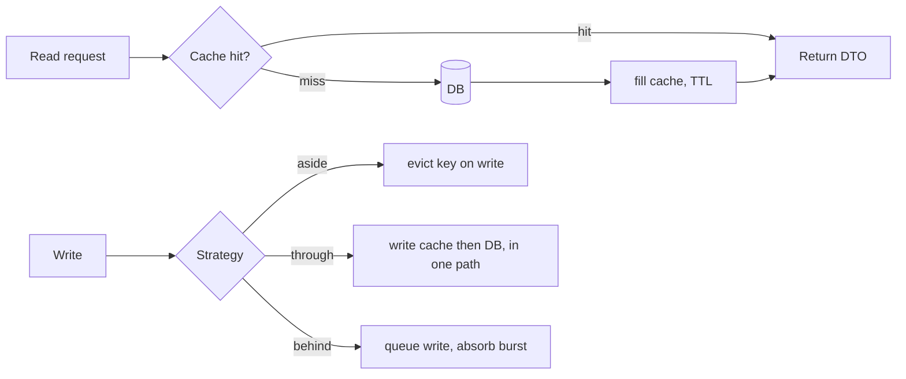

## Why it Matters

Caching is the cheapest latency and DB-load lever available, and the easiest way to serve wrong data. The value comes from matching the *invalidation strategy* to the staleness budget: TTL for the predictable, write-through for the correctness-critical, and no cache at all for data that must never be stale.

## Problems
### System Design Problem: Caching Strategies

**Requirements:**
- Functional: Core capabilities for caching strategies
- Non-functional (SLOs): Latency < 100ms p99, Availability 99.9%, Horizontal scalability

**Constraints:**
- Scale: Handle 10x growth without redesign
- Consistency: Appropriate model for domain (strong/eventual)
- Latency budget: p99 < 100ms for read paths

**API / Interfaces:**
- Primary: REST/gRPC endpoints for core operations
- Internal: Service-to-service contracts
- Events: Domain events for async integration

## Diagram



## Code

```java
@Service class Catalogue {
 @Cacheable(value = "products", key = "#id", unless = "#result == null")
 public ProductDto get(String id) { return ProductDto.from(repo.find(id)); }

 @CacheEvict(value = "products", key = "#p.id()") // invalidate on write
 public void update(Product p) { repo.save(p); }

 @CacheEvict(value = "products", allEntries = true) // bulk invalidation (careful)
 public void reindex() { search.reindex(); }
}
// Redis backing: spring-boot-starter-data-redis + @EnableCaching,
// TTL per cache: spring.cache.redis.time-to-live=10m; nulls: don't cache (unless=...)
```
Stampede guard: single-flight/`@Cacheable(sync=true)` for local caches; probabilistic early refresh or locks for Redis hot keys.

## When to use / not

| Strategy | Use when |
|---|---|
| Cache-aside (lazy) | Read-heavy, tolerates first-miss latency (product catalogue) |
| Read/write-through | Cache must stay authoritative-ish; writes go via cache |
| Write-behind | Bursty writes, loss-tolerant window (counters, analytics) |
| Refresh-ahead / TTL | Predictable hot keys; stale-while-revalidate UX |
| Request-scoped / memoize | Same entity read N times per request |

Golden rule: cache at the **service boundary** (DTOs), not entities, entities carry lazy proxies and identity semantics that poison caches.


## Trade-offs
| Dimension | This Approach | Alternative | Trade-off Rationale | Decision Rule |
|-----------|---------------|-------------|---------------------|---------------|
| Complexity | [TBD] | [TBD] | [TBD] | [TBD] |
| Operational Burden | [TBD] | [TBD] | [TBD] | [TBD] |
| Latency | [TBD] | [TBD] | [TBD] | [TBD] |
| Consistency | [TBD] | [TBD] | [TBD] | [TBD] |
| Cost at Scale | [TBD] | [TBD] | [TBD] | [TBD] |

## Vs

- **Vs [[06_Data-Architecture/04_Caching-CDN|CDN/HTTP caching]]:** app cache = per-object compute savings; CDN = edge bytes + origin offload. Use both, keyed differently.
- **Vs materialised views / CQRS read models:** caches are *ephemeral derivations*; read models are *durable*, pick durable when rebuild cost is high (see [[06_Data-Architecture/03_Event-Sourcing-CQRS|CQRS]]).

## Pitfalls

- Caching entities with lazy relations → serialisation bombs.
- No TTL ("cache forever"), every entry needs an expiry story.
- Cache key includes user input unbounded → memory blowup / poisoning.


## Pitfalls
1. Underestimating operational complexity (backups, monitoring, upgrades)
2. Ignoring failure modes (network partitions, disk failures, clock drift)
3. Not planning for 10x scale from day one
4. Skipping monitoring/alerting in MVP
5. Premature optimization before measuring
6. Dual-write without transactional outbox
7. Assuming global order in partitioned systems

## Interview q&a

**Q: How do you invalidate?**
A: Write-through/evict on the mutating path; TTL as backstop; version keys for deploys (`products:v2:{id}`). Never "clear all in prod" as a strategy.

**Q: Cache penetration / avalanche?**
A: Penetration (missing keys hammer DB): cache nulls briefly + Bloom filter. Avalanche (mass expiry): jittered TTLs + staged warmup.


## Flashcards (Spaced Repetition)

#flashcard
**Q:** What is the core concept of Caching Strategies? :: **A:** [Key algorithm/architecture pattern] #flashcard

#flashcard
**Q:** When do you apply Caching Strategies? :: **A:** [Trigger scenarios and context] #flashcard

#flashcard
**Q:** What is the primary trade-off in Caching Strategies? :: **A:** [Main tension: e.g., consistency vs latency] #flashcard

#flashcard
**Q:** What breaks first at scale in Caching Strategies? :: **A:** [Primary bottleneck: e.g., coordination, hot keys, replication lag] #flashcard

#flashcard
**Q:** How do you handle failures in Caching Strategies? :: **A:** [Retry, circuit breaker, fallback, graceful degradation] #flashcard

#flashcard
**Q:** What are the key metrics to monitor for Caching Strategies? :: **A:** [RED: rate, errors, duration; USE: utilization, saturation, errors] #flashcard

#flashcard
**Q:** How does Caching Strategies scale to 10x? :: **A:** [Sharding, read replicas, async processing, caching layers] #flashcard

#flashcard
**Q:** What is the consistency model for Caching Strategies? :: **A:** [Strong/eventual/causal - justify with use case] #flashcard

#flashcard
**Q:** How do you test Caching Strategies? :: **A:** [Contract tests, chaos engineering, load tests, fault injection] #flashcard

#flashcard
**Q:** What is the operational cost of Caching Strategies? :: **A:** [Team expertise, tooling, on-call burden, migration risk] #flashcard

#flashcard
**Q:** When would you NOT use Caching Strategies? :: **A:** [Managed service covers need, simple CRUD, team lacks maturity] #flashcard

#flashcard
**Q:** What is the key design decision in Caching Strategies? :: **A:** [The irreversible choice that defines the architecture] #flashcard

#flashcard
**Q:** How do you migrate to Caching Strategies? :: **A:** [Strangler fig, dual-write, canary, feature flags] #flashcard

#flashcard
**Q:** What security considerations for Caching Strategies? :: **A:** [AuthZ, encryption, audit, secrets management] #flashcard

#flashcard
**Q:** How do you debug Caching Strategies in production? :: **A:** [Structured logging, correlation IDs, distributed tracing, SLO alerts] #flashcard


## Practice Tasks (Tasks Plugin)
- [ ] Explain the architecture from memory 📅 {{date:YYYY-MM-DD, +1}}
- [ ] Draw the system diagram without looking 📅 {{date:YYYY-MM-DD, +3}}
- [ ] Answer all Interview Q&A aloud 📅 {{date:YYYY-MM-DD, +7}}
- [ ] Review flashcards (Spaced Repetition) 📅 {{date:YYYY-MM-DD, +1}}

```tasks
not done
path includes Architect/04_Design-Patterns-Building-Blocks
sort by due
limit 10
```

## Related

- [[06_Data-Architecture/04_Caching-CDN]] · [[01_Enterprise-Patterns]]

# Caching Strategies

> **Intent:** Trade freshness for speed/cost: serve hot reads from memory instead of recomputing or re-querying, choosing the invalidation strategy that matches how stale the data is allowed to be.
> Watch: [Caching Strategies for System Design Interviews](https://www.youtube.com/watch?v=Cm7gem9mBeg)
