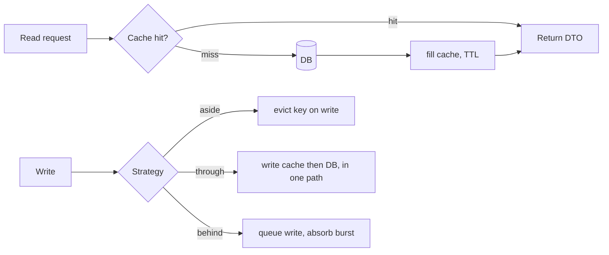

## Why it Matters

Caching is the cheapest latency and DB-load lever available, and the easiest way to serve wrong data. The value comes from matching the *invalidation strategy* to the staleness budget: TTL for the predictable, write-through for the correctness-critical, and no cache at all for data that must never be stale.

## Diagram



## Code

```java
@Service class Catalogue {
 @Cacheable(value = "products", key = "#id", unless = "#result == null")
 public ProductDto get(String id) { return ProductDto.from(repo.find(id)); }

 @CacheEvict(value = "products", key = "#p.id()") // invalidate on write
 public void update(Product p) { repo.save(p); }

 @CacheEvict(value = "products", allEntries = true) // bulk invalidation (careful)
 public void reindex() { search.reindex(); }
}
// Redis backing: spring-boot-starter-data-redis + @EnableCaching,
// TTL per cache: spring.cache.redis.time-to-live=10m; nulls: don't cache (unless=...)
```
Stampede guard: single-flight/`@Cacheable(sync=true)` for local caches; probabilistic early refresh or locks for Redis hot keys.

## When to use / not

| Strategy | Use when |
|---|---|
| Cache-aside (lazy) | Read-heavy, tolerates first-miss latency (product catalogue) |
| Read/write-through | Cache must stay authoritative-ish; writes go via cache |
| Write-behind | Bursty writes, loss-tolerant window (counters, analytics) |
| Refresh-ahead / TTL | Predictable hot keys; stale-while-revalidate UX |
| Request-scoped / memoize | Same entity read N times per request |

Golden rule: cache at the **service boundary** (DTOs), not entities, entities carry lazy proxies and identity semantics that poison caches.

## Trade-offs

| Pros | Cons |
|---|---|
| 10–100× latency cut, DB load shed | Invalidation bugs = stale/wrong data served |
| Cheap horizontal read scale | Cold start + thundering herd after eviction |
| Shields downstream in outages (stale fallback) | Extra infra + consistency reasoning cost |

## Vs

- **Vs [[06_Data-Architecture/04_Caching-CDN|CDN/HTTP caching]]:** app cache = per-object compute savings; CDN = edge bytes + origin offload. Use both, keyed differently.
- **Vs materialised views / CQRS read models:** caches are *ephemeral derivations*; read models are *durable*, pick durable when rebuild cost is high (see [[06_Data-Architecture/03_Event-Sourcing-CQRS|CQRS]]).

## Pitfalls

- Caching entities with lazy relations → serialisation bombs.
- No TTL ("cache forever"), every entry needs an expiry story.
- Cache key includes user input unbounded → memory blowup / poisoning.

## Interview q&a

**Q: How do you invalidate?**
A: Write-through/evict on the mutating path; TTL as backstop; version keys for deploys (`products:v2:{id}`). Never "clear all in prod" as a strategy.

**Q: Cache penetration / avalanche?**
A: Penetration (missing keys hammer DB): cache nulls briefly + Bloom filter. Avalanche (mass expiry): jittered TTLs + staged warmup.

## Related

- [[06_Data-Architecture/04_Caching-CDN]] · [[01_Enterprise-Patterns]]

# Caching Strategies

> **Intent:** Trade freshness for speed/cost: serve hot reads from memory instead of recomputing or re-querying, choosing the invalidation strategy that matches how stale the data is allowed to be.
> Watch: [Caching Strategies for System Design Interviews](https://www.youtube.com/watch?v=Cm7gem9mBeg)
