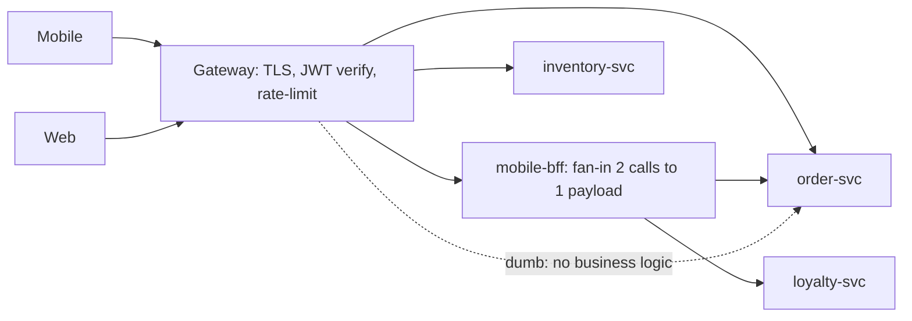

## Why it Matters

Cross-cutting traffic concerns have to live somewhere; writing auth, rate-limit and CORS into every service multiplies inconsistency and drift. Centralising them at the edge while pushing payload shaping into per-client BFFs keeps services honest about owning domain rules and lets each client get the chattiness it needs without churning services.

## Problems
### System Design Problem: API Gateway & BFF

**Requirements:**
- Functional: Core capabilities for api gateway & bff
- Non-functional (SLOs): Latency < 100ms p99, Availability 99.9%, Horizontal scalability

**Constraints:**
- Scale: Handle 10x growth without redesign
- Consistency: Appropriate model for domain (strong/eventual)
- Latency budget: p99 < 100ms for read paths

**API / Interfaces:**
- Primary: REST/gRPC endpoints for core operations
- Internal: Service-to-service contracts
- Events: Domain events for async integration

## Diagram



## Code

```java
@Bean RouteLocator routes(RouteLocatorBuilder b) {
 return b.routes()
 .route("orders", r -> r.path("/api/orders/**")
 .filters(f -> f.stripPrefix(2)
 .requestRateLimiter(c -> c.setRateLimiter(redisRateLimiter())) // per-key quota
 .circuitBreaker(c -> c.setName("orders").setFallbackUri("forward:/fb/orders")))
 .uri("lb://order-service"))
 .route("mobile-bff", r -> r.path("/api/mobile/**")
 .filters(f -> f.rewritePath("/api/mobile/(?<s>.*)", "/api/${s}"))
 .uri("lb://mobile-bff"))
 .build();
}
// BFF: a thin Boot app using declarative clients to fan-in
public record MobileHomeDto(OrderDto order, LoyaltyDto loyalty) {}
// BFF aggregates 2 service calls → 1 client call; owns NO domain rules
```
Auth pattern: gateway validates JWT (opaque → token introspection once), forwards claims as headers; services trust the edge + verify scope.

## When to use / not

- > a handful of services or clients, stop embedding auth/rate-limit in each service.
- Clients with divergent needs (mobile: few fat calls; web: many thin calls).
- Public API needing versioning, keys, quotas, WAF.

**When NOT:** single monolith + single client (YAGNI), or as a place to hide business logic (gateway stays dumb).


## Trade-offs
| Dimension | This Approach | Alternative | Trade-off Rationale | Decision Rule |
|-----------|---------------|-------------|---------------------|---------------|
| Complexity | [TBD] | [TBD] | [TBD] | [TBD] |
| Operational Burden | [TBD] | [TBD] | [TBD] | [TBD] |
| Latency | [TBD] | [TBD] | [TBD] | [TBD] |
| Consistency | [TBD] | [TBD] | [TBD] | [TBD] |
| Cost at Scale | [TBD] | [TBD] | [TBD] | [TBD] |

## Vs

- **Vs direct client→service:** direct is simpler at small scale; gateway pays off when policy/client-count grows.
- **Vs [[03_Caching-Strategies|app caching]] at edge:** gateway may cache GETs briefly (per-key TTL), but canonical caching stays in services/CDN.

## Pitfalls

- Fat gateway: orchestration/sagas in route filters, untestable; move to services.
- No rate-limit by authenticated principal → one tenant starves others.
- Breaking mobile with web-driven BFF changes, version BFF contracts per client.


## Pitfalls
1. Underestimating operational complexity (backups, monitoring, upgrades)
2. Ignoring failure modes (network partitions, disk failures, clock drift)
3. Not planning for 10x scale from day one
4. Skipping monitoring/alerting in MVP
5. Premature optimization before measuring
6. Dual-write without transactional outbox
7. Assuming global order in partitioned systems

## Interview q&a

**Q: Gateway vs BFF, aren't they the same box?**
A: Often deployed together but different jobs: gateway = traffic policy; BFF = payload shaping per UX. Keep them as separate route groups/code so policy changes don't redeploy UX shaping.

**Q: Where does auth live?**
A: Authenticate at the edge (gateway), authorise in services (they own the resource rules). Never trust client headers without edge verification.


## Flashcards (Spaced Repetition)

#flashcard
**Q:** What is the core concept of API Gateway & BFF? :: **A:** [Key algorithm/architecture pattern] #flashcard

#flashcard
**Q:** When do you apply API Gateway & BFF? :: **A:** [Trigger scenarios and context] #flashcard

#flashcard
**Q:** What is the primary trade-off in API Gateway & BFF? :: **A:** [Main tension: e.g., consistency vs latency] #flashcard

#flashcard
**Q:** What breaks first at scale in API Gateway & BFF? :: **A:** [Primary bottleneck: e.g., coordination, hot keys, replication lag] #flashcard

#flashcard
**Q:** How do you handle failures in API Gateway & BFF? :: **A:** [Retry, circuit breaker, fallback, graceful degradation] #flashcard

#flashcard
**Q:** What are the key metrics to monitor for API Gateway & BFF? :: **A:** [RED: rate, errors, duration; USE: utilization, saturation, errors] #flashcard

#flashcard
**Q:** How does API Gateway & BFF scale to 10x? :: **A:** [Sharding, read replicas, async processing, caching layers] #flashcard

#flashcard
**Q:** What is the consistency model for API Gateway & BFF? :: **A:** [Strong/eventual/causal - justify with use case] #flashcard

#flashcard
**Q:** How do you test API Gateway & BFF? :: **A:** [Contract tests, chaos engineering, load tests, fault injection] #flashcard

#flashcard
**Q:** What is the operational cost of API Gateway & BFF? :: **A:** [Team expertise, tooling, on-call burden, migration risk] #flashcard

#flashcard
**Q:** When would you NOT use API Gateway & BFF? :: **A:** [Managed service covers need, simple CRUD, team lacks maturity] #flashcard

#flashcard
**Q:** What is the key design decision in API Gateway & BFF? :: **A:** [The irreversible choice that defines the architecture] #flashcard

#flashcard
**Q:** How do you migrate to API Gateway & BFF? :: **A:** [Strangler fig, dual-write, canary, feature flags] #flashcard

#flashcard
**Q:** What security considerations for API Gateway & BFF? :: **A:** [AuthZ, encryption, audit, secrets management] #flashcard

#flashcard
**Q:** How do you debug API Gateway & BFF in production? :: **A:** [Structured logging, correlation IDs, distributed tracing, SLO alerts] #flashcard


## Practice Tasks (Tasks Plugin)
- [ ] Explain the architecture from memory 📅 {{date:YYYY-MM-DD, +1}}
- [ ] Draw the system diagram without looking 📅 {{date:YYYY-MM-DD, +3}}
- [ ] Answer all Interview Q&A aloud 📅 {{date:YYYY-MM-DD, +7}}
- [ ] Review flashcards (Spaced Repetition) 📅 {{date:YYYY-MM-DD, +1}}

```tasks
not done
path includes Architect/04_Design-Patterns-Building-Blocks
sort by due
limit 10
```

## Related

- [[03_Architecture-Styles/03_Microservices|Microservices]] · [[02_Resilience-Circuit-Breaker-Retry|Resilience]]

# API Gateway & bff (Backend-for-Frontend)

> **Intent:** Put a managed edge in front of services: the **gateway** handles cross-cutting traffic concerns (routing, auth, rate-limit, CORS) once, while per-client **BFFs** shape payloads so mobile/web/chatbot each get exactly the data and chattiness they need.
> Watch: [Gaurav Sen, What is an API Gateway?](https://www.youtube.com/watch?v=RbMxB_Cyx6A)
