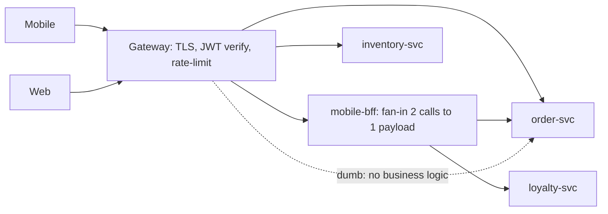

## Why it Matters

Cross-cutting traffic concerns have to live somewhere; writing auth, rate-limit and CORS into every service multiplies inconsistency and drift. Centralising them at the edge while pushing payload shaping into per-client BFFs keeps services honest about owning domain rules and lets each client get the chattiness it needs without churning services.

## Diagram



## Code

```java
@Bean RouteLocator routes(RouteLocatorBuilder b) {
 return b.routes()
 .route("orders", r -> r.path("/api/orders/**")
 .filters(f -> f.stripPrefix(2)
 .requestRateLimiter(c -> c.setRateLimiter(redisRateLimiter())) // per-key quota
 .circuitBreaker(c -> c.setName("orders").setFallbackUri("forward:/fb/orders")))
 .uri("lb://order-service"))
 .route("mobile-bff", r -> r.path("/api/mobile/**")
 .filters(f -> f.rewritePath("/api/mobile/(?<s>.*)", "/api/${s}"))
 .uri("lb://mobile-bff"))
 .build();
}
// BFF: a thin Boot app using declarative clients to fan-in
public record MobileHomeDto(OrderDto order, LoyaltyDto loyalty) {}
// BFF aggregates 2 service calls → 1 client call; owns NO domain rules
```
Auth pattern: gateway validates JWT (opaque → token introspection once), forwards claims as headers; services trust the edge + verify scope.

## When to use / not

- > a handful of services or clients, stop embedding auth/rate-limit in each service.
- Clients with divergent needs (mobile: few fat calls; web: many thin calls).
- Public API needing versioning, keys, quotas, WAF.

**When NOT:** single monolith + single client (YAGNI), or as a place to hide business logic (gateway stays dumb).

## Trade-offs

| Pros | Cons |
|---|---|
| Cross-cutting concerns in one place | Extra hop (latency) + new SPOF, run HA, keep it stateless |
| Client-specific shaping without service churn | BFF sprawl (one per client × version) |
| Central policy: WAF, quotas, audit | Temptation to leak orchestration/business logic upward |

## Vs

- **Vs direct client→service:** direct is simpler at small scale; gateway pays off when policy/client-count grows.
- **Vs [[03_Caching-Strategies|app caching]] at edge:** gateway may cache GETs briefly (per-key TTL), but canonical caching stays in services/CDN.

## Pitfalls

- Fat gateway: orchestration/sagas in route filters, untestable; move to services.
- No rate-limit by authenticated principal → one tenant starves others.
- Breaking mobile with web-driven BFF changes, version BFF contracts per client.

## Interview q&a

**Q: Gateway vs BFF, aren't they the same box?**
A: Often deployed together but different jobs: gateway = traffic policy; BFF = payload shaping per UX. Keep them as separate route groups/code so policy changes don't redeploy UX shaping.

**Q: Where does auth live?**
A: Authenticate at the edge (gateway), authorise in services (they own the resource rules). Never trust client headers without edge verification.

## Related

- [[03_Architecture-Styles/03_Microservices|Microservices]] · [[02_Resilience-Circuit-Breaker-Retry|Resilience]]

# API Gateway & bff (Backend-for-Frontend)

> **Intent:** Put a managed edge in front of services: the **gateway** handles cross-cutting traffic concerns (routing, auth, rate-limit, CORS) once, while per-client **BFFs** shape payloads so mobile/web/chatbot each get exactly the data and chattiness they need.
> Watch: [Gaurav Sen, What is an API Gateway?](https://www.youtube.com/watch?v=RbMxB_Cyx6A)
