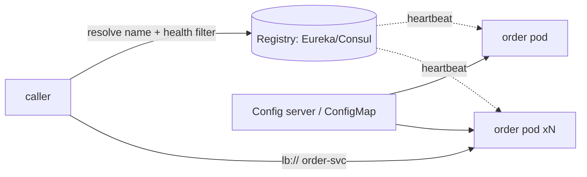

## Why it Matters

Hardcoded addresses break the first time autoscaling moves a pod; config baked into images makes a timeout change a full release pipeline. Discovery and externalised config are what let a fleet change shape and tune itself without redeploys, and on Kubernetes much of it is already built in, so the decision is often "don't build a second one."

## Problems
### System Design Problem: Discovery, Config & Registry

**Requirements:**
- Functional: Core capabilities for discovery, config & registry
- Non-functional (SLOs): Latency < 100ms p99, Availability 99.9%, Horizontal scalability

**Constraints:**
- Scale: Handle 10x growth without redesign
- Consistency: Appropriate model for domain (strong/eventual)
- Latency budget: p99 < 100ms for read paths

**API / Interfaces:**
- Primary: REST/gRPC endpoints for core operations
- Internal: Service-to-service contracts
- Events: Domain events for async integration

## Diagram



## Code

```java
// Option A: Spring Cloud (non-K8s / hybrid)
@EnableDiscoveryClient
@SpringBootApplication
public class OrderServiceApp { public static void main(String[] a) { SpringApplication.run(OrderServiceApp.class, a); } }
// client call by logical name — load-balanced, health-filtered
@HttpExchange("http://inventory-service/api/inventory")
public interface InventoryClient { @GetExchange("/{sku}") Availability check(@PathVariable String sku); }

## When to use / NOT

- > 3 services, autoscaling, or multi-zone deploys where IPs churn.
- Per-env tuning (timeouts, feature flags, secrets rotation) without rebuilds.

**When NOT:** K8s-native small fleet — kube-dns + Services already discover; adding Eureka/Consul on top is redundant complexity.


## Vs

- **Vs hardcoded URLs / static LB:** static breaks the moment autoscaling moves instances; registry tracks churn.
- **Vs Eureka-on-K8s:** on K8s, Services + readiness probes already do discovery + health — Eureka adds a second source of truth.


## Trade-offs
| Dimension | This Approach | Alternative | Trade-off Rationale | Decision Rule |
|-----------|---------------|-------------|---------------------|---------------|
| Complexity | Not specified | Not specified | Not specified | Not specified |
| Operational Burden | Not specified | Not specified | Not specified | Not specified |
| Latency | Not specified | Not specified | Not specified | Not specified |
| Consistency | Not specified | Not specified | Not specified | Not specified |
| Cost at Scale | Not specified | Not specified | Not specified | Not specified |

## Pitfalls

- Eureka + K8s both active — split-brain routing.
- Secrets in ConfigMap or git — use Vault / External Secrets Operator.
- No readiness probe → traffic to warming pods → cascading timeouts.


## Pitfalls
1. Underestimating operational complexity (backups, monitoring, upgrades)
2. Ignoring failure modes (network partitions, disk failures, clock drift)
3. Not planning for 10x scale from day one
4. Skipping monitoring/alerting in MVP
5. Premature optimization before measuring
6. Dual-write without transactional outbox
7. Assuming global order in partitioned systems

## Interview Q&A

**Q: Eureka vs Consul vs K8s Services?**
A: Eureka = Java-centric AP registry; Consul = multi-DC + KV + health; K8s Services = native discovery with kube-dns — on K8s prefer native, off-K8s pick Consul for heterogeneity.

**Q: How do config changes roll out safely?**
A: Versioned config source + rolling restart (new ReplicaSet) + readiness gates; never mutate running pods; refresh scope only for non-structural flags.

**Q: What happens when the registry dies?**
A: Clients use cached entries + retry with backoff; registry runs as 3-node cluster; K8s path keeps working via kube-dns regardless.


## Flashcards (Spaced Repetition)

#flashcard
**Q:** What is the core concept of Discovery, Config & Registry? :: **A:** [Key algorithm/architecture pattern] #flashcard

#flashcard
**Q:** When do you apply Discovery, Config & Registry? :: **A:** [Trigger scenarios and context] #flashcard

#flashcard
**Q:** What is the primary trade-off in Discovery, Config & Registry? :: **A:** [Main tension: e.g., consistency vs latency] #flashcard

#flashcard
**Q:** What breaks first at scale in Discovery, Config & Registry? :: **A:** [Primary bottleneck: e.g., coordination, hot keys, replication lag] #flashcard

#flashcard
**Q:** How do you handle failures in Discovery, Config & Registry? :: **A:** [Retry, circuit breaker, fallback, graceful degradation] #flashcard

#flashcard
**Q:** What are the key metrics to monitor for Discovery, Config & Registry? :: **A:** [RED: rate, errors, duration; USE: utilization, saturation, errors] #flashcard

#flashcard
**Q:** How does Discovery, Config & Registry scale to 10x? :: **A:** [Sharding, read replicas, async processing, caching layers] #flashcard

#flashcard
**Q:** What is the consistency model for Discovery, Config & Registry? :: **A:** [Strong/eventual/causal - justify with use case] #flashcard

#flashcard
**Q:** How do you test Discovery, Config & Registry? :: **A:** [Contract tests, chaos engineering, load tests, fault injection] #flashcard

#flashcard
**Q:** What is the operational cost of Discovery, Config & Registry? :: **A:** [Team expertise, tooling, on-call burden, migration risk] #flashcard

#flashcard
**Q:** When would you NOT use Discovery, Config & Registry? :: **A:** [Managed service covers need, simple CRUD, team lacks maturity] #flashcard

#flashcard
**Q:** What is the key design decision in Discovery, Config & Registry? :: **A:** [The irreversible choice that defines the architecture] #flashcard

#flashcard
**Q:** How do you migrate to Discovery, Config & Registry? :: **A:** [Strangler fig, dual-write, canary, feature flags] #flashcard

#flashcard
**Q:** What security considerations for Discovery, Config & Registry? :: **A:** [AuthZ, encryption, audit, secrets management] #flashcard

#flashcard
**Q:** How do you debug Discovery, Config & Registry in production? :: **A:** [Structured logging, correlation IDs, distributed tracing, SLO alerts] #flashcard


## Practice Tasks (Tasks Plugin)
- [ ] Explain the architecture from memory 📅 {{date:YYYY-MM-DD, +1}}
- [ ] Draw the system diagram without looking 📅 {{date:YYYY-MM-DD, +3}}
- [ ] Answer all Interview Q&A aloud 📅 {{date:YYYY-MM-DD, +7}}
- [ ] Review flashcards (Spaced Repetition) 📅 {{date:YYYY-MM-DD, +1}}

```tasks
not done
path includes Architect/04_Design-Patterns-Building-Blocks
sort by due
limit 10
```

## Related

- Decomposition · Gateway-BFF · K8s-Deploy · [[Architect/07_Integration-APIs/Gateway and Service Mesh.md|Gateway-Mesh]]

# Discovery, Config & Registry

> **Intent:** Let services find each other and reconfigure without redeploys — registry for live addresses, centralized config for environment differences, health-gated routing so dead instances get no traffic.
> Watch: [Concept && Coding — Service Discovery (Eureka + Spring Boot)](https://www.youtube.com/watch?v=h1mrflwF6Lc)

# bootstrap: spring.config.import=optional:configserver:http://config:8888 (central yml, refresh via /actuator/refresh or bus)

```
```yaml
# Option b: K8s-native, Skip Eureka, use Service + ConfigMap/Secret

# Discovery: Http://inventory-service:8080 (Kube-dns), Health Gates via ReadinessProbe

readinessProbe: { httpGet: { path: /actuator/health/readiness, port: 8080 }, periodSeconds: 10 }
envFrom: [{ configMapRef: { name: order-config } }, { secretRef: { name: order-secrets } }]
```
Rule: secrets in Vault/External-Secrets, never in ConfigMap/git; config changes roll via new ReplicaSet, not SSH edits.
