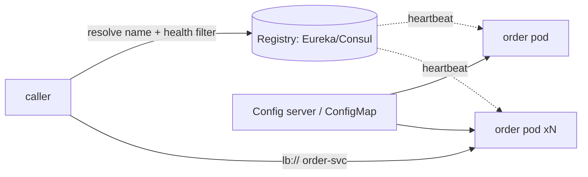

## Why it Matters

Hardcoded addresses break the first time autoscaling moves a pod; config baked into images makes a timeout change a full release pipeline. Discovery and externalised config are what let a fleet change shape and tune itself without redeploys, and on Kubernetes much of it is already built in, so the decision is often "don't build a second one."

## Diagram



## Code

```java
// Option A: Spring Cloud (non-K8s / hybrid)
@EnableDiscoveryClient
@SpringBootApplication
public class OrderServiceApp { public static void main(String[] a) { SpringApplication.run(OrderServiceApp.class, a); } }
// client call by logical name — load-balanced, health-filtered
@HttpExchange("http://inventory-service/api/inventory")
public interface InventoryClient { @GetExchange("/{sku}") Availability check(@PathVariable String sku); }

## When to use / NOT

- > 3 services, autoscaling, or multi-zone deploys where IPs churn.
- Per-env tuning (timeouts, feature flags, secrets rotation) without rebuilds.

**When NOT:** K8s-native small fleet — kube-dns + Services already discover; adding Eureka/Consul on top is redundant complexity.

## Trade-offs

| Pros | Cons |
|---|---|
| No hardcoded URLs; scaling just works | Registry is a critical path — must be HA (3 nodes) |
| Env parity via one config source | Stale cache/heartbeat delay can route to dead pods |
| Health-gated traffic reduces 5xx | Two discovery systems (Eureka + K8s) = confusion |

## Vs

- **Vs hardcoded URLs / static LB:** static breaks the moment autoscaling moves instances; registry tracks churn.
- **Vs Eureka-on-K8s:** on K8s, Services + readiness probes already do discovery + health — Eureka adds a second source of truth.

## Pitfalls

- Eureka + K8s both active — split-brain routing.
- Secrets in ConfigMap or git — use Vault / External Secrets Operator.
- No readiness probe → traffic to warming pods → cascading timeouts.

## Interview Q&A

**Q: Eureka vs Consul vs K8s Services?**
A: Eureka = Java-centric AP registry; Consul = multi-DC + KV + health; K8s Services = native discovery with kube-dns — on K8s prefer native, off-K8s pick Consul for heterogeneity.

**Q: How do config changes roll out safely?**
A: Versioned config source + rolling restart (new ReplicaSet) + readiness gates; never mutate running pods; refresh scope only for non-structural flags.

**Q: What happens when the registry dies?**
A: Clients use cached entries + retry with backoff; registry runs as 3-node cluster; K8s path keeps working via kube-dns regardless.

## Related

- [[05_Decomposition-Bounded-Context|Decomposition]] · [[04_API-Gateway-BFF|Gateway-BFF]] · [[../../08_NonFunctional-Ops/05_Cloud-K8s-Deploy-Helm|K8s-Deploy]] · [[Architect/07_Integration-APIs/Gateway and Service Mesh.md|Gateway-Mesh]]

# Discovery, Config & Registry

> **Intent:** Let services find each other and reconfigure without redeploys — registry for live addresses, centralized config for environment differences, health-gated routing so dead instances get no traffic.
> Watch: [Concept && Coding — Service Discovery (Eureka + Spring Boot)](https://www.youtube.com/watch?v=h1mrflwF6Lc)

# bootstrap: spring.config.import=optional:configserver:http://config:8888 (central yml, refresh via /actuator/refresh or bus)

```
```yaml
# Option b: K8s-native, Skip Eureka, use Service + ConfigMap/Secret

# Discovery: Http://inventory-service:8080 (Kube-dns), Health Gates via ReadinessProbe

readinessProbe: { httpGet: { path: /actuator/health/readiness, port: 8080 }, periodSeconds: 10 }
envFrom: [{ configMapRef: { name: order-config } }, { secretRef: { name: order-secrets } }]
```
Rule: secrets in Vault/External-Secrets, never in ConfigMap/git; config changes roll via new ReplicaSet, not SSH edits.
