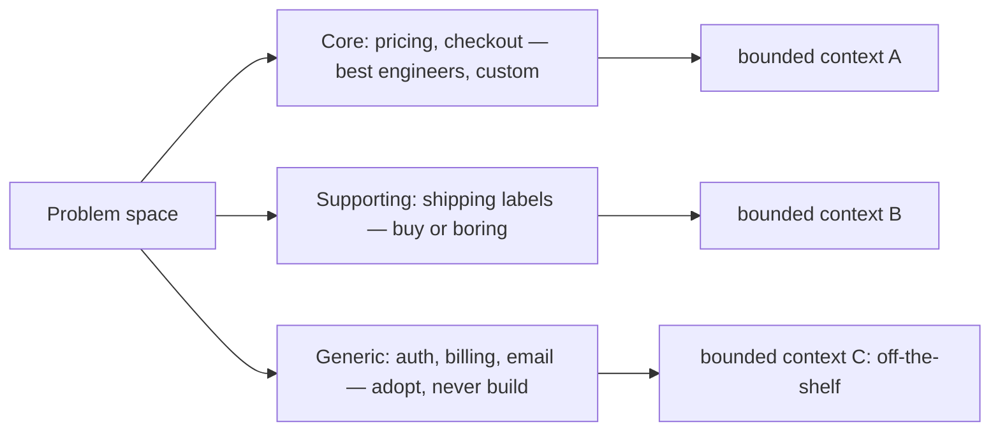

## Why it Matters

Before any technical decision, you have to know which part of the system is actually the business. Strategic DDD turns that into a concrete deliverable: a subdomain map that says where custom code buys competitive advantage and where it just burns calendar time. Get it wrong and your best engineers spend a year building auth; get it right and architecture effort flows to the core.

## Problems
### System Design Problem: Strategic DDD

**Requirements:**
- Functional: Core capabilities for strategic ddd
- Non-functional (SLOs): Latency < 100ms p99, Availability 99.9%, Horizontal scalability

**Constraints:**
- Scale: Handle 10x growth without redesign
- Consistency: Appropriate model for domain (strong/eventual)
- Latency budget: p99 < 100ms for read paths

**API / Interfaces:**
- Primary: REST/gRPC endpoints for core operations
- Internal: Service-to-service contracts
- Events: Domain events for async integration

## Diagram



## Code

```java
// Subdomain triage visible in the repository layout — structure follows value
package com.shop.pricing; // CORE : custom rules, best engineers, own model
package com.shop.shipping; // SUPPORTING: thin adapter over a carrier API
package com.shop.auth; // GENERIC : off-the-shelf Keycloak, don't build

// Ubiquitous language made executable — a domain rule, not a comment:
// "A shipped Order cannot be cancelled."
sealed interface OrderStatus permits Placed, Paid, Shipped, Cancelled {}
final class Order {
 private final OrderStatus status;
 Order cancel() {
 return switch (status) {
 case Shipped -> throw new DomainException("shipped orders cannot be cancelled");
 default -> new Order(id, items, Cancelled);
 };
 }
}
record Order(long id, List<Line> items, OrderStatus status) {}
```

## When to use / not

- Any system where misunderstood requirements cost more than code, i.e. most backend systems.
- Precedes every other decision here: no strategic map → [[02_Bounded-Contexts]] and [[03_Microservices|service splits]] are guesses.
- Revisit when language diverges ("order" means 3 things in standup), that's a missing boundary.

**Triage:** Core (differentiator, best engineers, custom code) · Supporting (necessary, buy-or-boring) · Generic (commodity, adopt, don't build: auth, billing, email).


## Trade-offs
| Dimension | This Approach | Alternative | Trade-off Rationale | Decision Rule |
|-----------|---------------|-------------|---------------------|---------------|
| Complexity | [TBD] | [TBD] | [TBD] | [TBD] |
| Operational Burden | [TBD] | [TBD] | [TBD] | [TBD] |
| Latency | [TBD] | [TBD] | [TBD] | [TBD] |
| Consistency | [TBD] | [TBD] | [TBD] | [TBD] |
| Cost at Scale | [TBD] | [TBD] | [TBD] | [TBD] |

## Vs

- **Vs data-first modelling:** data-first asks "what tables?"; strategic DDD asks "what business capabilities, and which matter?" Tables follow contexts, not vice versa.
- **Vs [[03_Architecture-Styles/06_Monolith-vs-Modular-Choice-Guide|tech-first splits]]:** split by subdomain value, not by class count.

## Pitfalls

- Ubiquitous language that only devs speak, experts must use (and correct) it.
- One shared "Order" object across contexts, see [[02_Bounded-Contexts]].
- Treating generic subdomains as interesting work (build auth yourself = delay).


## Pitfalls
1. Underestimating operational complexity (backups, monitoring, upgrades)
2. Ignoring failure modes (network partitions, disk failures, clock drift)
3. Not planning for 10x scale from day one
4. Skipping monitoring/alerting in MVP
5. Premature optimization before measuring
6. Dual-write without transactional outbox
7. Assuming global order in partitioned systems

## Interview q&a

**Q: How do you find subdomains?**
A: Event Storming + capability mapping with domain experts; cluster events that change together; confirm with change-frequency and language divergence.

**Q: What marks a core domain?**
A: Competitive edge + complex rules + high change rate. If you'd demo it to win a customer, it's core.


## Flashcards (Spaced Repetition)

#flashcard
**Q:** What is the core concept of Strategic DDD? :: **A:** [Key algorithm/architecture pattern] #flashcard

#flashcard
**Q:** When do you apply Strategic DDD? :: **A:** [Trigger scenarios and context] #flashcard

#flashcard
**Q:** What is the primary trade-off in Strategic DDD? :: **A:** [Main tension: e.g., consistency vs latency] #flashcard

#flashcard
**Q:** What breaks first at scale in Strategic DDD? :: **A:** [Primary bottleneck: e.g., coordination, hot keys, replication lag] #flashcard

#flashcard
**Q:** How do you handle failures in Strategic DDD? :: **A:** [Retry, circuit breaker, fallback, graceful degradation] #flashcard

#flashcard
**Q:** What are the key metrics to monitor for Strategic DDD? :: **A:** [RED: rate, errors, duration; USE: utilization, saturation, errors] #flashcard

#flashcard
**Q:** How does Strategic DDD scale to 10x? :: **A:** [Sharding, read replicas, async processing, caching layers] #flashcard

#flashcard
**Q:** What is the consistency model for Strategic DDD? :: **A:** [Strong/eventual/causal - justify with use case] #flashcard

#flashcard
**Q:** How do you test Strategic DDD? :: **A:** [Contract tests, chaos engineering, load tests, fault injection] #flashcard

#flashcard
**Q:** What is the operational cost of Strategic DDD? :: **A:** [Team expertise, tooling, on-call burden, migration risk] #flashcard

#flashcard
**Q:** When would you NOT use Strategic DDD? :: **A:** [Managed service covers need, simple CRUD, team lacks maturity] #flashcard

#flashcard
**Q:** What is the key design decision in Strategic DDD? :: **A:** [The irreversible choice that defines the architecture] #flashcard

#flashcard
**Q:** How do you migrate to Strategic DDD? :: **A:** [Strangler fig, dual-write, canary, feature flags] #flashcard

#flashcard
**Q:** What security considerations for Strategic DDD? :: **A:** [AuthZ, encryption, audit, secrets management] #flashcard

#flashcard
**Q:** How do you debug Strategic DDD in production? :: **A:** [Structured logging, correlation IDs, distributed tracing, SLO alerts] #flashcard


## Practice Tasks (Tasks Plugin)
- [ ] Explain the architecture from memory 📅 {{date:YYYY-MM-DD, +1}}
- [ ] Draw the system diagram without looking 📅 {{date:YYYY-MM-DD, +3}}
- [ ] Answer all Interview Q&A aloud 📅 {{date:YYYY-MM-DD, +7}}
- [ ] Review flashcards (Spaced Repetition) 📅 {{date:YYYY-MM-DD, +1}}

```tasks
not done
path includes Architect/05_DDD-Modeling
sort by due
limit 10
```

## Related

- [[02_Bounded-Contexts]] · [[03_Context-Mapping]] · [[04_Tactical-Aggregates-Entities-VO]]

# Strategic ddd

> **Intent:** Model the *business*, not the database: carve the problem space into subdomains, speak one ubiquitous language per context, and invest architecture effort where competitive advantage lives (core) while containing the rest (supporting/generic).
> Watch: [Domain Driven Design: What You Need To Know](https://www.youtube.com/watch?v=4rhzdZIDX_k)

## 2. Spring Example (Language → Code)

```java
// Ubiquitous language made executable: "an Order is placed with items,
// then paid, then shipped; a shipped Order cannot be cancelled."
class Order {
 void cancel() {
 if (status == SHIPPED) throw new DomainException("shipped orders cannot be cancelled");
 status = CANCELLED;
 register(new OrderCancelled(id)); // → [[05_Domain-Events]]
 }
}
// Subdomain triage visible in repo layout:
// com.shop.pricing (core, custom) vs com.shop.notification (supporting, thin) vs auth (generic, off-shelf)
```
Event Storming (the workshop): orange stickies = domain events, blue = commands, yellow = aggregates, walk the business flow before drawing boxes.
