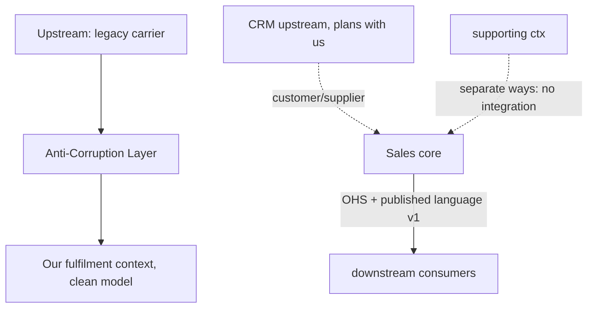

## Why it Matters

Every integration has a power dynamic, and unspoken ones are the expensive ones: "we just call their API" is conformist acceptance of someone else's model, and you find out when it breaks you. Naming the relationship, ACL, open-host service, conformist, separate ways, makes who adapts, who versions and who pays for translation an explicit, reviewable design decision.

## Diagram



## Code

```java
// Downstream (our context) defines what IT needs — the ACL translates:
interface CarrierRates { Money quote(Address to, Weight w); } // our language (port)
// Adapter: legacy carrier SOAP/XML → our Money/Weight, isolating the mess
@Component class LegacyCarrierAcl implements CarrierRates {
 public Money quote(Address a, Weight w) {
 var xml = soapClient.getRate(toLegacy(a), w.kg()); // alien model stays HERE
 return Money.of(parse(xml), "USD");
 }
}
// Upstream OHS: versioned events others consume
// topic: fulfilment.shipped.v1 { orderId, carrier, trackingId } — Schema Registry enforced
```
Map direction matters: draw arrows upstream→downstream; the downstream always pays the translation cost somewhere, choose *where* (ACL) deliberately.

## When to use / not

Map the top patterns:
| Relationship | Use when |
|---|---|
| Partnership | Two core contexts co-evolve, joint planning possible |
| Customer/Supplier (C/S) | Upstream plans with downstream needs in mind |
| Conformist | Upstream won't adapt, downstream accepts its model (be honest about it) |
| Anti-Corruption Layer (ACL) | Upstream model is legacy/alien, translate at the boundary |
| Open Host + Published Language (OHS/PL) | Many downstreams, stable API + documented event schema |
| Separate Ways | No real relationship, don't integrate (duplicate tiny bits instead) |

## Trade-offs

| Pros | Cons |
|---|---|
| Integration politics made discussable in design reviews | Map rots, needs re-validation per quarter |
| ACL contains legacy corruption to one class | ACL/OHS are code to maintain (translation tax) |
| OHS/PL scales to many consumers | Over-formalising trivial integrations wastes time |

## Vs

- **Vs "just call their API":** that IS conformist, the map forces you to admit it and budget for upstream breakage (contract tests, ACL).
- **Vs [[03_Architecture-Styles/04_Event-Driven-Architecture|events everywhere]]:** events are the *mechanism*; the map decides the *relationship* (who adapts, who versions, who translates).

## Pitfalls

- Conformist by accident ("their API is fine") then surprise breakage, at least add contract tests.
- ACL leaking upstream types (`LegacyXmlRate` in your domain), translate fully at the edge.
- Partnership declared without joint planning, it's C/S or Conformist; label honestly.

## Interview q&a

**Q: When is an ACL mandatory?**
A: Integrating legacy, vendor, or a context whose model would corrupt yours (different invariants, tech, release cadence). Cost of translation < cost of corruption.

**Q: How do you keep OHS stable?**
A: Additive-only event evolution, Schema Registry compatibility checks (BACKWARD), versioned topics, consumer-driven contract tests.

## Related

- [[02_Bounded-Contexts]] · [[05_Domain-Events]] · [[04_Design-Patterns-Building-Blocks/04_API-Gateway-BFF|Gateway/BFF]]

# Context Mapping

> **Intent:** Name the relationship between every pair of contexts (Partnership, Customer/Supplier, Conformist, Anti-Corruption Layer, Open Host, Published Language, Separate Ways) so integration choices are explicit, owned, and match the real power dynamics.
