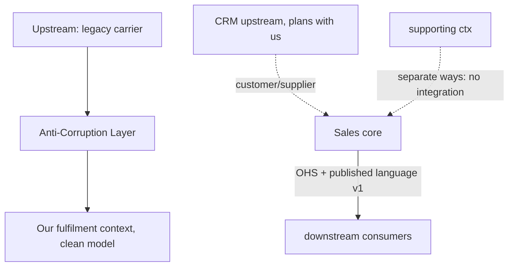

## Why it Matters

Every integration has a power dynamic, and unspoken ones are the expensive ones: "we just call their API" is conformist acceptance of someone else's model, and you find out when it breaks you. Naming the relationship, ACL, open-host service, conformist, separate ways, makes who adapts, who versions and who pays for translation an explicit, reviewable design decision.

## Problems
### System Design Problem: Context Mapping

**Requirements:**
- Functional: Core capabilities for context mapping
- Non-functional (SLOs): Latency < 100ms p99, Availability 99.9%, Horizontal scalability

**Constraints:**
- Scale: Handle 10x growth without redesign
- Consistency: Appropriate model for domain (strong/eventual)
- Latency budget: p99 < 100ms for read paths

**API / Interfaces:**
- Primary: REST/gRPC endpoints for core operations
- Internal: Service-to-service contracts
- Events: Domain events for async integration

## Diagram



## Code

```java
// Downstream (our context) defines what IT needs — the ACL translates:
interface CarrierRates { Money quote(Address to, Weight w); } // our language (port)
// Adapter: legacy carrier SOAP/XML → our Money/Weight, isolating the mess
@Component class LegacyCarrierAcl implements CarrierRates {
 public Money quote(Address a, Weight w) {
 var xml = soapClient.getRate(toLegacy(a), w.kg()); // alien model stays HERE
 return Money.of(parse(xml), "USD");
 }
}
// Upstream OHS: versioned events others consume
// topic: fulfilment.shipped.v1 { orderId, carrier, trackingId } — Schema Registry enforced
```
Map direction matters: draw arrows upstream→downstream; the downstream always pays the translation cost somewhere, choose *where* (ACL) deliberately.

## When to use / not

Map the top patterns:
| Relationship | Use when |
|---|---|
| Partnership | Two core contexts co-evolve, joint planning possible |
| Customer/Supplier (C/S) | Upstream plans with downstream needs in mind |
| Conformist | Upstream won't adapt, downstream accepts its model (be honest about it) |
| Anti-Corruption Layer (ACL) | Upstream model is legacy/alien, translate at the boundary |
| Open Host + Published Language (OHS/PL) | Many downstreams, stable API + documented event schema |
| Separate Ways | No real relationship, don't integrate (duplicate tiny bits instead) |


## Trade-offs
| Dimension | This Approach | Alternative | Trade-off Rationale | Decision Rule |
|-----------|---------------|-------------|---------------------|---------------|
| Complexity | [TBD] | [TBD] | [TBD] | [TBD] |
| Operational Burden | [TBD] | [TBD] | [TBD] | [TBD] |
| Latency | [TBD] | [TBD] | [TBD] | [TBD] |
| Consistency | [TBD] | [TBD] | [TBD] | [TBD] |
| Cost at Scale | [TBD] | [TBD] | [TBD] | [TBD] |

## Vs

- **Vs "just call their API":** that IS conformist, the map forces you to admit it and budget for upstream breakage (contract tests, ACL).
- **Vs [[03_Architecture-Styles/04_Event-Driven-Architecture|events everywhere]]:** events are the *mechanism*; the map decides the *relationship* (who adapts, who versions, who translates).

## Pitfalls

- Conformist by accident ("their API is fine") then surprise breakage, at least add contract tests.
- ACL leaking upstream types (`LegacyXmlRate` in your domain), translate fully at the edge.
- Partnership declared without joint planning, it's C/S or Conformist; label honestly.


## Pitfalls
1. Underestimating operational complexity (backups, monitoring, upgrades)
2. Ignoring failure modes (network partitions, disk failures, clock drift)
3. Not planning for 10x scale from day one
4. Skipping monitoring/alerting in MVP
5. Premature optimization before measuring
6. Dual-write without transactional outbox
7. Assuming global order in partitioned systems

## Interview q&a

**Q: When is an ACL mandatory?**
A: Integrating legacy, vendor, or a context whose model would corrupt yours (different invariants, tech, release cadence). Cost of translation < cost of corruption.

**Q: How do you keep OHS stable?**
A: Additive-only event evolution, Schema Registry compatibility checks (BACKWARD), versioned topics, consumer-driven contract tests.


## Flashcards (Spaced Repetition)

#flashcard
**Q:** What is the core concept of Context Mapping? :: **A:** [Key algorithm/architecture pattern] #flashcard

#flashcard
**Q:** When do you apply Context Mapping? :: **A:** [Trigger scenarios and context] #flashcard

#flashcard
**Q:** What is the primary trade-off in Context Mapping? :: **A:** [Main tension: e.g., consistency vs latency] #flashcard

#flashcard
**Q:** What breaks first at scale in Context Mapping? :: **A:** [Primary bottleneck: e.g., coordination, hot keys, replication lag] #flashcard

#flashcard
**Q:** How do you handle failures in Context Mapping? :: **A:** [Retry, circuit breaker, fallback, graceful degradation] #flashcard

#flashcard
**Q:** What are the key metrics to monitor for Context Mapping? :: **A:** [RED: rate, errors, duration; USE: utilization, saturation, errors] #flashcard

#flashcard
**Q:** How does Context Mapping scale to 10x? :: **A:** [Sharding, read replicas, async processing, caching layers] #flashcard

#flashcard
**Q:** What is the consistency model for Context Mapping? :: **A:** [Strong/eventual/causal - justify with use case] #flashcard

#flashcard
**Q:** How do you test Context Mapping? :: **A:** [Contract tests, chaos engineering, load tests, fault injection] #flashcard

#flashcard
**Q:** What is the operational cost of Context Mapping? :: **A:** [Team expertise, tooling, on-call burden, migration risk] #flashcard

#flashcard
**Q:** When would you NOT use Context Mapping? :: **A:** [Managed service covers need, simple CRUD, team lacks maturity] #flashcard

#flashcard
**Q:** What is the key design decision in Context Mapping? :: **A:** [The irreversible choice that defines the architecture] #flashcard

#flashcard
**Q:** How do you migrate to Context Mapping? :: **A:** [Strangler fig, dual-write, canary, feature flags] #flashcard

#flashcard
**Q:** What security considerations for Context Mapping? :: **A:** [AuthZ, encryption, audit, secrets management] #flashcard

#flashcard
**Q:** How do you debug Context Mapping in production? :: **A:** [Structured logging, correlation IDs, distributed tracing, SLO alerts] #flashcard


## Practice Tasks (Tasks Plugin)
- [ ] Explain the architecture from memory 📅 {{date:YYYY-MM-DD, +1}}
- [ ] Draw the system diagram without looking 📅 {{date:YYYY-MM-DD, +3}}
- [ ] Answer all Interview Q&A aloud 📅 {{date:YYYY-MM-DD, +7}}
- [ ] Review flashcards (Spaced Repetition) 📅 {{date:YYYY-MM-DD, +1}}

```tasks
not done
path includes Architect/05_DDD-Modeling
sort by due
limit 10
```

## Related

- [[02_Bounded-Contexts]] · [[05_Domain-Events]] · [[04_Design-Patterns-Building-Blocks/04_API-Gateway-BFF|Gateway/BFF]]

# Context Mapping

> **Intent:** Name the relationship between every pair of contexts (Partnership, Customer/Supplier, Conformist, Anti-Corruption Layer, Open Host, Published Language, Separate Ways) so integration choices are explicit, owned, and match the real power dynamics.
