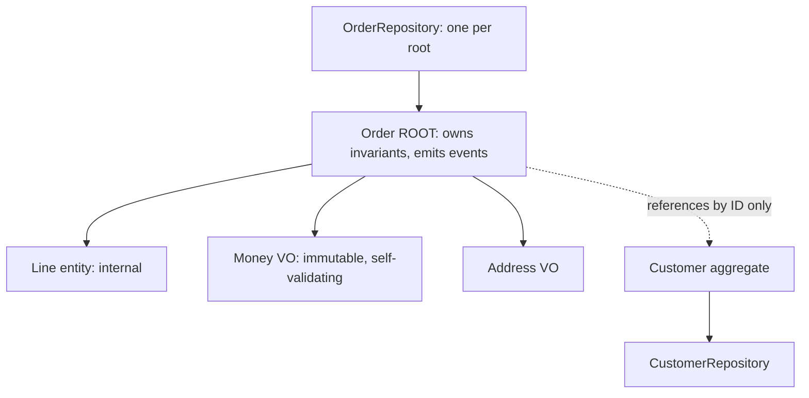

## Why it Matters

Aggregates are where correctness becomes a design property instead of a hope: the boundary defines what a transaction must cover, the root is the only door in, and value objects make invalid states unrepresentable. Size them by invariant, not by object graph, small aggregates keep locks, deadlocks and latency manageable and let contexts split later.

## Diagram



## Code

```java
// VALUE OBJECT — immutable, no identity, self-validating
record Money(BigDecimal amount, String currency) {
 Money { if (amount.signum() < 0) throw new DomainException("negative money"); }
 Money add(Money o) { /* same-currency check */ return new Money(amount.add(o.amount), currency); }
}
// AGGREGATE ROOT — owns invariants + emits events
class Order {
 private final List<Line> lines = new ArrayList<>(); // internal entities
 private Status status;
 static Order place(List<Line> items) { /* min-1-item, max-quantity rules */ }
 void pay(Payment p) { if (status != PLACED) throw ...; status = PAID; register(new OrderPaid(id)); }
 // No setters; behaviour methods only
}
// REPOSITORY per aggregate root ONLY (Spring Data)
interface OrderRepository extends JpaRepository<Order, Long> {}
// Customer referenced by ID: private Long customerId; — never @ManyToOne across aggregates
```
JPA mapping: root = `@Entity`, internal entities = `@ElementCollection`/`@OneToMany(cascade=ALL, orphanRemoval)`, VOs = `@Embeddable`.

## When to use / not

- Rule 1: **one aggregate = one transaction**. If two things must change atomically, they belong in one aggregate; if they change independently, split them.
- Rule 2: reference other aggregates **by ID only** (keeps transactions small, enables distribution).
- Rule 3: all external access goes through the **aggregate root**.

## Trade-offs

| Pros | Cons |
|---|---|
| Invariants compile into the model (can't represent invalid states) | JPA fights DDD (lazy loading, identity map), map deliberately |
| Small transactions → fewer deadlocks, easier distribution | Large-cluster aggregates (Order+everything) kill performance |
| Clear repository-per-root rule | Behaviour-rich modelling is slower than getters/setters habits |

## Vs

- **Vs anemic CRUD entities:** anemic = data + service-layer rules (rules scatter); rich aggregates = rules live with data (rules co-locate).
- **Vs [[06_Data-Architecture/03_Event-Sourcing-CQRS|event-sourced aggregates]]:** same boundary thinking; state-stored vs event-stored persistence differs.

## Pitfalls

- Giant aggregates (whole graph in one transaction) → contention + LazyInitializationException.
- Setters on the root ("for JPA/Hibernate"), use field access + protected no-arg constructor.
- Business logic in `@Entity` lifecycle callbacks, keep JPA annotations dumb, logic explicit.

## Interview q&a

**Q: How big should an aggregate be?**
A: As small as invariants allow. "Modify one aggregate per transaction", design to make that true, use eventual consistency (events) between aggregates.

**Q: Entity vs Value Object?**
A: Does it need a stable identity across changes (Order, Customer → entity) or is it fully described by attributes (Money, Address → VO)? When in doubt, VO, immutability is cheaper.

**Q: How do aggregates communicate?**
A: Domain events + IDs, never direct object references or shared transactions.

## Related

- [[01_Strategic-DDD]] · [[02_Bounded-Contexts]] · [[05_Domain-Events]] · [[04_Design-Patterns-Building-Blocks/01_Enterprise-Patterns|Enterprise Patterns]]

# Tactical DDD, Aggregates, Entities, Value Objects

> **Intent:** Model consistency boundaries in code: **Aggregates** (transactional consistency unit, one root), **Entities** (identity-tracked, mutable lifecycle), **Value Objects** (immutable, interchangeable by value), so invariants are enforced, not hoped for.
