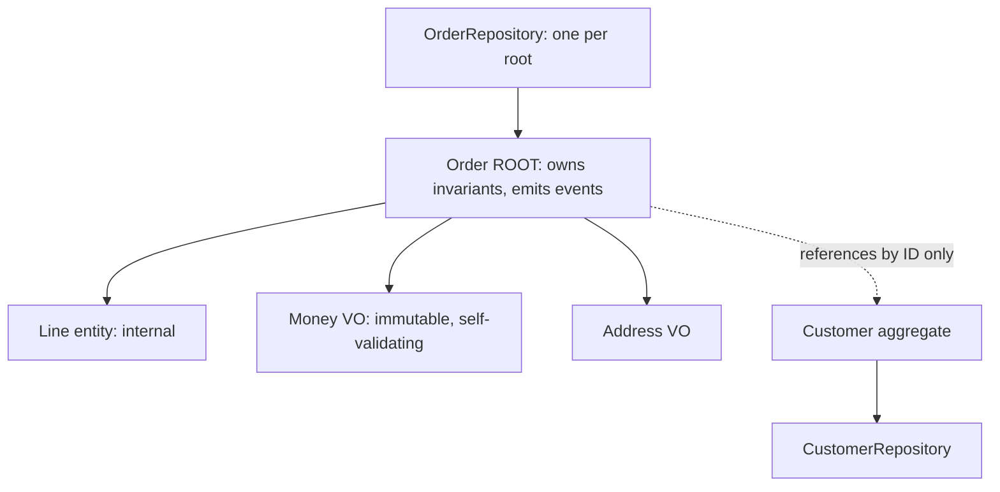

## Why it Matters

Aggregates are where correctness becomes a design property instead of a hope: the boundary defines what a transaction must cover, the root is the only door in, and value objects make invalid states unrepresentable. Size them by invariant, not by object graph, small aggregates keep locks, deadlocks and latency manageable and let contexts split later.

## Problems
### System Design Problem: Tactical DDD, Aggregates, Entities, Value Objects

**Requirements:**
- Functional: Core capabilities for tactical ddd, aggregates, entities, value objects
- Non-functional (SLOs): Latency < 100ms p99, Availability 99.9%, Horizontal scalability

**Constraints:**
- Scale: Handle 10x growth without redesign
- Consistency: Appropriate model for domain (strong/eventual)
- Latency budget: p99 < 100ms for read paths

**API / Interfaces:**
- Primary: REST/gRPC endpoints for core operations
- Internal: Service-to-service contracts
- Events: Domain events for async integration

## Diagram



## Code

```java
// VALUE OBJECT — immutable, no identity, self-validating
record Money(BigDecimal amount, String currency) {
 Money { if (amount.signum() < 0) throw new DomainException("negative money"); }
 Money add(Money o) { /* same-currency check */ return new Money(amount.add(o.amount), currency); }
}
// AGGREGATE ROOT — owns invariants + emits events
class Order {
 private final List<Line> lines = new ArrayList<>(); // internal entities
 private Status status;
 static Order place(List<Line> items) { /* min-1-item, max-quantity rules */ }
 void pay(Payment p) { if (status != PLACED) throw ...; status = PAID; register(new OrderPaid(id)); }
 // No setters; behaviour methods only
}
// REPOSITORY per aggregate root ONLY (Spring Data)
interface OrderRepository extends JpaRepository<Order, Long> {}
// Customer referenced by ID: private Long customerId; — never @ManyToOne across aggregates
```
JPA mapping: root = `@Entity`, internal entities = `@ElementCollection`/`@OneToMany(cascade=ALL, orphanRemoval)`, VOs = `@Embeddable`.

## When to use / not

- Rule 1: **one aggregate = one transaction**. If two things must change atomically, they belong in one aggregate; if they change independently, split them.
- Rule 2: reference other aggregates **by ID only** (keeps transactions small, enables distribution).
- Rule 3: all external access goes through the **aggregate root**.


## Trade-offs
| Dimension | This Approach | Alternative | Trade-off Rationale | Decision Rule |
|-----------|---------------|-------------|---------------------|---------------|
| Complexity | [TBD] | [TBD] | [TBD] | [TBD] |
| Operational Burden | [TBD] | [TBD] | [TBD] | [TBD] |
| Latency | [TBD] | [TBD] | [TBD] | [TBD] |
| Consistency | [TBD] | [TBD] | [TBD] | [TBD] |
| Cost at Scale | [TBD] | [TBD] | [TBD] | [TBD] |

## Vs

- **Vs anemic CRUD entities:** anemic = data + service-layer rules (rules scatter); rich aggregates = rules live with data (rules co-locate).
- **Vs [[06_Data-Architecture/03_Event-Sourcing-CQRS|event-sourced aggregates]]:** same boundary thinking; state-stored vs event-stored persistence differs.

## Pitfalls

- Giant aggregates (whole graph in one transaction) → contention + LazyInitializationException.
- Setters on the root ("for JPA/Hibernate"), use field access + protected no-arg constructor.
- Business logic in `@Entity` lifecycle callbacks, keep JPA annotations dumb, logic explicit.


## Pitfalls
1. Underestimating operational complexity (backups, monitoring, upgrades)
2. Ignoring failure modes (network partitions, disk failures, clock drift)
3. Not planning for 10x scale from day one
4. Skipping monitoring/alerting in MVP
5. Premature optimization before measuring
6. Dual-write without transactional outbox
7. Assuming global order in partitioned systems

## Interview q&a

**Q: How big should an aggregate be?**
A: As small as invariants allow. "Modify one aggregate per transaction", design to make that true, use eventual consistency (events) between aggregates.

**Q: Entity vs Value Object?**
A: Does it need a stable identity across changes (Order, Customer → entity) or is it fully described by attributes (Money, Address → VO)? When in doubt, VO, immutability is cheaper.

**Q: How do aggregates communicate?**
A: Domain events + IDs, never direct object references or shared transactions.


## Flashcards (Spaced Repetition)

#flashcard
**Q:** What is the core concept of Tactical DDD, Aggregates, Entities, Value Objects? :: **A:** [Key algorithm/architecture pattern] #flashcard

#flashcard
**Q:** When do you apply Tactical DDD, Aggregates, Entities, Value Objects? :: **A:** [Trigger scenarios and context] #flashcard

#flashcard
**Q:** What is the primary trade-off in Tactical DDD, Aggregates, Entities, Value Objects? :: **A:** [Main tension: e.g., consistency vs latency] #flashcard

#flashcard
**Q:** What breaks first at scale in Tactical DDD, Aggregates, Entities, Value Objects? :: **A:** [Primary bottleneck: e.g., coordination, hot keys, replication lag] #flashcard

#flashcard
**Q:** How do you handle failures in Tactical DDD, Aggregates, Entities, Value Objects? :: **A:** [Retry, circuit breaker, fallback, graceful degradation] #flashcard

#flashcard
**Q:** What are the key metrics to monitor for Tactical DDD, Aggregates, Entities, Value Objects? :: **A:** [RED: rate, errors, duration; USE: utilization, saturation, errors] #flashcard

#flashcard
**Q:** How does Tactical DDD, Aggregates, Entities, Value Objects scale to 10x? :: **A:** [Sharding, read replicas, async processing, caching layers] #flashcard

#flashcard
**Q:** What is the consistency model for Tactical DDD, Aggregates, Entities, Value Objects? :: **A:** [Strong/eventual/causal - justify with use case] #flashcard

#flashcard
**Q:** How do you test Tactical DDD, Aggregates, Entities, Value Objects? :: **A:** [Contract tests, chaos engineering, load tests, fault injection] #flashcard

#flashcard
**Q:** What is the operational cost of Tactical DDD, Aggregates, Entities, Value Objects? :: **A:** [Team expertise, tooling, on-call burden, migration risk] #flashcard

#flashcard
**Q:** When would you NOT use Tactical DDD, Aggregates, Entities, Value Objects? :: **A:** [Managed service covers need, simple CRUD, team lacks maturity] #flashcard

#flashcard
**Q:** What is the key design decision in Tactical DDD, Aggregates, Entities, Value Objects? :: **A:** [The irreversible choice that defines the architecture] #flashcard

#flashcard
**Q:** How do you migrate to Tactical DDD, Aggregates, Entities, Value Objects? :: **A:** [Strangler fig, dual-write, canary, feature flags] #flashcard

#flashcard
**Q:** What security considerations for Tactical DDD, Aggregates, Entities, Value Objects? :: **A:** [AuthZ, encryption, audit, secrets management] #flashcard

#flashcard
**Q:** How do you debug Tactical DDD, Aggregates, Entities, Value Objects in production? :: **A:** [Structured logging, correlation IDs, distributed tracing, SLO alerts] #flashcard


## Practice Tasks (Tasks Plugin)
- [ ] Explain the architecture from memory 📅 {{date:YYYY-MM-DD, +1}}
- [ ] Draw the system diagram without looking 📅 {{date:YYYY-MM-DD, +3}}
- [ ] Answer all Interview Q&A aloud 📅 {{date:YYYY-MM-DD, +7}}
- [ ] Review flashcards (Spaced Repetition) 📅 {{date:YYYY-MM-DD, +1}}

```tasks
not done
path includes Architect/05_DDD-Modeling
sort by due
limit 10
```

## Related

- [[01_Strategic-DDD]] · [[02_Bounded-Contexts]] · [[05_Domain-Events]] · [[04_Design-Patterns-Building-Blocks/01_Enterprise-Patterns|Enterprise Patterns]]

# Tactical DDD, Aggregates, Entities, Value Objects

> **Intent:** Model consistency boundaries in code: **Aggregates** (transactional consistency unit, one root), **Entities** (identity-tracked, mutable lifecycle), **Value Objects** (immutable, interchangeable by value), so invariants are enforced, not hoped for.
