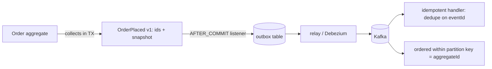

## Why it Matters

Without events, every cross-aggregate side effect becomes a cross-service call or a shared transaction, and the model bloats with other people's concerns. Raising a fact after commit keeps the aggregate focused and turns integration into a subscribable seam, but only if the event is versioned from day one and dispatch survives a broker outage, which is what the outbox is for.

## Diagram



## Code

```java
// 1. Aggregate raises (in-memory list, cleared on dispatch)
class Order {
 private final List<Object> events = new ArrayList<>();
 public static Order place(...) { var o = new Order(...); o.events.add(new OrderPlaced(o.id, o.total)); return o; }
}
// 2. Persist + dispatch AFTER commit — @TransactionalEventListener(AFTER_COMMIT)
@Service class OrderService {
 @Transactional public void place(Cmd c) { repo.save(Order.place(c.items())); /* events flush via listener */ }
}
@Component class Dispatch {
 @TransactionalEventListener(phase = AFTER_COMMIT)
 public void on(OrderPlaced e) { kafka.send("orders.placed.v1", e); } // no ghost events
}
// Production-grade: transactional OUTBOX table + relay poller (Debezium) instead of listener —
// survives broker outages; listener alone loses events when Kafka is down
```

## When to use / not

- Side-effects that must not bloat the aggregate (email, loyalty, analytics on `OrderPlaced`).
- Cross-aggregate/context communication without shared transactions.
- Audit history the business can read ("show me everything that happened to order 42").

Design: past-tense name, immutable, carries IDs + snapshot of decision-relevant data, versioned (`v1`) from day one.

## Trade-offs

| Pros | Cons |
|---|---|
| Aggregates stay focused; reactions pluggable | Eventual consistency reasoning everywhere |
| Perfect seam for [[03_Architecture-Styles/04_Event-Driven-Architecture\|EDA]] + sagas | Schema/version discipline required |
| Business-readable audit trail | Ordering/duplicates: design idempotent handlers |

## Vs

- **Vs application events (generic pub/sub):** domain events use ubiquitous language and are part of the model; infra events (`CacheEvicted`) are plumbing. Don't mix them in one bus unprefixed.
- **Vs [[06_Data-Architecture/03_Event-Sourcing-CQRS|event sourcing]]:** domain events *notify*; sourced events *persist state*. You can publish the former without storing the latter.

## Pitfalls

- Synchronous `@EventListener` doing I/O inside the transaction, blocks commit, widens failure surface.
- Events as commands (`DoFulfilment`), past-tense facts keep producers decoupled from consumer intent.
- Unversioned events, first breaking change without `v1` teaches this painfully.

## Interview q&a

**Q: Raise before or after commit?**
A: Collect during the transaction, dispatch after commit (listener/outbox), dispatch-before-commit creates ghost reactions to rolled-back work.

**Q: Fat or thin events?**
A: Carry what consumers need for decisions (IDs + key snapshot); link, don't embed, volatile data. Version additively.

**Q: How do handlers stay safe?**
A: Idempotent (dedup on event ID), retryable with DLQ, ordered only within a partition key (aggregate ID).

## Related

- [[04_Tactical-Aggregates-Entities-VO]] · [[03_Context-Mapping]] · [[03_Architecture-Styles/04_Event-Driven-Architecture|EDA]]

# Domain Events

> **Intent:** Capture facts the business cares about (`OrderPlaced`, `PaymentFailed`) as first-class objects, raised by aggregates, dispatched after commit, decoupling *what happened* from *what reacts* and forming the backbone of inter-context integration.
