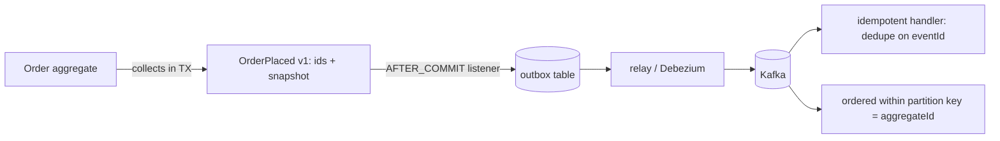

## Why it Matters

Without events, every cross-aggregate side effect becomes a cross-service call or a shared transaction, and the model bloats with other people's concerns. Raising a fact after commit keeps the aggregate focused and turns integration into a subscribable seam, but only if the event is versioned from day one and dispatch survives a broker outage, which is what the outbox is for.

## Problems
### System Design Problem: Domain Events

**Requirements:**
- Functional: Core capabilities for domain events
- Non-functional (SLOs): Latency < 100ms p99, Availability 99.9%, Horizontal scalability

**Constraints:**
- Scale: Handle 10x growth without redesign
- Consistency: Appropriate model for domain (strong/eventual)
- Latency budget: p99 < 100ms for read paths

**API / Interfaces:**
- Primary: REST/gRPC endpoints for core operations
- Internal: Service-to-service contracts
- Events: Domain events for async integration

## Diagram



## Code

```java
// 1. Aggregate raises (in-memory list, cleared on dispatch)
class Order {
 private final List<Object> events = new ArrayList<>();
 public static Order place(...) { var o = new Order(...); o.events.add(new OrderPlaced(o.id, o.total)); return o; }
}
// 2. Persist + dispatch AFTER commit — @TransactionalEventListener(AFTER_COMMIT)
@Service class OrderService {
 @Transactional public void place(Cmd c) { repo.save(Order.place(c.items())); /* events flush via listener */ }
}
@Component class Dispatch {
 @TransactionalEventListener(phase = AFTER_COMMIT)
 public void on(OrderPlaced e) { kafka.send("orders.placed.v1", e); } // no ghost events
}
// Production-grade: transactional OUTBOX table + relay poller (Debezium) instead of listener —
// survives broker outages; listener alone loses events when Kafka is down
```

## When to use / not

- Side-effects that must not bloat the aggregate (email, loyalty, analytics on `OrderPlaced`).
- Cross-aggregate/context communication without shared transactions.
- Audit history the business can read ("show me everything that happened to order 42").

Design: past-tense name, immutable, carries IDs + snapshot of decision-relevant data, versioned (`v1`) from day one.


## Trade-offs
| Dimension | This Approach | Alternative | Trade-off Rationale | Decision Rule |
|-----------|---------------|-------------|---------------------|---------------|
| Complexity | Not specified | Not specified | Not specified | Not specified |
| Operational Burden | Not specified | Not specified | Not specified | Not specified |
| Latency | Not specified | Not specified | Not specified | Not specified |
| Consistency | Not specified | Not specified | Not specified | Not specified |
| Cost at Scale | Not specified | Not specified | Not specified | Not specified |

## Vs

- **Vs application events (generic pub/sub):** domain events use ubiquitous language and are part of the model; infra events (`CacheEvicted`) are plumbing. Don't mix them in one bus unprefixed.
- **Vs event sourcing:** domain events *notify*; sourced events *persist state*. You can publish the former without storing the latter.

## Pitfalls

- Synchronous `@EventListener` doing I/O inside the transaction, blocks commit, widens failure surface.
- Events as commands (`DoFulfilment`), past-tense facts keep producers decoupled from consumer intent.
- Unversioned events, first breaking change without `v1` teaches this painfully.


## Pitfalls
1. Underestimating operational complexity (backups, monitoring, upgrades)
2. Ignoring failure modes (network partitions, disk failures, clock drift)
3. Not planning for 10x scale from day one
4. Skipping monitoring/alerting in MVP
5. Premature optimization before measuring
6. Dual-write without transactional outbox
7. Assuming global order in partitioned systems

## Interview q&a

**Q: Raise before or after commit?**
A: Collect during the transaction, dispatch after commit (listener/outbox), dispatch-before-commit creates ghost reactions to rolled-back work.

**Q: Fat or thin events?**
A: Carry what consumers need for decisions (IDs + key snapshot); link, don't embed, volatile data. Version additively.

**Q: How do handlers stay safe?**
A: Idempotent (dedup on event ID), retryable with DLQ, ordered only within a partition key (aggregate ID).


## Flashcards (Spaced Repetition)

#flashcard
**Q:** What is the core concept of Domain Events? :: **A:** [Key algorithm/architecture pattern] #flashcard

#flashcard
**Q:** When do you apply Domain Events? :: **A:** [Trigger scenarios and context] #flashcard

#flashcard
**Q:** What is the primary trade-off in Domain Events? :: **A:** [Main tension: e.g., consistency vs latency] #flashcard

#flashcard
**Q:** What breaks first at scale in Domain Events? :: **A:** [Primary bottleneck: e.g., coordination, hot keys, replication lag] #flashcard

#flashcard
**Q:** How do you handle failures in Domain Events? :: **A:** [Retry, circuit breaker, fallback, graceful degradation] #flashcard

#flashcard
**Q:** What are the key metrics to monitor for Domain Events? :: **A:** [RED: rate, errors, duration; USE: utilization, saturation, errors] #flashcard

#flashcard
**Q:** How does Domain Events scale to 10x? :: **A:** [Sharding, read replicas, async processing, caching layers] #flashcard

#flashcard
**Q:** What is the consistency model for Domain Events? :: **A:** [Strong/eventual/causal - justify with use case] #flashcard

#flashcard
**Q:** How do you test Domain Events? :: **A:** [Contract tests, chaos engineering, load tests, fault injection] #flashcard

#flashcard
**Q:** What is the operational cost of Domain Events? :: **A:** [Team expertise, tooling, on-call burden, migration risk] #flashcard

#flashcard
**Q:** When would you NOT use Domain Events? :: **A:** [Managed service covers need, simple CRUD, team lacks maturity] #flashcard

#flashcard
**Q:** What is the key design decision in Domain Events? :: **A:** [The irreversible choice that defines the architecture] #flashcard

#flashcard
**Q:** How do you migrate to Domain Events? :: **A:** [Strangler fig, dual-write, canary, feature flags] #flashcard

#flashcard
**Q:** What security considerations for Domain Events? :: **A:** [AuthZ, encryption, audit, secrets management] #flashcard

#flashcard
**Q:** How do you debug Domain Events in production? :: **A:** [Structured logging, correlation IDs, distributed tracing, SLO alerts] #flashcard


## Practice Tasks (Tasks Plugin)
- [ ] Explain the architecture from memory 📅 {{date:YYYY-MM-DD, +1}}
- [ ] Draw the system diagram without looking 📅 {{date:YYYY-MM-DD, +3}}
- [ ] Answer all Interview Q&A aloud 📅 {{date:YYYY-MM-DD, +7}}
- [ ] Review flashcards (Spaced Repetition) 📅 {{date:YYYY-MM-DD, +1}}

```tasks
not done
path includes Architect/05_DDD-Modeling
sort by due
limit 10
```

## Related

- 04_Tactical-Aggregates-Entities-VO · 03_Context-Mapping · EDA

# Domain Events

> **Intent:** Capture facts the business cares about (`OrderPlaced`, `PaymentFailed`) as first-class objects, raised by aggregates, dispatched after commit, decoupling *what happened* from *what reacts* and forming the backbone of inter-context integration.
