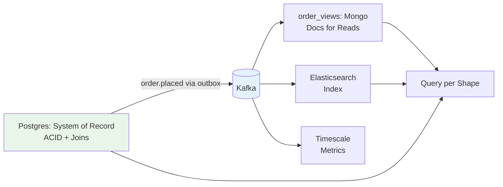

## 🎯 Intent
Choose the store by access pattern and consistency needs — relational for structured data with joins/invariants, document/key-value/column/graph where shape, scale, or query demands it — defaulting to Postgres until a concrete force pushes elsewhere.

## 💡 Why It Matters
- **Interview signal**: "When would you NOT use Postgres?" and "How do you keep polyglot stores consistent?" — defaulting to familiar store fights the workload; defaulting to fashionable one reimplements joins in app code
- **Polyglot reality**: One system of record per context (usually Postgres) + purpose-built derived stores fed by events covers most systems
- **Operational cost**: Each new store = new backup, monitoring, upgrade, skill set; force the choice to be earned

## 🧩 Diagram: Polyglot Data Architecture


## 💻 Code: Postgres-First + Derived Stores (Java 25 + Spring Data)
```java
// System of record: JPA + Postgres
@Entity class Order {
    @Id Long id;
    @Embedded Money total;
    @Enumerated Status status;
}

// Adjacent document read-model fed by OrderPlaced events (Spring Data Mongo)
@Document("order_views")
record OrderView(@Id String orderId, String status, BigDecimal total) {}

// Choosing in code review: "Can this be a Postgres JSONB + GIN index instead of a new cluster?"
// @Column(columnDefinition = "jsonb") + native query — one less system to operate
@Repository
interface OrderViewRepository extends MongoRepository<OrderView, String> {
    List<OrderView> findByStatus(String status);
}
```

## ✅ When to Use / ❌ When NOT to Use
| Workload | Pick | Reason |
|---|---|---|
| Orders, payments, ledger, joins + ACID invariants | **Postgres** (+ Flyway/Liquibase) | Mature tooling, ACID, JSONB covers 80% "flexible" needs |
| Catalogue/product JSON, flexible schemas, read-heavy | **MongoDB / DocumentDB** | Schema flexibility, horizontal read scale |
| Session/cart, counters, feature flags, hot keys | **Redis** (KV) | Sub-ms latency, TTL, pub/sub |
| Time-series metrics, IoT, event logs at volume | **Timescale / ClickHouse** | Columnar compression, continuous aggregates |
| Fraud rings, recommendations, deep traversals | **Neo4j (graph)** | Native traversals, no recursive CTEs |
| Full-text search, faceting | **Elasticsearch/OpenSearch** | As index, NOT system of record |

**Polyglot rule**: One **system of record** per context (usually Postgres) + purpose-built *derived* stores fed by events.

## ⚖️ Trade-offs
| Dimension | Postgres-First | NoSQL-When-Earned |
|---|---|---|
| **ACID + Joins** | ✅ Native | ❌ Reimplement in app |
| **Operational Burden** | 1 cluster | N clusters (backup, monitor, upgrade each) |
| **Schema Flexibility** | JSONB + GIN (80% cases) | Native (but costs ops) |
| **Horizontal Write Scale** | Limited (single primary) | Native sharding |
| **Spring Data Maturity** | Best-in-class | Dialects differ, less mature |

## 🆚 Vs. Alternatives
| Alternative | When to Choose | Decision Rule |
|---|---|---|
| **Postgres JSONB** | 80% "flexible" needs | Can this be JSONB + GIN instead of new cluster? |
| **CQRS + Event Sourcing** | Audit + divergent reads | See [[03_Event-Sourcing-CQRS]] |
| **Single Shared DB** | Never | Recreates monolith at data layer — ownership unclear |

## ⚠️ Pitfalls
1. **Mongo-as-default** → reimplementing joins/transactions in app code
2. **Elasticsearch as system of record** — it's a *search index* (rebuildable), not authoritative
3. **One shared DB/cluster across contexts** — recreates monolith at data layer
4. **No eventual consistency contract** — derived stores need staleness SLAs (p99 lag < 5s) and alerts

## 🎤 Interview Q&A (Senior Depth)

**Q1: "When would you NOT use Postgres?"**
> **Answer**: Sustained write throughput past single-primary headroom, truly schemaless high-churn documents at scale, sub-ms KV, or graph traversals unjoinable in SQL. **Rejected**: "When data is unstructured" — Postgres JSONB + GIN covers most.

**Q2: "How do you keep polyglot stores consistent?"**
> **Answer**: Events from SOT (outbox → Kafka) build derived stores; accept eventual consistency there; NEVER dual-write in request path. **Metric**: p99 replication lag < 5s, alert on breach. **Rejected**: "Dual-write" — violates atomicity, causes drift.

**Q3: "Postgres vs Mongo for product catalogue — how do you decide?"**
> **Answer**: If catalogue has stable schema + needs joins to orders/inventory → Postgres. If schema churns weekly + read-heavy + horizontal scale needed → Mongo. Default to Postgres; force Mongo to earn its place. **Decision rule**: "Can this be Postgres JSONB + GIN?"

**Q4: "How do you handle polyglot in local dev / CI?"**
> **Answer**: Testcontainers for each store; `docker-compose` with Postgres, Mongo, Redis, Elasticsearch. CI spins all; local uses same. Cost = disk/RAM, not complexity. **Rejected**: "Mock everything" — integration bugs only surface with real stores.

**Q5: "What's the cost of a second store?"**
> **Answer**: Backup strategy, monitoring dashboards, upgrade cadence, incident runbooks, team skill ramp, schema migration tooling, connection pooling. If the derived store saves <50% latency or <30% compute vs Postgres JSONB, it's not worth it. **Metric**: Store count vs incident frequency correlation.

## 🔗 Related
- [[02_Consistency-CAP-PACELC]] · [[03_Event-Sourcing-CQRS]] · [[05_Data-Migration-Strangler]]