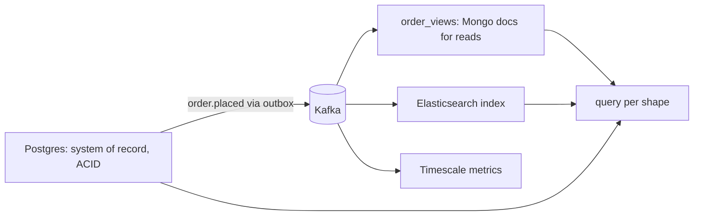

## Why it Matters

The store choice is usually decided by one question nobody asks aloud: what is the access pattern and what invariants must hold? Defaulting to the familiar store fights the workload; defaulting to the fashionable one reimplements joins and transactions in application code. Postgres-first plus derived stores fed by events covers most systems, and forces the choice to be earned.

## Diagram



## Code

```java
// System of record: JPA + Postgres
@Entity class Order { @Id Long id; @Embedded Money total; @Enumerated Status status; }
// Adjacent document read-model fed by OrderPlaced events (Spring Data Mongo)
@Document("order_views") record OrderView(@Id String orderId, String status, BigDecimal total) {}
// Choosing in code review: "Can this be a Postgres JSONB + GIN index instead of a new cluster?"
// @Column(columnDefinition = "jsonb") + native query — one less system to operate
```

## When to use / not

| Workload | Pick |
|---|---|
| Orders, payments, ledger, joins + ACID invariants | **Postgres** (+ Flyway/Liquibase) |
| Catalogue/product JSON, flexible schemas, read-heavy | **MongoDB / DocumentDB** |
| Session/cart, counters, feature flags, hot keys | **Redis** (KV) |
| Time-series metrics, IoT, event logs at volume | **Timescale / ClickHouse / columnar** |
| Fraud rings, recommendations, deep traversals | **Neo4j (graph)** |
| Full-text search, faceting | **Elasticsearch/OpenSearch** (as index, not SOT) |

Polyglot rule: one **system of record** per context (usually Postgres), plus purpose-built *derived* stores fed by events.

## Trade-offs

| Postgres-first pros | NoSQL-when-earned pros |
|---|---|
| ACID, joins, one ops story, JSONB covers 80% "flexible" needs | Horizontal write scale, schema flexibility, shape-matched queries |
| Mature Spring Data + migration tooling | Managed serverless options scale to zero |
| NoSQL cons: eventual consistency, no joins, second ops burden, Spring Data dialects differ |

## Vs

- **Vs [[02_Consistency-CAP-PACELC|CAP/PACELC]] lens:** SQL = CP-leaning consistency; many NoSQL = AP-leaning availability, the choice is a consistency choice, not a fashion choice.
- **Vs [[03_Event-Sourcing-CQRS|CQRS]]:** CQRS lets the write side stay relational while read sides go document/search, best of both without dual-writes.

## Pitfalls

- Mongo-as-default then reimplementing joins/transactions in app code.
- Elasticsearch as system of record (it's a *search index*, rebuildable, not authoritative).
- One shared DB/cluster across contexts, recreates the monolith at the data layer.

## Interview q&a

**Q: "When would you NOT use Postgres?"**
A: Sustained write throughput past single-primary headroom, truly schemaless high-churn documents at scale, sub-ms KV, or graph traversals unjoinable in SQL.

**Q: How do you keep polyglot stores consistent?**
A: Events from the SOT (outbox → Kafka) build derived stores; accept eventual consistency there; never dual-write in the request path.

## Related

- [[02_Consistency-CAP-PACELC]] · [[03_Event-Sourcing-CQRS]] · [[05_Data-Migration-Strangler]]

# SQL vs NoSQL Selection

> **Intent:** Choose the store by access pattern and consistency needs, relational for structured data with joins/invariants, document/key-value/column/graph where shape, scale, or query shape demands it, defaulting to Postgres until a concrete force pushes elsewhere.
> Watch: [IBM, SQL vs NoSQL](https://www.youtube.com/watch?v=Q5aTUc7c4jg)
