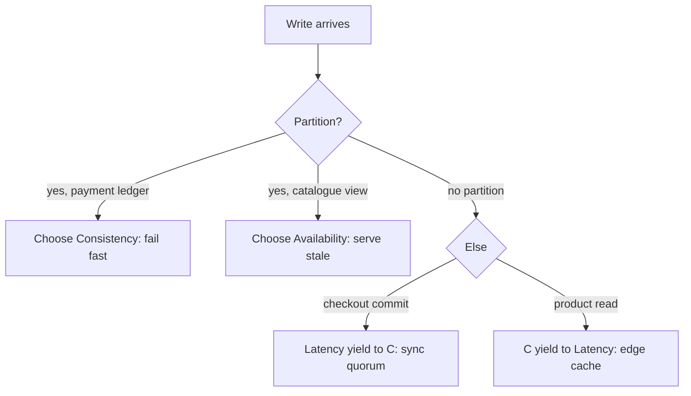

## Why it Matters

"Our database is CP" is the wrong unit of reasoning, consistency is a property of an *operation*, not a store. Checkout fails rather than oversell; a stale catalogue page costs nothing. Making that choice per operation, and stating the latency cost when there is no partition (PACELC), is what turns CAP from trivia into a design tool.

## Diagram



## Code

```java
// Strong-consistency operation: optimistic lock on the aggregate
@Entity
class Inventory {
 @Version private long version; // conflict → OptimisticLockException → retry with backoff
 private int stock;
}

// Availability-leaning operation: explicit, documented staleness window
@Cacheable(value = "catalogue", key = "#id")
public ProductDto view(String id) {
 return repo.find(id); // TTL = accepted staleness, not an accident
}

// Partition stance is code, not config: fail-fast vs serve-last-known is a
// Resilience4j fallback choice made per use case.
```

## When to use / not

- Every distributed decision: checkout (consistency) vs product views (availability) vs cart (somewhere between).
- PACELC in normal operation: synchronous cross-region write (consistent, slow) vs local-write + async replicate (fast, stale).
- Interview frame: "it depends on the operation" beats "our DB is CP/AP".

| Operation | Partition stance | Normal stance |
|---|---|---|
| Place order / take payment | C (fail rather than oversell) | C (sync commit) |
| Show catalogue / reviews | A (serve stale) | L (edge cache) |
| Add to cart | A (merge later, CRDT/last-write) | L |

## Trade-offs

| Strong consistency pros | Eventual pros |
|---|---|
| Simple reasoning, no reconciliation | Available + fast under partition/load |
| No conflict-resolution code | Scales reads/writes independently |
| Cons: higher latency, lower availability, contention at scale | Cons: stale reads, reconciliation logic, harder UX copy ("usually up to date") |

## Vs

- **Vs [[01_SQL-vs-NoSQL-Selection|store choice]]:** stores *bias* toward C or A, but operations decide, you can do eventual on Postgres (read replicas) and strong-ish on NoSQL (conditional writes).
- **Vs [[03_Event-Sourcing-CQRS|sourcing/CQRS]]:** CQRS is how you *implement* mixed consistency: consistent writes, eventually-consistent reads.

## Pitfalls

- One global consistency setting for all operations, overpaying latency on reads, risking availability on writes.
- "Eventual" without a bound, define staleness SLAs (p99 lag < 5s) and alert on them.
- Assuming the network won't partition (VPC AZ failure says hi).

## Interview q&a

**Q: Is CAP "pick two of three"?**
A: Outdated framing. Partitions happen, the real choice is C-vs-A *during* a partition, and L-vs-C *otherwise* (PACELC). Design per operation.

**Q: How do you handle conflicts in AP mode?**
A: Idempotency keys + versioning; merge rules declared upfront (last-writer-wins with vector clocks, CRDTs, or business reconciliation queues).

## Related

- [[01_SQL-vs-NoSQL-Selection]] · [[03_Event-Sourcing-CQRS]] · [[05_DDD-Modeling/05_Domain-Events|Domain Events]]

# Consistency, cap & PACELC

> **Intent:** Make consistency-vs-availability trade-offs explicit: **CAP** (partition → choose Consistency or Availability), **PACELC** (else → choose Latency or Consistency), then design each operation (not each database) for the answer.
> Watch: [ByteByteGo, CAP Theorem Simplified](https://www.youtube.com/watch?v=BHqjEjzAicA)

## 2. Spring Example

```java
// Consistency-critical: pessimistic/optimistic locking on the aggregate
@Entity class Inventory { @Version long version; int stock; } // optimistic: conflicts → retry with backoff
// Availability-leaning: stale-tolerant read with explicit staleness contract
@Cacheable(value = "catalogue", key = "#id")
public ProductDto view(String id) { ... } // TTL = accepted staleness window, documented
// Partition behaviour: Resilience4j fallback serves last-known (A) vs fail-fast (C), chosen per use-case
```