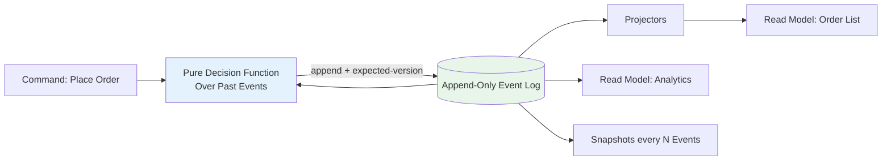

## 🎯 Intent
Event Sourcing: persist state *changes* as an append-only event log (the log is truth; state is a fold). CQRS: split write models (commands, invariants) from read models (queries, shape-optimised). Combine them when auditability and divergent read/write needs justify the complexity.

## 💡 Why It Matters
- **Interview signal**: "How do you handle schema evolution?" and "Where do you start?" — sourcing everything is a common anti-pattern; CQRS-lite first covers 80% of cases
- **Right sizing**: Most systems don't need current state stored so much as *how it got there* — audit, replay, time travel, divergent read shapes
- **Cost**: Eventual consistency on reads, schema evolution over immutable log (upcasting), snapshotting, projections, replay tooling — steep learning curve

## 🧩 Diagram: Event Sourcing + CQRS Flow


## 💻 Code: Write Side + Projectors (Java 25 + Spring + Kafka)
```java
// Write side: append events, never UPDATE state rows
record Event(long seq, String orderId, String type, String payload) {}

@Transactional
public void handle(Command c) {
    var past = log.load(c.orderId());           // rehydrate by folding
    var next = OrderDecider.apply(past, c);     // pure decision function
    log.append(next);                           // single atomic append (optimistic concurrency on seq)
    publisher.publish(next);                    // feeds read models
}

// Read side: projector builds query tables (plain JPA/Mongo docs)
@Component
class OrderProjector {
    @KafkaListener(topics = "orders.events")
    public void on(Event e) {
        views.upsert(project(e));
    }
}

// Concurrency: expected-version check on append (`WHERE seq = ?`); conflict → reload, re-decide, retry
```

## ✅ When to Use / ❌ When NOT to Use
| Scenario | Use? | Reason |
|---|---|---|
| Audit/regeneration needs (finance, ledger, replay to any point) | ✅ | Log is truth; full history |
| Reads/writes scale/shape differently (write: normalised; reads: 5 denormalised views) | ✅ | CQRS splits models |
| Temporal queries ("what did order look like Tuesday?") | ✅ | Replay to point in time |
| Standard CRUD | ❌ | Current-state rows simpler, faster, tooling-rich |
| CQRS without sourcing | ⚠️ | Separate read tables fed by outbox events covers most cases |

## ⚖️ Trade-offs
| Dimension | Pros | Cons |
|---|---|---|
| **Audit + Time Travel** | Full replay/debug | **Eventual consistency on reads** — no simple `SELECT *` |
| **Read/Write Scaling** | Independent | **Schema evolution** over immutable log (upcasting) |
| **Decision Logic** | Pure + testable | **Snapshotting, projections, replay tooling** to build |
| **Domain Events** | Natural fit | **Team learning curve** is steep |

## 🆚 Vs. Alternatives
| Alternative | When to Choose | Decision Rule |
|---|---|---|
| **State-stored + Outbox** | Reliable publishing with simple current-state | 80% benefit at 20% cost. Choose full sourcing ONLY for audit/time-travel |
| **Plain EDA** | Notifications about changes | EDA notifies; sourcing *stores* changes as truth |
| **CQRS-lite (Outbox)** | Divergent reads without audit | Start here; add sourcing only to aggregates needing history |

## ⚠️ Pitfalls
1. **Sourcing everything ("event-sourced CRUD")** — log growth + replay pain with no payoff
2. **Fat events carrying volatile data** — snapshots rot; store decision facts, not derived data
3. **GDPR erasure vs immutable log** — plan crypto-shredding/pseudonymisation upfront
4. **No snapshot strategy** — rehydration O(N) events; snapshot every N (e.g., 100) events

## 🎤 Interview Q&A (Senior Depth)

**Q1: "How do you handle schema evolution?"**
> **Answer**: Additive events only; upcasters (v1→v2 on read); versioned event types (`OrderPlaced_v1`, `OrderPlaced_v2`); NEVER rewrite the log. Upcaster chain runs at projector load time. **Rejected**: "Migrate events in place" — violates immutability.

**Q2: "How do rebuilds work?"**
> **Answer**: Replay log into fresh projections; snapshot every N events to bound rehydration; blue/green projectors for zero-downtime rebuilds. **Metric**: Full replay < 30min for 1M events with snapshots. **Rejected**: "Rebuild on demand" — too slow for incidents.

**Q3: "Where do you start?"**
> **Answer**: CQRS-lite first (read models via outbox events); add sourcing only to aggregates that need history. **Decision rule**: If you don't need audit/replay/temporal queries, you don't need sourcing. **Rejected**: "Start with full ES" — over-engineering.

**Q4: "How do you handle concurrent commands on same aggregate?"**
> **Answer**: Optimistic concurrency via expected-version on append (`WHERE seq = ?`). Conflict → reload past events, re-run decision function, retry. **Metric**: Conflict rate < 1%; retry success > 99%. **Rejected**: "Pessimistic lock" — kills throughput.

**Q5: "CQRS without Event Sourcing — what's the difference?"**
> **Answer**: CQRS = split write/read models. Sourcing = log is truth. CQRS without sourcing = write to DB, publish events via outbox, projectors build read models. 80% of cases need only this. **Rejected**: "They're the same" — sourcing adds immutable log + replay; CQRS doesn't require it.

## 🔗 Related
- [[02_Consistency-CAP-PACELC]] · [[../05_DDD-Modeling/05_Domain-Events|Domain Events]] · [[01_SQL-vs-NoSQL-Selection]]