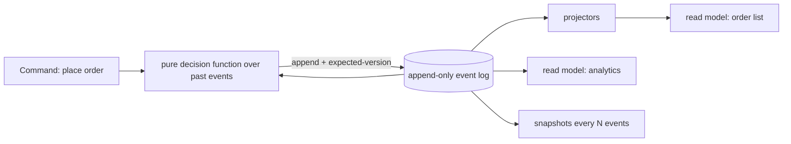

## Why it Matters

Most systems don't need their current state stored so much as *how it got there*, audit, replay, time travel and divergent read shapes are all symptoms of that. Event sourcing makes the log the truth and reads projections; it also makes every query a rebuild and every schema change an upcaster, so it earns its place on a handful of aggregates, never the whole system.

## Diagram



## Code

```java
// Write side: append events, never UPDATE state rows
record Event(long seq, String orderId, String type, String payload) {}
@Transactional public void handle(Command c) {
 var past = log.load(c.orderId()); // rehydrate by folding
 var next = OrderDecider.apply(past, c); // pure decision function
 log.append(next); // single atomic append (optimistic concurrency on seq)
 publisher.publish(next); // feeds read models
}
// Read side: projector builds query tables (plain JPA/Mongo docs)
@Component class OrderProjector {
 @KafkaListener(topics = "orders.events") public void on(Event e) { views.upsert(project(e)); }
}
```
Concurrency: expected-version check on append (`WHERE seq = ?`); conflict → reload, re-decide, retry.

## When to use / not

- Audit/regeneration needs (finance, ledger, "replay to any point in time").
- Reads and writes scale/shape differently (write: normalised; reads: 5 denormalised views).
- Temporal queries ("what did the order look like Tuesday?").

**When NOT:** standard CRUD, storing current-state rows is simpler, faster to query, and tooling-rich. CQRS without sourcing (separate read tables fed by events) covers most real cases.

## Trade-offs

| Pros | Cons |
|---|---|
| Full audit + time travel + replay/debug | Eventual consistency on reads; no simple `SELECT *` |
| Scales reads/writes independently | Schema evolution over an immutable log (upcasting) |
| Decision logic pure + testable | Snapshotting, projections, replay tooling to build |
| Natural fit with [[05_DDD-Modeling/05_Domain-Events\|domain events]] | Team learning curve is steep |

## Vs

- **Vs state-stored + outbox:** outbox gives reliable *publishing* with simple current-state storage, 80% of the benefit at 20% cost. Choose full sourcing only for audit/time-travel needs.
- **Vs [[03_Architecture-Styles/04_Event-Driven-Architecture|plain EDA]]:** EDA notifies about changes; sourcing *stores* changes as truth.

## Pitfalls

- Sourcing everything ("event-sourced CRUD"), log growth + replay pain with no payoff.
- Fat events carrying volatile data, snapshots rot; store decision facts.
- GDPR erasure vs immutable log, plan crypto-shredding/pseudonymisation upfront.

## Interview q&a

**Q: How do you handle schema evolution?**
A: Additive events, upcasters (v1→v2 on read), versioned event types; never rewrite the log.

**Q: How do rebuilds work?**
A: Replay log into fresh projections; snapshot every N events to bound rehydration; blue/green projectors for zero-downtime rebuilds.

**Q: Where do you start?**
A: CQRS-lite first (read models via outbox events); add sourcing only to aggregates that need history.

## Related

- [[02_Consistency-CAP-PACELC]] · [[05_DDD-Modeling/05_Domain-Events|Domain Events]] · [[01_SQL-vs-NoSQL-Selection]]

# Event Sourcing & CQRS

> **Intent:** **Event sourcing:** persist state *changes* as an append-only event log (the log is truth; state is a fold). **CQRS:** split write models (commands, invariants) from read models (queries, shape-optimised), combine them when auditability and divergent read/write needs justify the complexity.
> Watch: [Event Sourcing and CQRS (EDA part 3)](https://www.youtube.com/watch?v=i2eVTk2Fb40)
