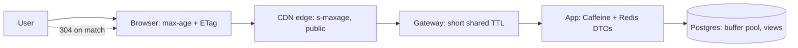

## Why it Matters

Every layer between the user and the database that can serve a valid answer is a multiplier on capacity, but each one also multiplies the chance of serving something stale. Designing the stack as *one* caching strategy with per-layer invalidation, rather than five unrelated caches, is what keeps the latency win without the correctness surprises.

## Diagram



## Code

```java
// HTTP caching headers — let browsers + CDN do the work
@GetMapping("/products/{id}")
public ResponseEntity<ProductDto> get(@PathVariable String id,
 @RequestHeader(value = "If-None-Match", required = false) String inm) {
 var p = catalogue.get(id);
 String etag = "\"" + p.version() + "\"";
 if (etag.equals(inm)) return ResponseEntity.status(304).build();
 return ResponseEntity.ok().eTag(etag)
 .cacheControl(CacheControl.maxAge(60, SECONDS).cachePublic()).body(p);
}
// Static assets: content-hashed filenames (app.9f2c.js) → immutable, Cache-Control: max-age=1y
```

## When to use / not

Layers and their jobs:
| Layer | Serves | Invalidate via |
|---|---|---|
| Browser (`Cache-Control: max-age`, ETag) | Private, per-user GETs | Versioned URLs, short max-age |
| CDN edge (CloudFront/Cloudflare) | Public static + cacheable API GETs | Path purge / versioned keys, `s-maxage` |
| Gateway (Spring Cloud Gateway) | Brief shared GETs, rate-limit counters | Short TTL (seconds–minutes) |
| App (Caffeine local / Redis) | DTOs, computed views | Write-through evict + TTL (see [[04_Design-Patterns-Building-Blocks/03_Caching-Strategies\|Caching Strategies]]) |
| DB (buffer pool, materialised views) | Hot pages, pre-joined reads | Refresh concurrently on schedule |

## Trade-offs

| Pros | Cons |
|---|---|
| Each layer multiplies origin offload (CDN often 90%+) | Stale-serving risk compounds across layers |
| Edge latency (ms) for global users | Purge is eventually consistent, plan for it |
| Survives origin outages briefly (stale-while-revalidate) | Debugging "which layer served this?" needs headers (`Age`, `X-Cache`) |

## Vs

- **Vs [[04_Design-Patterns-Building-Blocks/03_Caching-Strategies|app-only caching]]:** app cache saves compute; CDN saves *bytes on the wire* + global latency. Different bills, both worth paying.
- **Vs precomputation (materialised views):** durable vs ephemeral, combine: nightly view + edge TTL.

## Pitfalls

- Caching authenticated responses at edge under one key, personal data leak.
- No `Vary` discipline (`Vary: Accept-Encoding, Authorization` where needed).
- Thundering herd on CDN miss, origin shield + stale-while-revalidate.

## Interview q&a

**Q: How do you invalidate across layers?**
A: Versioned keys/URLs (deploy-safe), event-driven purge (product-updated → CDN purge + Redis evict), TTLs as backstop. Prefer versioning over purging, purges are slow and partial.

**Q: Private vs public caching?**
A: `private` for user-scoped (browser only), `s-maxage`/`public` for shared edge; never edge-cache personalised payloads under shared keys.

## Related

- [[04_Design-Patterns-Building-Blocks/03_Caching-Strategies|Caching Strategies]] · [[04_Design-Patterns-Building-Blocks/04_API-Gateway-BFF|Gateway/BFF]]

# Caching & cdn (Multi-Layer Strategy)

> **Intent:** Layer caches from browser → CDN edge → gateway → app → DB so each request is served by the cheapest layer that may hold a valid answer, with invalidation and TTLs designed per layer, not improvised.
