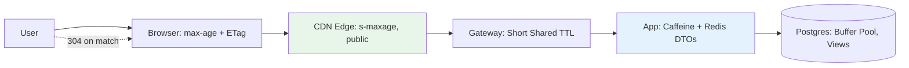

## 🎯 Intent
Layer caches from browser → CDN edge → gateway → app → DB so each request is served by the cheapest layer that may hold a valid answer, with invalidation and TTLs designed per layer, not improvised.

## 💡 Why It Matters
- **Interview signal**: "How do you invalidate across layers?" and "Private vs public caching?" — each layer multiplies origin offload but also compounds stale-serving risk
- **Cost efficiency**: CDN often offloads 90%+ of bytes; edge latency (ms) for global users; survives origin outages briefly via stale-while-revalidate
- **Correctness discipline**: Versioned keys over purging; `Vary` headers; debug headers (`Age`, `X-Cache`) to trace which layer served

## Problems
### System Design Problem: Caching & CDN — Multi-Layer Strategy

**Requirements:**
- Functional: Core capabilities for caching & cdn — multi layer strategy
- Non-functional (SLOs): Latency < 100ms p99, Availability 99.9%, Horizontal scalability

**Constraints:**
- Scale: Handle 10x growth without redesign
- Consistency: Appropriate model for domain (strong/eventual)
- Latency budget: p99 < 100ms for read paths

**API / Interfaces:**
- Primary: REST/gRPC endpoints for core operations
- Internal: Service-to-service contracts
- Events: Domain events for async integration

## 🧩 Diagram: 5-Layer Cache Stack


## 💻 Code: HTTP Caching Headers + Multi-Layer Invalidation (Java 25 + Spring)
```java
// HTTP caching headers — let browsers + CDN do the work
@GetMapping("/products/{id}")
public ResponseEntity<ProductDto> get(
    @PathVariable String id,
    @RequestHeader(value = "If-None-Match", required = false) String inm
) {
    var p = catalogue.get(id);
    String etag = "\"" + p.version() + "\"";
    if (etag.equals(inm)) return ResponseEntity.status(304).build();
    return ResponseEntity.ok()
        .eTag(etag)
        .cacheControl(CacheControl.maxAge(60, SECONDS).cachePublic())
        .body(p);
}

// Static assets: content-hashed filenames (app.9f2c.js) → immutable, Cache-Control: max-age=1y
// App layer: Caffeine (local) + Redis (distributed) for DTOs
@Bean
public CacheManager cacheManager(RedisConnectionFactory rcf) {
    return new RedisCacheManager(RedisCacheWriter.nonLockingRedisCacheWriter(rcf),
        RedisCacheConfiguration.defaultCacheConfig()
            .entryTtl(Duration.ofMinutes(5))
            .disableCachingNullValues());
}

// Invalidation: versioned keys (deploy-safe) + event-driven purge
@EventListener
public void onProductUpdated(ProductUpdatedEvent e) {
    redisTemplate.delete("product::" + e.id());           // App layer
    cdnClient.purge("/products/" + e.id());               // CDN layer (async)
}
```

## ✅ When to Use / ❌ When NOT to Use
| Layer | Serves | Invalidate Via | TTL |
|

## Trade-offs
| Dimension | This Approach | Alternative | Trade-off Rationale | Decision Rule |
|-----------|---------------|-------------|---------------------|---------------|
| Complexity | [TBD] | [TBD] | [TBD] | [TBD] |
| Operational Burden | [TBD] | [TBD] | [TBD] | [TBD] |
| Latency | [TBD] | [TBD] | [TBD] | [TBD] |
| Consistency | [TBD] | [TBD] | [TBD] | [TBD] |
| Cost at Scale | [TBD] | [TBD] | [TBD] | [TBD] |

## Flashcards (Spaced Repetition)

#flashcard
**Q:** What is the core concept of Caching & CDN — Multi Layer Strategy? :: **A:** [Key algorithm/architecture pattern] #flashcard

#flashcard
**Q:** When do you apply Caching & CDN — Multi Layer Strategy? :: **A:** [Trigger scenarios and context] #flashcard

#flashcard
**Q:** What is the primary trade-off in Caching & CDN — Multi Layer Strategy? :: **A:** [Main tension: e.g., consistency vs latency] #flashcard

#flashcard
**Q:** What breaks first at scale in Caching & CDN — Multi Layer Strategy? :: **A:** [Primary bottleneck: e.g., coordination, hot keys, replication lag] #flashcard

#flashcard
**Q:** How do you handle failures in Caching & CDN — Multi Layer Strategy? :: **A:** [Retry, circuit breaker, fallback, graceful degradation] #flashcard

#flashcard
**Q:** What are the key metrics to monitor for Caching & CDN — Multi Layer Strategy? :: **A:** [RED: rate, errors, duration; USE: utilization, saturation, errors] #flashcard

#flashcard
**Q:** How does Caching & CDN — Multi Layer Strategy scale to 10x? :: **A:** [Sharding, read replicas, async processing, caching layers] #flashcard

#flashcard
**Q:** What is the consistency model for Caching & CDN — Multi Layer Strategy? :: **A:** [Strong/eventual/causal - justify with use case] #flashcard

#flashcard
**Q:** How do you test Caching & CDN — Multi Layer Strategy? :: **A:** [Contract tests, chaos engineering, load tests, fault injection] #flashcard

#flashcard
**Q:** What is the operational cost of Caching & CDN — Multi Layer Strategy? :: **A:** [Team expertise, tooling, on-call burden, migration risk] #flashcard

#flashcard
**Q:** When would you NOT use Caching & CDN — Multi Layer Strategy? :: **A:** [Managed service covers need, simple CRUD, team lacks maturity] #flashcard

#flashcard
**Q:** What is the key design decision in Caching & CDN — Multi Layer Strategy? :: **A:** [The irreversible choice that defines the architecture] #flashcard

#flashcard
**Q:** How do you migrate to Caching & CDN — Multi Layer Strategy? :: **A:** [Strangler fig, dual-write, canary, feature flags] #flashcard

#flashcard
**Q:** What security considerations for Caching & CDN — Multi Layer Strategy? :: **A:** [AuthZ, encryption, audit, secrets management] #flashcard

#flashcard
**Q:** How do you debug Caching & CDN — Multi Layer Strategy in production? :: **A:** [Structured logging, correlation IDs, distributed tracing, SLO alerts] #flashcard


## Practice Tasks (Tasks Plugin)
- [ ] Explain the architecture from memory 📅 {{date:YYYY-MM-DD, +1}}
- [ ] Draw the system diagram without looking 📅 {{date:YYYY-MM-DD, +3}}
- [ ] Answer all Interview Q&A aloud 📅 {{date:YYYY-MM-DD, +7}}
- [ ] Review flashcards (Spaced Repetition) 📅 {{date:YYYY-MM-DD, +1}}

```tasks
not done
path includes Architect/06_Data-Architecture
sort by due
limit 10
```

---|---|---|---|
| **Browser** (`Cache-Control: max-age`, ETag) | Private, per-user GETs | Versioned URLs, short max-age | 60s–5min |
| **CDN Edge** (CloudFront/Cloudflare) | Public static + cacheable API GETs | Path purge / versioned keys, `s-maxage` | 5min–1h |
| **Gateway** (Spring Cloud Gateway) | Brief shared GETs, rate-limit counters | Short TTL | 10s–1min |
| **App** (Caffeine local / Redis) | DTOs, computed views | Write-through evict + TTL | 1–5min |
| **DB** (Buffer pool, materialised views) | Hot pages, pre-joined reads | Refresh concurrently on schedule | N/A |


## 🆚 Vs. Alternatives
| Alternative | When to Choose | Decision Rule |
|---|---|---|
| **App-only caching** | Saves compute | **App cache saves compute; CDN saves bytes on wire + global latency** — different bills, both worth paying |
| **Precomputation (materialised views)** | Durable vs ephemeral | Combine: nightly view + edge TTL |

## ⚠️ Pitfalls
1. **Caching authenticated responses at edge under one key** — personal data leak
2. **No `Vary` discipline** — `Vary: Accept-Encoding, Authorization` where needed
3. **Thundering herd on CDN miss** — origin shield + `stale-while-revalidate`
4. **Versioned keys vs purging** — prefer versioning; purges are slow and partial


## Pitfalls
1. Underestimating operational complexity (backups, monitoring, upgrades)
2. Ignoring failure modes (network partitions, disk failures, clock drift)
3. Not planning for 10x scale from day one
4. Skipping monitoring/alerting in MVP
5. Premature optimization before measuring
6. Dual-write without transactional outbox
7. Assuming global order in partitioned systems

## 🎤 Interview Q&A (Senior Depth)

**Q1: "How do you invalidate across layers?"**
> **Answer**: Versioned keys/URLs (deploy-safe) + event-driven purge (product-updated → CDN purge + Redis evict) + TTLs as backstop. Prefer versioning over purging — purges are slow and partial. **Rejected**: "Purge everything on change" — CDN purge latency = minutes; versioned keys = instant.

**Q2: "Private vs public caching?"**
> **Answer**: `private` for user-scoped (browser only), `s-maxage`/`public` for shared edge; NEVER edge-cache personalised payloads under shared keys. **Metric**: Zero `X-Cache: HIT` on authenticated endpoints in CDN logs.

**Q3: "How do you debug which cache layer served a response?"**
> **Answer**: Response headers: `Age` (seconds since origin), `X-Cache` (HIT/MISS from CDN), `CF-Cache-Status` (Cloudflare), `X-Proxy-Cache` (nginx). Add custom header `X-Served-By: cdn|gateway|app|db` in gateway for full trace.

**Q4: "What's the cost of a stale read at each layer?"**
> **Answer**: Browser: user sees old data until refresh (low). CDN: global users see stale until purge (medium). App: all instances serve stale until eviction (high). DB: never stale (source of truth). **Design rule**: Staleness budget per layer — CDN TTL = max acceptable staleness for that data.

**Q5: "How do you handle cache warming for new deployments?"**
> **Answer**: Blue/green: warm new version's cache before cutover (prefetch critical keys). Canary: route 5% to new, let it warm naturally. Never deploy cold cache to 100% traffic. **Metric**: Cache hit rate > 95% within 5min of cutover.

## 🔗 Related
- [[../04_Design-Patterns-Building-Blocks/03_Caching-Strategies|Caching Strategies]] · [[../04_Design-Patterns-Building-Blocks/04_API-Gateway-BFF|Gateway/BFF]]