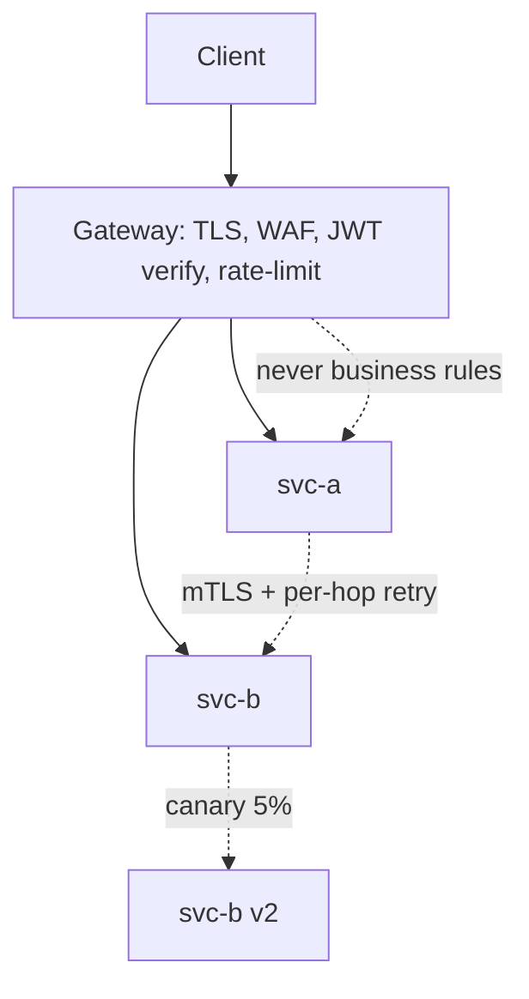

## Why it Matters

Once a fleet passes a handful of services, the question stops being "do we need an edge?" and becomes "which concern lives where?" Putting mTLS and per-hop retry in the gateway duplicates policy; putting rate-limit and JWT verification in every service guarantees drift. The split, gateway north-south, mesh east-west, business logic in neither, is what keeps both layers replaceable and the services honest.

## Problems
### System Design Problem: Gateway and Service Mesh

**Requirements:**
- Functional: Core capabilities for gateway and service mesh
- Non-functional (SLOs): Latency < 100ms p99, Availability 99.9%, Horizontal scalability

**Constraints:**
- Scale: Handle 10x growth without redesign
- Consistency: Appropriate model for domain (strong/eventual)
- Latency budget: p99 < 100ms for read paths

**API / Interfaces:**
- Primary: REST/gRPC endpoints for core operations
- Internal: Service-to-service contracts
- Events: Domain events for async integration

## Diagram



## Code

```java
// Gateway route: strip prefix, rate-limit per key, forward identity downstream
@Bean
RouteLocator routes(RouteLocatorBuilder b) {
 return b.routes()
 .route("orders", r -> r.path("/api/v1/orders/**")
 .filters(f -> f.stripPrefix(2)
 .requestRateLimiter(c -> c.setRateLimiter(redisRateLimiter()))) // 100 rps/key
 .uri("lb://order-service"))
 .build();
}

// Service side: authorise on the edge-verified subject, never on a client claim
@GetMapping("/orders/{id}")
OrderDto get(@PathVariable Long id, @AuthenticationPrincipal Jwt jwt) {
 if (!jwt.getClaimAsStringList("scope").contains("order:read")) throw new AccessDeniedException(...);
 return service.find(id);
}
```

## When to use / not

**Use when:**
- A fleet of services needs uniform TLS termination, auth and throttling at one edge.
- Service-to-service calls need mTLS, retries or canary routing without per-service code.
- You want progressive delivery (5% canary) driven by telemetry rather than deploy scripts.

**When NOT:**
- A single monolith with one client, a gateway is a hop with no payoff.
- Day-one microservices: gateway + client retries + OTel cover most of it; add a mesh only when mTLS-everywhere and per-hop policy are real requirements.
- Business logic in either layer, if a route filter is deciding business outcomes, it is in the wrong place.


## Trade-offs
| Dimension | This Approach | Alternative | Trade-off Rationale | Decision Rule |
|-----------|---------------|-------------|---------------------|---------------|
| Complexity | [TBD] | [TBD] | [TBD] | [TBD] |
| Operational Burden | [TBD] | [TBD] | [TBD] | [TBD] |
| Latency | [TBD] | [TBD] | [TBD] | [TBD] |
| Consistency | [TBD] | [TBD] | [TBD] | [TBD] |
| Cost at Scale | [TBD] | [TBD] | [TBD] | [TBD] |

## Vs

| Aspect | Gateway (Spring Cloud Gateway / Kong) | Mesh (Istio / Linkerd) |
|---|---|---|
| Traffic direction | North-south (edge) | East-west (service-to-service) |
| Auth, rate-limit, WAF | owns it | — |
| mTLS between services | — | owns it |
| Retries / circuit breaking | Coarse, at edge | Per-hop, telemetry-driven |
| Replaceability | Swap Kong → SCG at the edge | Remove sidecars, app keeps working |

## Pitfalls

- Fat gateway with business logic, becomes an untestable monolith at the edge.
- Retries at both gateway AND mesh → retry amplification (cap total attempts).


## Pitfalls
1. Underestimating operational complexity (backups, monitoring, upgrades)
2. Ignoring failure modes (network partitions, disk failures, clock drift)
3. Not planning for 10x scale from day one
4. Skipping monitoring/alerting in MVP
5. Premature optimization before measuring
6. Dual-write without transactional outbox
7. Assuming global order in partitioned systems

## Interview q&a

- **Q: Do we need a mesh on day one?** A: No, gateway + client retries + OTel suffice; add mesh when you need mTLS everywhere and per-hop policy.
- **Q: Rate-limit where?** A: Edge per-tenant (gateway + Redis); per-service concurrency limits in mesh/app.


## Flashcards (Spaced Repetition)

#flashcard
**Q:** What is the core concept of Gateway and Service Mesh? :: **A:** [Key algorithm/architecture pattern] #flashcard

#flashcard
**Q:** When do you apply Gateway and Service Mesh? :: **A:** [Trigger scenarios and context] #flashcard

#flashcard
**Q:** What is the primary trade-off in Gateway and Service Mesh? :: **A:** [Main tension: e.g., consistency vs latency] #flashcard

#flashcard
**Q:** What breaks first at scale in Gateway and Service Mesh? :: **A:** [Primary bottleneck: e.g., coordination, hot keys, replication lag] #flashcard

#flashcard
**Q:** How do you handle failures in Gateway and Service Mesh? :: **A:** [Retry, circuit breaker, fallback, graceful degradation] #flashcard

#flashcard
**Q:** What are the key metrics to monitor for Gateway and Service Mesh? :: **A:** [RED: rate, errors, duration; USE: utilization, saturation, errors] #flashcard

#flashcard
**Q:** How does Gateway and Service Mesh scale to 10x? :: **A:** [Sharding, read replicas, async processing, caching layers] #flashcard

#flashcard
**Q:** What is the consistency model for Gateway and Service Mesh? :: **A:** [Strong/eventual/causal - justify with use case] #flashcard

#flashcard
**Q:** How do you test Gateway and Service Mesh? :: **A:** [Contract tests, chaos engineering, load tests, fault injection] #flashcard

#flashcard
**Q:** What is the operational cost of Gateway and Service Mesh? :: **A:** [Team expertise, tooling, on-call burden, migration risk] #flashcard

#flashcard
**Q:** When would you NOT use Gateway and Service Mesh? :: **A:** [Managed service covers need, simple CRUD, team lacks maturity] #flashcard

#flashcard
**Q:** What is the key design decision in Gateway and Service Mesh? :: **A:** [The irreversible choice that defines the architecture] #flashcard

#flashcard
**Q:** How do you migrate to Gateway and Service Mesh? :: **A:** [Strangler fig, dual-write, canary, feature flags] #flashcard

#flashcard
**Q:** What security considerations for Gateway and Service Mesh? :: **A:** [AuthZ, encryption, audit, secrets management] #flashcard

#flashcard
**Q:** How do you debug Gateway and Service Mesh in production? :: **A:** [Structured logging, correlation IDs, distributed tracing, SLO alerts] #flashcard


## Practice Tasks (Tasks Plugin)
- [ ] Explain the architecture from memory 📅 {{date:YYYY-MM-DD, +1}}
- [ ] Draw the system diagram without looking 📅 {{date:YYYY-MM-DD, +3}}
- [ ] Answer all Interview Q&A aloud 📅 {{date:YYYY-MM-DD, +7}}
- [ ] Review flashcards (Spaced Repetition) 📅 {{date:YYYY-MM-DD, +1}}

```tasks
not done
path includes Architect/07_Integration-APIs
sort by due
limit 10
```

## Related

- [[REST Maturity and Contracts]] • [[Kafka Messaging and Idempotency]] • [[Architect/08_NonFunctional-Ops/01_Security-OAuth2-JWT.md|Security OAuth2 and JWT]]

# Gateway and Service Mesh

> Part of [[README|07 Integration MOC]] • `integration` • **Edge vs mesh.** Interviews test **what lives in the gateway vs the sidecar**.
> Watch: [Concept && Coding, Service Mesh Architecture](https://www.youtube.com/watch?v=eIxdHepOeHw)

## TL;DR for Interviews

> **Gateway = north-south** (edge: auth, rate-limit, routing). **Mesh = east-west** (mTLS, retries, canary). Don't push business logic into either.

## Separation

| Concern | Gateway (Spring Cloud Gateway / Kong) | Mesh (Istio / Linkerd) |
|---------|--------------------------------------|------------------------|
| TLS termination, WAF | | — |
| Auth (JWT verify), rate-limit | | — |
| Version/canary routing at edge | | (finer, per-service) |
| mTLS service-to-service | — | |
| Retries, timeouts, circuit break | Edge coarse | per-hop, telemetry-driven |
| Business rules | never | never |
```yaml

# Concept: edge route, strip prefix, rate-limit, forward identity downstream

spring:
 cloud:
 gateway:
 routes:
 - id: orders
 uri: lb://orders-service
 predicates: [Path=/api/v1/orders/**]
 filters:
 - StripPrefix=2
 - name: RequestRateLimiter # Concept: 100 rps per API key
 args: { redis-rate-limiter.replenishRate: 100, burstCapacity: 200 }
```

## Quick Check

- [ ] Gateway vs mesh, one-sentence split?
- [ ] Where does JWT verification happen?
- [ ] How do you canary 5% to v2?
