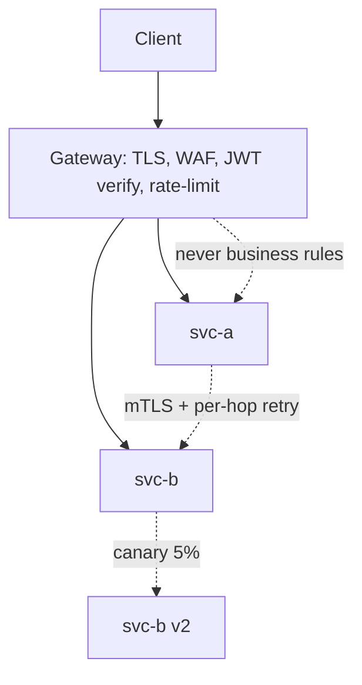

---
title: "Gateway and Service Mesh"
pattern: 4
category: "integration
tags: [gateway, service-mesh, istio, rate-limit, interview]
created: 2026-09-03
completed: false"
reviewed: ""
sr-due: ""
difficulty: Medium
problems-solved: []
problems-solved-dates: {}
excalidraw: ""
---## Why it Matters

Once a fleet passes a handful of services, the question stops being "do we need an edge?" and becomes "which concern lives where?" Putting mTLS and per-hop retry in the gateway duplicates policy; putting rate-limit and JWT verification in every service guarantees drift. The split, gateway north-south, mesh east-west, business logic in neither, is what keeps both layers replaceable and the services honest.

## Diagram



## Code

```java
// Gateway route: strip prefix, rate-limit per key, forward identity downstream
@Bean
RouteLocator routes(RouteLocatorBuilder b) {
 return b.routes()
 .route("orders", r -> r.path("/api/v1/orders/**")
 .filters(f -> f.stripPrefix(2)
 .requestRateLimiter(c -> c.setRateLimiter(redisRateLimiter()))) // 100 rps/key
 .uri("lb://order-service"))
 .build();
}

// Service side: authorise on the edge-verified subject, never on a client claim
@GetMapping("/orders/{id}")
OrderDto get(@PathVariable Long id, @AuthenticationPrincipal Jwt jwt) {
 if (!jwt.getClaimAsStringList("scope").contains("order:read")) throw new AccessDeniedException(...);
 return service.find(id);
}
```

## When to use / not

**Use when:**
- A fleet of services needs uniform TLS termination, auth and throttling at one edge.
- Service-to-service calls need mTLS, retries or canary routing without per-service code.
- You want progressive delivery (5% canary) driven by telemetry rather than deploy scripts.

**When NOT:**
- A single monolith with one client, a gateway is a hop with no payoff.
- Day-one microservices: gateway + client retries + OTel cover most of it; add a mesh only when mTLS-everywhere and per-hop policy are real requirements.
- Business logic in either layer, if a route filter is deciding business outcomes, it is in the wrong place.

## Trade-offs

| Pros | Cons |
|---|---|
| One place for edge policy: auth, quotas, WAF | Extra network hop and a new HA SPOF |
| mTLS + canary without touching service code | Sidecar CPU/memory tax on every pod |
| Retries/timeouts/circuit-breaking per hop | Duplicated retry budgets between gateway and mesh |
| Centralised telemetry for north-south and east-west | Two systems to configure and reason about |

## Vs

| Aspect | Gateway (Spring Cloud Gateway / Kong) | Mesh (Istio / Linkerd) |
|---|---|---|
| Traffic direction | North-south (edge) | East-west (service-to-service) |
| Auth, rate-limit, WAF | owns it | — |
| mTLS between services | — | owns it |
| Retries / circuit breaking | Coarse, at edge | Per-hop, telemetry-driven |
| Replaceability | Swap Kong → SCG at the edge | Remove sidecars, app keeps working |

## Pitfalls

- Fat gateway with business logic, becomes an untestable monolith at the edge.
- Retries at both gateway AND mesh → retry amplification (cap total attempts).

## Interview q&a

- **Q: Do we need a mesh on day one?** A: No, gateway + client retries + OTel suffice; add mesh when you need mTLS everywhere and per-hop policy.
- **Q: Rate-limit where?** A: Edge per-tenant (gateway + Redis); per-service concurrency limits in mesh/app.

## Related

- [[REST Maturity and Contracts]] • [[Kafka Messaging and Idempotency]] • [[Architect/08_NonFunctional-Ops/01_Security-OAuth2-JWT.md|Security OAuth2 and JWT]]

# Gateway and Service Mesh

> Part of [[README|07 Integration MOC]] • `integration` • **Edge vs mesh.** Interviews test **what lives in the gateway vs the sidecar**.
> Watch: [Concept && Coding, Service Mesh Architecture](https://www.youtube.com/watch?v=eIxdHepOeHw)

## TL;DR for Interviews

> **Gateway = north-south** (edge: auth, rate-limit, routing). **Mesh = east-west** (mTLS, retries, canary). Don't push business logic into either.

## Separation

| Concern | Gateway (Spring Cloud Gateway / Kong) | Mesh (Istio / Linkerd) |
|---------|--------------------------------------|------------------------|
| TLS termination, WAF | | — |
| Auth (JWT verify), rate-limit | | — |
| Version/canary routing at edge | | (finer, per-service) |
| mTLS service-to-service | — | |
| Retries, timeouts, circuit break | Edge coarse | per-hop, telemetry-driven |
| Business rules | never | never |
```yaml

# Concept: edge route, strip prefix, rate-limit, forward identity downstream

spring:
 cloud:
 gateway:
 routes:
 - id: orders
 uri: lb://orders-service
 predicates: [Path=/api/v1/orders/**]
 filters:
 - StripPrefix=2
 - name: RequestRateLimiter # Concept: 100 rps per API key
 args: { redis-rate-limiter.replenishRate: 100, burstCapacity: 200 }
```

## Quick Check

- [ ] Gateway vs mesh, one-sentence split?
- [ ] Where does JWT verification happen?
- [ ] How do you canary 5% to v2?
