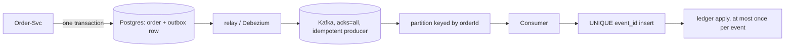

## Why it Matters

Kafka is a durable log, not a queue, and the difference shows up exactly when things crash: a commit that never reached the broker, or a redelivery that charges a card twice. The outbox on the producer and a dedupe constraint on the consumer are the pair that turns at-least-once delivery into exactly-once *effect*, the bar for any money-moving integration.

## Diagram



## Code

```java
// Producer: business write and publish-intent commit atomically
@Transactional
public void placeOrder(Order o) {
 orders.save(o);
 outbox.save(new OutboxEvent("order.placed", o.getId(), toJson(o))); // same TX
}

// Consumer: the UNIQUE(event_id) insert is the lock — duplicates die here
@Transactional
@KafkaListener(topics = "payments", groupId = "ledger")
public void onPayment(PaymentEvent e) {
 int inserted = jdbc.update(
 "INSERT INTO processed_events(event_id) VALUES (?) ON CONFLICT DO NOTHING", e.id());
 if (inserted == 0) return; // redelivery — already applied, ack and skip
 ledger.apply(e); // runs at most once per event_id
}
```

## When to use / not

**Use when:**
- A business event must survive a producer crash, DB write and publish commit together.
- Consumers must be safe under redelivery (payments, inventory, notifications).
- Ordering matters per entity, same key, same partition, replayable history.

**When NOT:**
- Request/reply flows needing an instant answer, use REST/gRPC.
- Small-volume internal plumbing where a managed queue's ops cost outweighs replay value.
- If you cannot afford the operational maturity: topic/partition sizing, min ISR, DLQ alerting and retention policy.

## Trade-offs

| Pros | Cons |
|---|---|
| Durable, replayable, decouples producers from consumers | Eventual consistency: UI and clients must tolerate pending state |
| Per-key ordering without a global lock | Not globally ordered, designing around partitions is a real constraint |
| at-least-once + dedupe = exactly-once effect | Cluster ops: brokers, partitions, min ISR, retention |
| Horizontal consumer scaling via groups | Rebalancing pauses consumers; lag-based autoscaling (KEDA) needed |

## Vs

| Aspect | Kafka | RabbitMQ/SQS |
|---|---|---|
| Model | Durable log, replay by offset | Queue, message consumed and gone |
| Ordering | Per-partition key | FIFO queue (limited throughput) |
| Replay | Reset offset / new group, any history | Only if you archived it yourself |
| Fit | Event backbone, audit, analytics | Point-to-point work queue, ops-simple |

## Pitfalls

- Dual-write (DB + Kafka in code, no outbox) → ghost events or lost events on crash.
- Assuming global order, only per-key within a partition.

## Interview q&a

- **Q: Poison message kills the consumer loop?** A: Retry with backoff → dead-letter topic after N attempts, alert on DLQ depth.
- **Q: Rebasing offsets / retention?** A: Size retention by replay need (e.g. 7d); long-term audit lives in object storage, not Kafka.

## Related

- [[gRPC and Protobuf]] • [[Gateway and Service Mesh]] • [[Architect/08_NonFunctional-Ops/04_Resilience-Chaos.md|Resilience and Chaos]]

# Kafka Messaging and Idempotency

> Part of [[README|07 Integration MOC]] • `integration` • **Events at scale + exactly-once effect.** Interviews test **outbox, idempotent consumers, and ordering**.
> Watch: [TechWorld with Nana, Kafka Tutorial for Beginners](https://www.youtube.com/watch?v=QkdkLdMBuL0)

## TL;DR for Interviews

> **Kafka = durable log, not a queue.** Producer: **transactional outbox** (DB write + event atomically). Consumer: **idempotency key + dedupe table** → at-least-once delivery, exactly-once effect.

## Core Design

| Concern | Pattern |
|---------|---------|
| Publish atomically | Transactional outbox table → relay publishes |
| Ordering | Same key → same partition (per-key order only) |
| No lost events | `acks=all`, `enable.idempotence=true`, min ISR |
| No double-apply | Consumer dedupe on `event_id` (unique constraint) |
| Replay | Reset offset / new consumer group, idempotent handlers |

## Spring Kafka, Idempotent Consumer

```java
// Concept: the UNIQUE(event_id) insert is the lock, duplicates die here, not in business logic
@Transactional
@KafkaListener(topics = "payments", groupId = "ledger")
public void onPayment(PaymentEvent e) {
 int inserted = jdbc.update(
 "INSERT INTO processed_events(event_id) VALUES (?) ON CONFLICT DO NOTHING", e.id());
 if (inserted == 0) return; // Concept: redelivery, already applied, ack and skip
 ledger.apply(e); // Concept: runs at most once per event_id
}
```

## Outbox (Producer Side)

```java
// Concept: business row + outbox row commit together; a relay polls outbox → Kafka
@Transactional
public void placeOrder(Order o) {
 orders.save(o);
 outbox.save(new OutboxEvent("order.placed", o.getId(), toJson(o))); // same TX
}
```

## Quick Check

- [ ] Why outbox instead of publish-then-commit?
- [ ] Partition key vs consumer group, what controls order vs parallelism?
- [ ] How do you get exactly-once *effect*?
