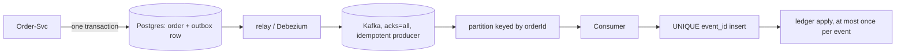

## Why it Matters

Kafka is a durable log, not a queue, and the difference shows up exactly when things crash: a commit that never reached the broker, or a redelivery that charges a card twice. The outbox on the producer and a dedupe constraint on the consumer are the pair that turns at-least-once delivery into exactly-once *effect*, the bar for any money-moving integration.

## Problems
### System Design Problem: Kafka Messaging and Idempotency

**Requirements:**
- Functional: Core capabilities for kafka messaging and idempotency
- Non-functional (SLOs): Latency < 100ms p99, Availability 99.9%, Horizontal scalability

**Constraints:**
- Scale: Handle 10x growth without redesign
- Consistency: Appropriate model for domain (strong/eventual)
- Latency budget: p99 < 100ms for read paths

**API / Interfaces:**
- Primary: REST/gRPC endpoints for core operations
- Internal: Service-to-service contracts
- Events: Domain events for async integration

## Diagram



## Code

```java
// Producer: business write and publish-intent commit atomically
@Transactional
public void placeOrder(Order o) {
 orders.save(o);
 outbox.save(new OutboxEvent("order.placed", o.getId(), toJson(o))); // same TX
}

// Consumer: the UNIQUE(event_id) insert is the lock — duplicates die here
@Transactional
@KafkaListener(topics = "payments", groupId = "ledger")
public void onPayment(PaymentEvent e) {
 int inserted = jdbc.update(
 "INSERT INTO processed_events(event_id) VALUES (?) ON CONFLICT DO NOTHING", e.id());
 if (inserted == 0) return; // redelivery — already applied, ack and skip
 ledger.apply(e); // runs at most once per event_id
}
```

## When to use / not

**Use when:**
- A business event must survive a producer crash, DB write and publish commit together.
- Consumers must be safe under redelivery (payments, inventory, notifications).
- Ordering matters per entity, same key, same partition, replayable history.

**When NOT:**
- Request/reply flows needing an instant answer, use REST/gRPC.
- Small-volume internal plumbing where a managed queue's ops cost outweighs replay value.
- If you cannot afford the operational maturity: topic/partition sizing, min ISR, DLQ alerting and retention policy.


## Trade-offs
| Dimension | This Approach | Alternative | Trade-off Rationale | Decision Rule |
|-----------|---------------|-------------|---------------------|---------------|
| Complexity | Not specified | Not specified | Not specified | Not specified |
| Operational Burden | Not specified | Not specified | Not specified | Not specified |
| Latency | Not specified | Not specified | Not specified | Not specified |
| Consistency | Not specified | Not specified | Not specified | Not specified |
| Cost at Scale | Not specified | Not specified | Not specified | Not specified |

## Vs

| Aspect | Kafka | RabbitMQ/SQS |
|---|---|---|
| Model | Durable log, replay by offset | Queue, message consumed and gone |
| Ordering | Per-partition key | FIFO queue (limited throughput) |
| Replay | Reset offset / new group, any history | Only if you archived it yourself |
| Fit | Event backbone, audit, analytics | Point-to-point work queue, ops-simple |

## Pitfalls

- Dual-write (DB + Kafka in code, no outbox) → ghost events or lost events on crash.
- Assuming global order, only per-key within a partition.


## Pitfalls
1. Underestimating operational complexity (backups, monitoring, upgrades)
2. Ignoring failure modes (network partitions, disk failures, clock drift)
3. Not planning for 10x scale from day one
4. Skipping monitoring/alerting in MVP
5. Premature optimization before measuring
6. Dual-write without transactional outbox
7. Assuming global order in partitioned systems

## Interview q&a

- **Q: Poison message kills the consumer loop?** A: Retry with backoff → dead-letter topic after N attempts, alert on DLQ depth.
- **Q: Rebasing offsets / retention?** A: Size retention by replay need (e.g. 7d); long-term audit lives in object storage, not Kafka.


## Flashcards (Spaced Repetition)

#flashcard
**Q:** What is the core concept of Kafka Messaging and Idempotency? :: **A:** Not specified #flashcard

#flashcard
**Q:** When do you apply Kafka Messaging and Idempotency? :: **A:** Not specified #flashcard

#flashcard
**Q:** What is the primary trade-off in Kafka Messaging and Idempotency? :: **A:** Not specified #flashcard

#flashcard
**Q:** What breaks first at scale in Kafka Messaging and Idempotency? :: **A:** Not specified #flashcard

#flashcard
**Q:** How do you handle failures in Kafka Messaging and Idempotency? :: **A:** Not specified #flashcard

#flashcard
**Q:** What are the key metrics to monitor for Kafka Messaging and Idempotency? :: **A:** Not specified #flashcard

#flashcard
**Q:** How does Kafka Messaging and Idempotency scale to 10x? :: **A:** Not specified #flashcard

#flashcard
**Q:** What is the consistency model for Kafka Messaging and Idempotency? :: **A:** Not specified #flashcard

#flashcard
**Q:** How do you test Kafka Messaging and Idempotency? :: **A:** Not specified #flashcard

#flashcard
**Q:** What is the operational cost of Kafka Messaging and Idempotency? :: **A:** Not specified #flashcard

#flashcard
**Q:** When would you NOT use Kafka Messaging and Idempotency? :: **A:** Not specified #flashcard

#flashcard
**Q:** What is the key design decision in Kafka Messaging and Idempotency? :: **A:** Not specified #flashcard

#flashcard
**Q:** How do you migrate to Kafka Messaging and Idempotency? :: **A:** Not specified #flashcard

#flashcard
**Q:** What security considerations for Kafka Messaging and Idempotency? :: **A:** Not specified #flashcard

#flashcard
**Q:** How do you debug Kafka Messaging and Idempotency in production? :: **A:** Not specified #flashcard


## Practice Tasks (Tasks Plugin)
- [ ] Explain the architecture from memory 📅 {{date:YYYY-MM-DD, +1}}
- [ ] Draw the system diagram without looking 📅 {{date:YYYY-MM-DD, +3}}
- [ ] Answer all Interview Q&A aloud 📅 {{date:YYYY-MM-DD, +7}}
- [ ] Review flashcards (Spaced Repetition) 📅 {{date:YYYY-MM-DD, +1}}

```tasks
not done
path includes Architect/07_Integration-APIs
sort by due
limit 10
```

## Related

- gRPC and Protobuf • Gateway and Service Mesh • [[Architect/08_NonFunctional-Ops/04_Resilience-Chaos.md|Resilience and Chaos]]

# Kafka Messaging and Idempotency

> Part of [[README|07 Integration MOC]] • `integration` • **Events at scale + exactly-once effect.** Interviews test **outbox, idempotent consumers, and ordering**.
> Watch: [TechWorld with Nana, Kafka Tutorial for Beginners](https://www.youtube.com/watch?v=QkdkLdMBuL0)

## TL;DR for Interviews

> **Kafka = durable log, not a queue.** Producer: **transactional outbox** (DB write + event atomically). Consumer: **idempotency key + dedupe table** → at-least-once delivery, exactly-once effect.

## Core Design

| Concern | Pattern |
|---------|---------|
| Publish atomically | Transactional outbox table → relay publishes |
| Ordering | Same key → same partition (per-key order only) |
| No lost events | `acks=all`, `enable.idempotence=true`, min ISR |
| No double-apply | Consumer dedupe on `event_id` (unique constraint) |
| Replay | Reset offset / new consumer group, idempotent handlers |

## Spring Kafka, Idempotent Consumer

```java
// Concept: the UNIQUE(event_id) insert is the lock, duplicates die here, not in business logic
@Transactional
@KafkaListener(topics = "payments", groupId = "ledger")
public void onPayment(PaymentEvent e) {
 int inserted = jdbc.update(
 "INSERT INTO processed_events(event_id) VALUES (?) ON CONFLICT DO NOTHING", e.id());
 if (inserted == 0) return; // Concept: redelivery, already applied, ack and skip
 ledger.apply(e); // Concept: runs at most once per event_id
}
```

## Outbox (Producer Side)

```java
// Concept: business row + outbox row commit together; a relay polls outbox → Kafka
@Transactional
public void placeOrder(Order o) {
 orders.save(o);
 outbox.save(new OutboxEvent("order.placed", o.getId(), toJson(o))); // same TX
}
```

## Quick Check

- [ ] Why outbox instead of publish-then-commit?
- [ ] Partition key vs consumer group, what controls order vs parallelism?
- [ ] How do you get exactly-once *effect*?
