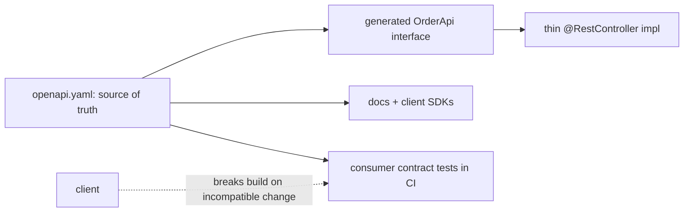

## Why it Matters

An API is a compiled dependency of someone else's code, which makes evolution the actual hard part, not the verbs. Contract-first with OpenAPI, additive-only change and consumer-driven tests in CI is what lets a public API add features for years without breaking clients, and idempotency keys are what make retry-safe `POST` possible at all.

## Problems
### System Design Problem: REST Maturity and Contracts

**Requirements:**
- Functional: Core capabilities for rest maturity and contracts
- Non-functional (SLOs): Latency < 100ms p99, Availability 99.9%, Horizontal scalability

**Constraints:**
- Scale: Handle 10x growth without redesign
- Consistency: Appropriate model for domain (strong/eventual)
- Latency budget: p99 < 100ms for read paths

**API / Interfaces:**
- Primary: REST/gRPC endpoints for core operations
- Internal: Service-to-service contracts
- Events: Domain events for async integration

## Diagram



## Code

```java
// Contract-first: implement the generated interface, not a freehand controller
@RestController
public class OrderController implements OrderApi {
 @Override
 public ResponseEntity<OrderDto> getOrder(UUID id) {
 return ResponseEntity.ok(service.find(id)); // 404 via exception handler
 }
}

// POST made retry-safe: idempotency key, server-side dedupe
@PostMapping("/payments")
public ResponseEntity<PaymentDto> pay(@RequestBody PaymentReq req,
 @RequestHeader("Idempotency-Key") String key) {
 return payments.pay(req, key) // unique index on (paymentId, key)
 .map(ResponseEntity::ok)
 .orElse(ResponseEntity.accepted().build()); // in-flight duplicate
}
```

## When to use / not

**Use when:**
- Public or partner-facing APIs, browsers, mobile, third parties all speak HTTP/JSON.
- Evolution over years matters: additive-only change inside a versioned path.
- Semantic caching, proxyability and tooling (OpenAPI, curl) are worth more than wire efficiency.

**When NOT:**
- Internal high-throughput or streaming calls, gRPC's binary frames and bidi streams win.
- Wrapping a domain model directly, expose a contract-shaped DTO, never an entity graph.


## Trade-offs
| Dimension | This Approach | Alternative | Trade-off Rationale | Decision Rule |
|-----------|---------------|-------------|---------------------|---------------|
| Complexity | Not specified | Not specified | Not specified | Not specified |
| Operational Burden | Not specified | Not specified | Not specified | Not specified |
| Latency | Not specified | Not specified | Not specified | Not specified |
| Consistency | Not specified | Not specified | Not specified | Not specified |
| Cost at Scale | Not specified | Not specified | Not specified | Not specified |

## Vs

| Aspect | REST + OpenAPI | gRPC + Protobuf |
|---|---|---|
| Wire | JSON, human-readable | Binary, compact |
| Schema | OpenAPI (often after the fact) | Protobuf, enforced and generated |
| Streaming | Workarounds (SSE/WebSocket) | Native bidi streaming |
| Browser/public edge | | Needs grpc-web proxy |
| Evolution | Additive fields, alias on rename | reserved numbers, never reuse |

## Pitfalls

- `POST` for everything (L0 in disguise), loses caching + retry semantics.
- Breaking rename of a JSON field without alias/dual-write.


## Pitfalls
1. Underestimating operational complexity (backups, monitoring, upgrades)
2. Ignoring failure modes (network partitions, disk failures, clock drift)
3. Not planning for 10x scale from day one
4. Skipping monitoring/alerting in MVP
5. Premature optimization before measuring
6. Dual-write without transactional outbox
7. Assuming global order in partitioned systems

## Interview q&a

- **Q: How do you evolve an API without breaking clients?** A: Additive changes only, optional fields, deprecate-then-remove with sunset header, Pact consumer tests in CI.
- **Q: Cursor vs offset pagination?** A: Cursor is stable under inserts and O(1) seeks; offset drifts and degrades.


## Flashcards (Spaced Repetition)

#flashcard
**Q:** What is the core concept of REST Maturity and Contracts? :: **A:** Not specified #flashcard

#flashcard
**Q:** When do you apply REST Maturity and Contracts? :: **A:** Not specified #flashcard

#flashcard
**Q:** What is the primary trade-off in REST Maturity and Contracts? :: **A:** Not specified #flashcard

#flashcard
**Q:** What breaks first at scale in REST Maturity and Contracts? :: **A:** Not specified #flashcard

#flashcard
**Q:** How do you handle failures in REST Maturity and Contracts? :: **A:** Not specified #flashcard

#flashcard
**Q:** What are the key metrics to monitor for REST Maturity and Contracts? :: **A:** Not specified #flashcard

#flashcard
**Q:** How does REST Maturity and Contracts scale to 10x? :: **A:** Not specified #flashcard

#flashcard
**Q:** What is the consistency model for REST Maturity and Contracts? :: **A:** Not specified #flashcard

#flashcard
**Q:** How do you test REST Maturity and Contracts? :: **A:** Not specified #flashcard

#flashcard
**Q:** What is the operational cost of REST Maturity and Contracts? :: **A:** Not specified #flashcard

#flashcard
**Q:** When would you NOT use REST Maturity and Contracts? :: **A:** Not specified #flashcard

#flashcard
**Q:** What is the key design decision in REST Maturity and Contracts? :: **A:** Not specified #flashcard

#flashcard
**Q:** How do you migrate to REST Maturity and Contracts? :: **A:** Not specified #flashcard

#flashcard
**Q:** What security considerations for REST Maturity and Contracts? :: **A:** Not specified #flashcard

#flashcard
**Q:** How do you debug REST Maturity and Contracts in production? :: **A:** Not specified #flashcard


## Practice Tasks (Tasks Plugin)
- [ ] Explain the architecture from memory 📅 {{date:YYYY-MM-DD, +1}}
- [ ] Draw the system diagram without looking 📅 {{date:YYYY-MM-DD, +3}}
- [ ] Answer all Interview Q&A aloud 📅 {{date:YYYY-MM-DD, +7}}
- [ ] Review flashcards (Spaced Repetition) 📅 {{date:YYYY-MM-DD, +1}}

```tasks
not done
path includes Architect/07_Integration-APIs
sort by due
limit 10
```

## Related

- gRPC and Protobuf • Gateway and Service Mesh • [[Architect/08_NonFunctional-Ops/01_Security-OAuth2-JWT.md|Security OAuth2 and JWT]]

# REST Maturity and Contracts

> Part of [[README|07 Integration MOC]] • `integration` • **Richardson levels 0–3 + contracts.** Interviews test **idempotency, versioning, and OpenAPI-first**, not just verbs.

## TL;DR for Interviews

> **L2 (verbs + resources) is the production default; L3 (HATEOAS) rarely pays off.** Contract = **OpenAPI + consumer-driven tests (Pact)** + **backwards-compatible evolution** (additive, never rename/remove).

## Richardson Maturity

| Level | Meaning | Verdict |
|-------|---------|---------|
| L0 | Single endpoint, RPC-over-HTTP | Legacy SOAP tunnels, avoid |
| L1 | Resources, one verb | Partial, stepping stone |
| L2 | Resources + verbs + status codes | Production default |
| L3 | L2 + HATEOAS links | Only for discoverable public APIs |

## Spring Contract-First (OpenAPI Generator)

```java
// openapi.yaml → generated OrderApi interface; impl stays thin
// Concept: contract is the source of truth; code follows it
@RestController
public class OrderController implements OrderApi {
 @Override
 public ResponseEntity<OrderDto> getOrder(UUID id) {
 // Concept: 404 via exception handler, not null body
 return ResponseEntity.ok(service.find(id));
 }
}
```

## Rules that Matter

- **Idempotent methods:** `GET/PUT/DELETE` safe to retry; `POST` needs an **idempotency key** header.
- **Versioning:** URI (`/v1`) for public APIs; additive-only inside a version; **never break field types**.
- **Pagination:** cursor (`after`/`limit`) over offset for large sets; always envelope errors (`code`, `message`, `traceId`).

## Quick Check

- [ ] L2 vs L3, when is HATEOAS worth it?
- [ ] How do you make `POST /payments` idempotent?
- [ ] URI vs header versioning trade-off?
- [ ] What goes in a standard error envelope?
