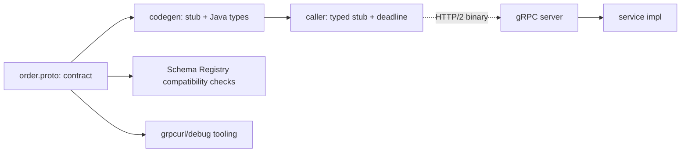

## Why it Matters

gRPC is HTTP/2 + Protobuf + codegen: what makes it worth adopting is the *schema being the source of truth*, a contract that generates clients, stubs and docs, and binary frames that cut payload size. What makes it dangerous is that the contract is invisible to curl and field numbers are forever, so evolution discipline is not optional.

## Problems
### System Design Problem: gRPC and Protobuf

**Requirements:**
- Functional: Core capabilities for grpc and protobuf
- Non-functional (SLOs): Latency < 100ms p99, Availability 99.9%, Horizontal scalability

**Constraints:**
- Scale: Handle 10x growth without redesign
- Consistency: Appropriate model for domain (strong/eventual)
- Latency budget: p99 < 100ms for read paths

**API / Interfaces:**
- Primary: REST/gRPC endpoints for core operations
- Internal: Service-to-service contracts
- Events: Domain events for async integration

## Diagram



## Code

```java
// Deadline propagates; never block a virtual thread on an unbounded stub call
ManagedChannel ch = ManagedChannelBuilder.forTarget("orders:9090")
 .usePlaintext().build();
OrderServiceGrpc.OrderServiceBlockingStub stub =
 OrderServiceGrpc.newBlockingStub(ch).withDeadlineAfter(300, TimeUnit.MILLISECONDS);

OrderResponse r = stub.getById(OrderRequest.newBuilder().setId(id).build());
```

## When to use / not

**Use when:**
- Internal service-to-service calls with a tight latency budget and stable schema.
- Streaming is first-class: bidi chat, server-push price ticks, long-lived subscriptions.
- Payload size or throughput makes JSON the bottleneck.

**When NOT:**
- Browser or public clients, needs grpc-web proxy tooling and loses curl-debuggability.
- Schema churns faster than teams can honour reserved-field rules.
- Request/reply at low volume, REST is simpler to operate and debug.


## Trade-offs
| Dimension | This Approach | Alternative | Trade-off Rationale | Decision Rule |
|-----------|---------------|-------------|---------------------|---------------|
| Complexity | [TBD] | [TBD] | [TBD] | [TBD] |
| Operational Burden | [TBD] | [TBD] | [TBD] | [TBD] |
| Latency | [TBD] | [TBD] | [TBD] | [TBD] |
| Consistency | [TBD] | [TBD] | [TBD] | [TBD] |
| Cost at Scale | [TBD] | [TBD] | [TBD] | [TBD] |

## Vs

| Aspect | gRPC | REST | GraphQL |
|---|---|---|---|
| Contract | .proto, enforced | OpenAPI, often after the fact | schema, query-driven |
| Payload | binary, compact | JSON | JSON, client-shaped |
| Streaming | native bidi | SSE/WebSocket workaround | subscriptions |
| Fit | internal mesh, streaming | public edge | many clients, nested fetches |

## Pitfalls

- Reusing a retired field number, silently corrupts old clients.
- No deadline → one slow downstream parks threads (even virtual ones pile up).


## Pitfalls
1. Underestimating operational complexity (backups, monitoring, upgrades)
2. Ignoring failure modes (network partitions, disk failures, clock drift)
3. Not planning for 10x scale from day one
4. Skipping monitoring/alerting in MVP
5. Premature optimization before measuring
6. Dual-write without transactional outbox
7. Assuming global order in partitioned systems

## Interview q&a

- **Q: gRPC vs REST for payments authorize?** A: gRPC if internal mesh call with 50ms budget + streaming settlement updates; REST at public edge.
- **Q: How do you version Protobuf?** A: Additive fields, `reserved` numbers, `UNKNOWN = 0` default, dual-serve during rollout.


## Flashcards (Spaced Repetition)

#flashcard
**Q:** What is the core concept of gRPC and Protobuf? :: **A:** [Key algorithm/architecture pattern] #flashcard

#flashcard
**Q:** When do you apply gRPC and Protobuf? :: **A:** [Trigger scenarios and context] #flashcard

#flashcard
**Q:** What is the primary trade-off in gRPC and Protobuf? :: **A:** [Main tension: e.g., consistency vs latency] #flashcard

#flashcard
**Q:** What breaks first at scale in gRPC and Protobuf? :: **A:** [Primary bottleneck: e.g., coordination, hot keys, replication lag] #flashcard

#flashcard
**Q:** How do you handle failures in gRPC and Protobuf? :: **A:** [Retry, circuit breaker, fallback, graceful degradation] #flashcard

#flashcard
**Q:** What are the key metrics to monitor for gRPC and Protobuf? :: **A:** [RED: rate, errors, duration; USE: utilization, saturation, errors] #flashcard

#flashcard
**Q:** How does gRPC and Protobuf scale to 10x? :: **A:** [Sharding, read replicas, async processing, caching layers] #flashcard

#flashcard
**Q:** What is the consistency model for gRPC and Protobuf? :: **A:** [Strong/eventual/causal - justify with use case] #flashcard

#flashcard
**Q:** How do you test gRPC and Protobuf? :: **A:** [Contract tests, chaos engineering, load tests, fault injection] #flashcard

#flashcard
**Q:** What is the operational cost of gRPC and Protobuf? :: **A:** [Team expertise, tooling, on-call burden, migration risk] #flashcard

#flashcard
**Q:** When would you NOT use gRPC and Protobuf? :: **A:** [Managed service covers need, simple CRUD, team lacks maturity] #flashcard

#flashcard
**Q:** What is the key design decision in gRPC and Protobuf? :: **A:** [The irreversible choice that defines the architecture] #flashcard

#flashcard
**Q:** How do you migrate to gRPC and Protobuf? :: **A:** [Strangler fig, dual-write, canary, feature flags] #flashcard

#flashcard
**Q:** What security considerations for gRPC and Protobuf? :: **A:** [AuthZ, encryption, audit, secrets management] #flashcard

#flashcard
**Q:** How do you debug gRPC and Protobuf in production? :: **A:** [Structured logging, correlation IDs, distributed tracing, SLO alerts] #flashcard


## Practice Tasks (Tasks Plugin)
- [ ] Explain the architecture from memory 📅 {{date:YYYY-MM-DD, +1}}
- [ ] Draw the system diagram without looking 📅 {{date:YYYY-MM-DD, +3}}
- [ ] Answer all Interview Q&A aloud 📅 {{date:YYYY-MM-DD, +7}}
- [ ] Review flashcards (Spaced Repetition) 📅 {{date:YYYY-MM-DD, +1}}

```tasks
not done
path includes Architect/07_Integration-APIs
sort by due
limit 10
```

## Related

- [[REST Maturity and Contracts]] • [[Kafka Messaging and Idempotency]] • [[Gateway and Service Mesh]]

# GRPC and Protobuf

> Part of [[README|07 Integration MOC]] • `integration` • **Binary RPC for service-to-service.** Interviews test **when gRPC beats REST and schema evolution rules**.
> Watch: [NeetCode, gRPC Explained](https://www.youtube.com/watch?v=JVenO9-d6J4)

## TL;DR for Interviews

> **gRPC = HTTP/2 + Protobuf + codegen.** Pick it for **low-latency internal calls and streaming**; keep **REST at the edge** for browsers/public clients.

## When GRPC Wins

| Need | gRPC | REST |
|------|------|------|
| Payload size / speed | binary, ~5–10× smaller | JSON tax |
| Streaming (bidi, server-push) | native | SSE/WS workarounds |
| Browser / public API | needs grpc-web proxy | universal |
| Debuggability (`curl`) | needs `grpcurl` | trivial |

## Protobuf Evolution Rules

```proto
// Concept: field numbers are the contract, never reuse, never change type
syntax = "proto3";
message Order {
 string id = 1;
 int64 total_cents = 2; // Concept: money as integer minor units
 // string status = 3; // DEPRECATED, reserve it, don't delete
 reserved 3;
 OrderStatus status_v2 = 4;
}
enum OrderStatus { UNKNOWN = 0; PLACED = 1; PAID = 2; }
```
```java
// Concept: deadline propagates; never block a virtual thread on an unbounded stub call
ManagedChannel ch = ManagedChannelBuilder.forTarget("orders:9090").usePlaintext().build();
OrderServiceGrpc.OrderServiceBlockingStub stub =
 OrderServiceGrpc.newBlockingStub(ch).withDeadlineAfter(300, TimeUnit.MILLISECONDS);
```
## Quick Check

- [ ] Why `reserved` instead of deleting a field?
- [ ] Which 4 call types does gRPC support?
- [ ] Why deadlines on every stub call?
