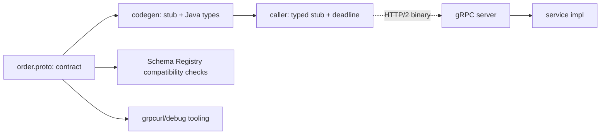

## Why it Matters

gRPC is HTTP/2 + Protobuf + codegen: what makes it worth adopting is the *schema being the source of truth*, a contract that generates clients, stubs and docs, and binary frames that cut payload size. What makes it dangerous is that the contract is invisible to curl and field numbers are forever, so evolution discipline is not optional.

## Diagram



## Code

```java
// Deadline propagates; never block a virtual thread on an unbounded stub call
ManagedChannel ch = ManagedChannelBuilder.forTarget("orders:9090")
 .usePlaintext().build();
OrderServiceGrpc.OrderServiceBlockingStub stub =
 OrderServiceGrpc.newBlockingStub(ch).withDeadlineAfter(300, TimeUnit.MILLISECONDS);

OrderResponse r = stub.getById(OrderRequest.newBuilder().setId(id).build());
```

## When to use / not

**Use when:**
- Internal service-to-service calls with a tight latency budget and stable schema.
- Streaming is first-class: bidi chat, server-push price ticks, long-lived subscriptions.
- Payload size or throughput makes JSON the bottleneck.

**When NOT:**
- Browser or public clients, needs grpc-web proxy tooling and loses curl-debuggability.
- Schema churns faster than teams can honour reserved-field rules.
- Request/reply at low volume, REST is simpler to operate and debug.

## Trade-offs

| Pros | Cons |
|---|---|
| Binary frames: smaller payloads, faster parse | No curl: debugging needs grpcurl or reflection |
| Native streaming (unary/server/bidi) | Schema evolution rules are unforgiving |
| Codegen: typed clients, no hand-written marshalling | HTTP/2 + sidecar/L7 infra requirement |
| Deadlines propagate across call chains | Tooling and browser story lags REST |

## Vs

| Aspect | gRPC | REST | GraphQL |
|---|---|---|---|
| Contract | .proto, enforced | OpenAPI, often after the fact | schema, query-driven |
| Payload | binary, compact | JSON | JSON, client-shaped |
| Streaming | native bidi | SSE/WebSocket workaround | subscriptions |
| Fit | internal mesh, streaming | public edge | many clients, nested fetches |

## Pitfalls

- Reusing a retired field number, silently corrupts old clients.
- No deadline → one slow downstream parks threads (even virtual ones pile up).

## Interview q&a

- **Q: gRPC vs REST for payments authorize?** A: gRPC if internal mesh call with 50ms budget + streaming settlement updates; REST at public edge.
- **Q: How do you version Protobuf?** A: Additive fields, `reserved` numbers, `UNKNOWN = 0` default, dual-serve during rollout.

## Related

- [[REST Maturity and Contracts]] • [[Kafka Messaging and Idempotency]] • [[Gateway and Service Mesh]]

# GRPC and Protobuf

> Part of [[README|07 Integration MOC]] • `integration` • **Binary RPC for service-to-service.** Interviews test **when gRPC beats REST and schema evolution rules**.
> Watch: [NeetCode, gRPC Explained](https://www.youtube.com/watch?v=JVenO9-d6J4)

## TL;DR for Interviews

> **gRPC = HTTP/2 + Protobuf + codegen.** Pick it for **low-latency internal calls and streaming**; keep **REST at the edge** for browsers/public clients.

## When GRPC Wins

| Need | gRPC | REST |
|------|------|------|
| Payload size / speed | binary, ~5–10× smaller | JSON tax |
| Streaming (bidi, server-push) | native | SSE/WS workarounds |
| Browser / public API | needs grpc-web proxy | universal |
| Debuggability (`curl`) | needs `grpcurl` | trivial |

## Protobuf Evolution Rules

```proto
// Concept: field numbers are the contract, never reuse, never change type
syntax = "proto3";
message Order {
 string id = 1;
 int64 total_cents = 2; // Concept: money as integer minor units
 // string status = 3; // DEPRECATED, reserve it, don't delete
 reserved 3;
 OrderStatus status_v2 = 4;
}
enum OrderStatus { UNKNOWN = 0; PLACED = 1; PAID = 2; }
```
```java
// Concept: deadline propagates; never block a virtual thread on an unbounded stub call
ManagedChannel ch = ManagedChannelBuilder.forTarget("orders:9090").usePlaintext().build();
OrderServiceGrpc.OrderServiceBlockingStub stub =
 OrderServiceGrpc.newBlockingStub(ch).withDeadlineAfter(300, TimeUnit.MILLISECONDS);
```
## Quick Check

- [ ] Why `reserved` instead of deleting a field?
- [ ] Which 4 call types does gRPC support?
- [ ] Why deadlines on every stub call?
