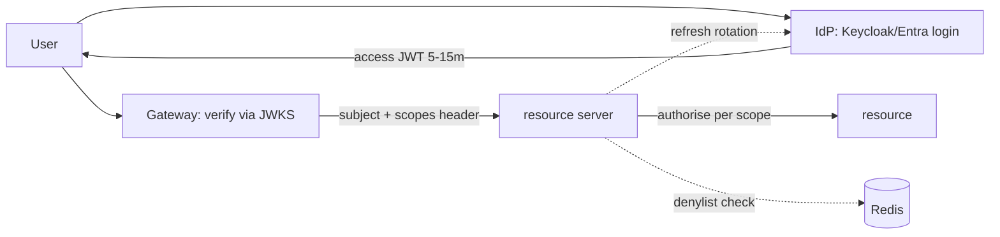

## Why it Matters

Authentication is the one subsystem where inventing your own is a liability, and OAuth2/OIDC exists so you don't. Short-lived signed tokens validated locally let a fleet scale statelessly while an identity provider owns the credentials; the hard parts move to token lifetime, revocation and keeping secrets out of logs, all cheaper than a breach.

## Diagram



## Code

```java
// Resource server: validate JWT, enforce scopes
@Bean SecurityFilterChain api(HttpSecurity h) throws Exception {
 return h.authorizeHttpRequests(a -> a
 .requestMatchers("/public/**").permitAll()
 .requestMatchers("/admin/**").hasAuthority("SCOPE_admin")
 .anyRequest().authenticated())
 .oauth2ResourceServer(o -> o.jwt(Customizer.withDefaults()))
 .sessionManagement(s -> s.sessionCreationPolicy(STATELESS))
 .build(); // short TTL (5-15m) + refresh rotation
```

## When to use / not

- SPAs/mobile calling Spring resource servers.
- Service-to-service via client-credentials + mTLS.
- Any multi-tenant SaaS needing SSO.

**When NOT:** Public clients storing long-lived secrets; opaque sessions at web scale without a session store; putting PII/permissions blobs in JWT claims.

## Trade-offs

| Pros | Cons |
|---|---|
| Stateless scale; single SSO | Token revocation is hard (need denylist/short TTL) |
| Delegated login (Google/Entra/Keycloak) | Claim bloat → header size; key rotation ops |
| Scopes = coarse authz standard | Fine-grained authz still needs local policy (OPA/Cedar) |

## Vs

- **Vs session cookie:** sessions revoke instantly but need sticky/shared store; JWT scales statelessly but revocation lags.
- **Vs mTLS-only:** mTLS proves identity, OAuth adds delegated scopes + user consent.

## Pitfalls

- Accepting `none` alg or skipping `iss`/`aud` validation.
- Long-lived access tokens (hours/days).
- Trusting client-supplied roles without server mapping.

## Interview q&a

**Q: Where do you store tokens in a SPA?**
A: Access token in memory, refresh in HttpOnly Secure SameSite cookie (BFF pattern); never localStorage (XSS theft).

**Q: How do you handle revocation?**
A: Short TTL + refresh rotation + denylist (Redis) checked at gateway; critical ops re-check IdP/introspection.

**Q: JWT vs opaque?**
A: JWT for edge scale (verify locally via JWKS); opaque at gateway when instant revoke/audit matters.

## Related

- [[05_Cloud-K8s-Deploy-Helm|K8s Deploy]] · [[05_Compliance-Audit]] · [[04_API-Gateway-BFF]]

# Security, OAuth2, OIDC & jwt

> **Intent:** Authenticate once at an IdP, authorize everywhere downstream with short-lived signed tokens; never roll your own auth.
> Watch: [ByteByteGo, OAuth 2 in Simple Terms](https://www.youtube.com/watch?v=ZV5yTm4pT8g)
