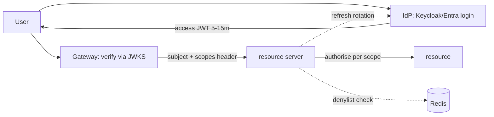

## Why it Matters

Authentication is the one subsystem where inventing your own is a liability, and OAuth2/OIDC exists so you don't. Short-lived signed tokens validated locally let a fleet scale statelessly while an identity provider owns the credentials; the hard parts move to token lifetime, revocation and keeping secrets out of logs, all cheaper than a breach.

## Problems
### System Design Problem: Security, OAuth2, OIDC & JWT

**Requirements:**
- Functional: Core capabilities for security, oauth2, oidc & jwt
- Non-functional (SLOs): Latency < 100ms p99, Availability 99.9%, Horizontal scalability

**Constraints:**
- Scale: Handle 10x growth without redesign
- Consistency: Appropriate model for domain (strong/eventual)
- Latency budget: p99 < 100ms for read paths

**API / Interfaces:**
- Primary: REST/gRPC endpoints for core operations
- Internal: Service-to-service contracts
- Events: Domain events for async integration

## Diagram



## Code

```java
// Resource server: validate JWT, enforce scopes
@Bean SecurityFilterChain api(HttpSecurity h) throws Exception {
 return h.authorizeHttpRequests(a -> a
 .requestMatchers("/public/**").permitAll()
 .requestMatchers("/admin/**").hasAuthority("SCOPE_admin")
 .anyRequest().authenticated())
 .oauth2ResourceServer(o -> o.jwt(Customizer.withDefaults()))
 .sessionManagement(s -> s.sessionCreationPolicy(STATELESS))
 .build(); // short TTL (5-15m) + refresh rotation
```

## When to use / not

- SPAs/mobile calling Spring resource servers.
- Service-to-service via client-credentials + mTLS.
- Any multi-tenant SaaS needing SSO.

**When NOT:** Public clients storing long-lived secrets; opaque sessions at web scale without a session store; putting PII/permissions blobs in JWT claims.


## Trade-offs
| Dimension | This Approach | Alternative | Trade-off Rationale | Decision Rule |
|-----------|---------------|-------------|---------------------|---------------|
| Complexity | [TBD] | [TBD] | [TBD] | [TBD] |
| Operational Burden | [TBD] | [TBD] | [TBD] | [TBD] |
| Latency | [TBD] | [TBD] | [TBD] | [TBD] |
| Consistency | [TBD] | [TBD] | [TBD] | [TBD] |
| Cost at Scale | [TBD] | [TBD] | [TBD] | [TBD] |

## Vs

- **Vs session cookie:** sessions revoke instantly but need sticky/shared store; JWT scales statelessly but revocation lags.
- **Vs mTLS-only:** mTLS proves identity, OAuth adds delegated scopes + user consent.

## Pitfalls

- Accepting `none` alg or skipping `iss`/`aud` validation.
- Long-lived access tokens (hours/days).
- Trusting client-supplied roles without server mapping.


## Pitfalls
1. Underestimating operational complexity (backups, monitoring, upgrades)
2. Ignoring failure modes (network partitions, disk failures, clock drift)
3. Not planning for 10x scale from day one
4. Skipping monitoring/alerting in MVP
5. Premature optimization before measuring
6. Dual-write without transactional outbox
7. Assuming global order in partitioned systems

## Interview q&a

**Q: Where do you store tokens in a SPA?**
A: Access token in memory, refresh in HttpOnly Secure SameSite cookie (BFF pattern); never localStorage (XSS theft).

**Q: How do you handle revocation?**
A: Short TTL + refresh rotation + denylist (Redis) checked at gateway; critical ops re-check IdP/introspection.

**Q: JWT vs opaque?**
A: JWT for edge scale (verify locally via JWKS); opaque at gateway when instant revoke/audit matters.


## Flashcards (Spaced Repetition)

#flashcard
**Q:** What is the core concept of Security, OAuth2, OIDC & JWT? :: **A:** [Key algorithm/architecture pattern] #flashcard

#flashcard
**Q:** When do you apply Security, OAuth2, OIDC & JWT? :: **A:** [Trigger scenarios and context] #flashcard

#flashcard
**Q:** What is the primary trade-off in Security, OAuth2, OIDC & JWT? :: **A:** [Main tension: e.g., consistency vs latency] #flashcard

#flashcard
**Q:** What breaks first at scale in Security, OAuth2, OIDC & JWT? :: **A:** [Primary bottleneck: e.g., coordination, hot keys, replication lag] #flashcard

#flashcard
**Q:** How do you handle failures in Security, OAuth2, OIDC & JWT? :: **A:** [Retry, circuit breaker, fallback, graceful degradation] #flashcard

#flashcard
**Q:** What are the key metrics to monitor for Security, OAuth2, OIDC & JWT? :: **A:** [RED: rate, errors, duration; USE: utilization, saturation, errors] #flashcard

#flashcard
**Q:** How does Security, OAuth2, OIDC & JWT scale to 10x? :: **A:** [Sharding, read replicas, async processing, caching layers] #flashcard

#flashcard
**Q:** What is the consistency model for Security, OAuth2, OIDC & JWT? :: **A:** [Strong/eventual/causal - justify with use case] #flashcard

#flashcard
**Q:** How do you test Security, OAuth2, OIDC & JWT? :: **A:** [Contract tests, chaos engineering, load tests, fault injection] #flashcard

#flashcard
**Q:** What is the operational cost of Security, OAuth2, OIDC & JWT? :: **A:** [Team expertise, tooling, on-call burden, migration risk] #flashcard

#flashcard
**Q:** When would you NOT use Security, OAuth2, OIDC & JWT? :: **A:** [Managed service covers need, simple CRUD, team lacks maturity] #flashcard

#flashcard
**Q:** What is the key design decision in Security, OAuth2, OIDC & JWT? :: **A:** [The irreversible choice that defines the architecture] #flashcard

#flashcard
**Q:** How do you migrate to Security, OAuth2, OIDC & JWT? :: **A:** [Strangler fig, dual-write, canary, feature flags] #flashcard

#flashcard
**Q:** What security considerations for Security, OAuth2, OIDC & JWT? :: **A:** [AuthZ, encryption, audit, secrets management] #flashcard

#flashcard
**Q:** How do you debug Security, OAuth2, OIDC & JWT in production? :: **A:** [Structured logging, correlation IDs, distributed tracing, SLO alerts] #flashcard


## Practice Tasks (Tasks Plugin)
- [ ] Explain the architecture from memory 📅 {{date:YYYY-MM-DD, +1}}
- [ ] Draw the system diagram without looking 📅 {{date:YYYY-MM-DD, +3}}
- [ ] Answer all Interview Q&A aloud 📅 {{date:YYYY-MM-DD, +7}}
- [ ] Review flashcards (Spaced Repetition) 📅 {{date:YYYY-MM-DD, +1}}

```tasks
not done
path includes Architect/08_NonFunctional-Ops
sort by due
limit 10
```

## Related

- [[05_Cloud-K8s-Deploy-Helm|K8s Deploy]] · [[05_Compliance-Audit]] · [[04_API-Gateway-BFF]]

# Security, OAuth2, OIDC & jwt

> **Intent:** Authenticate once at an IdP, authorize everywhere downstream with short-lived signed tokens; never roll your own auth.
> Watch: [ByteByteGo, OAuth 2 in Simple Terms](https://www.youtube.com/watch?v=ZV5yTm4pT8g)
