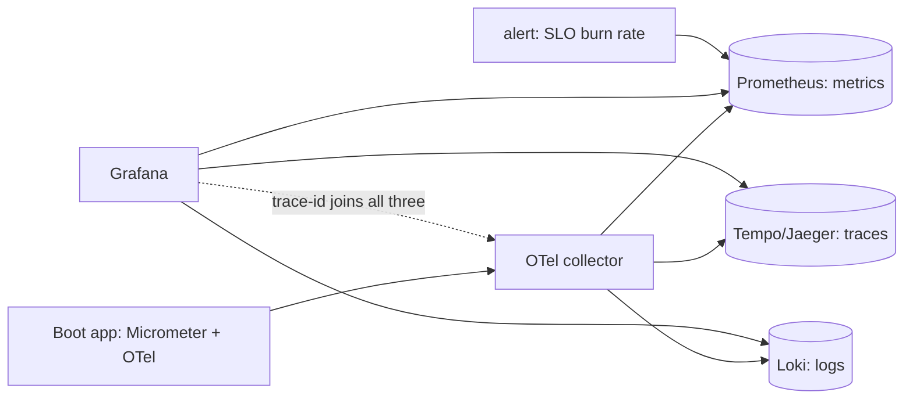

## Why it Matters

In a distributed system the incident question is never "which log line" but "which causal path", and only correlated signals answer it. One trace-id from edge to database is what turns a two-hour hunt into a ten-minute one, and burn-rate alerts on SLOs are what tells you a slow regression is happening before users do.

## Diagram



## Code

```java
// build.gradle: micrometer + otel
// management.otlp.metrics.export.url=http://collector:4318/v1/metrics
// management.tracing.sampling.probability=0.1 // 10% head sampling
@RestController class OrderApi {
 private final MeterRegistry reg; // inject
 @GetMapping("/orders/{id}") Order get(@PathVariable String id) {
 reg.counter("orders.get", "route", "byId").increment();
 return repo.find(id); // trace auto-propagated via OTel
 }
}
```

## When to use / not

- Every Spring Boot service (actuator + Micrometer + OTel agent).
- SLO burn-rate alerts on RED/USE signals.
- Post-incident forensics across services.

**When NOT:** Logging everything at DEBUG in prod; high-cardinality labels (user-id in Prometheus); tracing without sampling policy (cost blowup).

## Trade-offs

| Pros | Cons |
|---|---|
| One trace-id joins logs/metrics/traces | Instrumentation + collector ops overhead |
| Burn-rate alerts catch SLO bleed early | Cardinality/cost discipline required |
| Vendor-neutral (OTLP → any backend) | Tail-sampling complexity for rare errors |

## Vs

- **Vs ELK-only:** logs tell what happened on one box; traces show the cross-service causal path + latency split.
- **Vs APM agent lock-in:** OTel exports OTLP to Prometheus/Tempo/Jaeger, swap backends freely.

## Pitfalls

- Alerting on symptoms-free CPU% instead of SLO burn rate.
- Missing trace propagation through Kafka headers.
- Dashboard sprawl: 50 panels nobody owns.

## Interview q&a

**Q: RED vs USE?**
A: RED (Rate/Errors/Duration) for user-facing services; USE (Util/Sat/Errors) for infra (CPU, disk, broker lag).

**Q: How do you keep Prometheus cheap?**
A: Bound label cardinality, drop debug histograms at edge, federate/record rules, 15-30d local retention → Thanos/Mimir.

**Q: Head vs tail sampling?**
A: Head (probabilistic at ingress) is cheap; tail (collector keeps errors/slow) preserves rare failures, use both.

## Related

- [[03_Performance-SLOs]] · [[04_Resilience-Chaos]] · [[05_Cloud-K8s-Deploy-Helm]]

# Observability, OTel, Prometheus & Grafana

> **Intent:** Answer 'what broke, where, and why' in minutes: correlated logs + metrics + traces with one trace-id from edge to DB.
> Watch: [OpenTelemetry, OTel for Beginners](https://www.youtube.com/watch?v=iEEIabOha8U)
