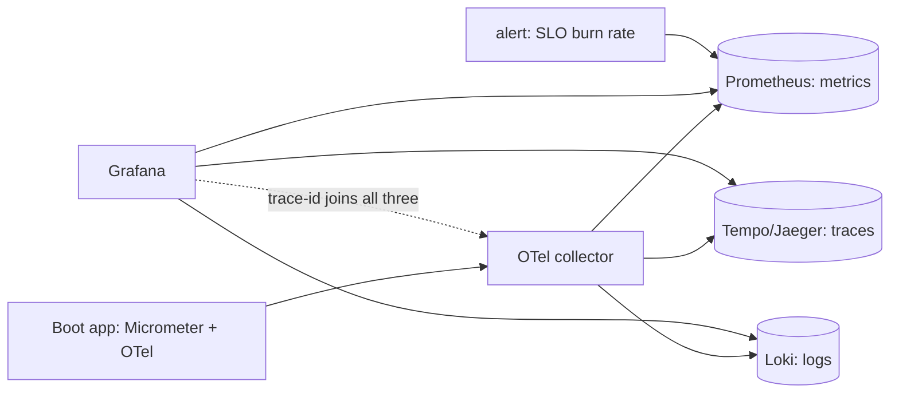

## Why it Matters

In a distributed system the incident question is never "which log line" but "which causal path", and only correlated signals answer it. One trace-id from edge to database is what turns a two-hour hunt into a ten-minute one, and burn-rate alerts on SLOs are what tells you a slow regression is happening before users do.

## Problems
### System Design Problem: Observability, OTel, Prometheus & Grafana

**Requirements:**
- Functional: Core capabilities for observability, otel, prometheus & grafana
- Non-functional (SLOs): Latency < 100ms p99, Availability 99.9%, Horizontal scalability

**Constraints:**
- Scale: Handle 10x growth without redesign
- Consistency: Appropriate model for domain (strong/eventual)
- Latency budget: p99 < 100ms for read paths

**API / Interfaces:**
- Primary: REST/gRPC endpoints for core operations
- Internal: Service-to-service contracts
- Events: Domain events for async integration

## Diagram



## Code

```java
// build.gradle: micrometer + otel
// management.otlp.metrics.export.url=http://collector:4318/v1/metrics
// management.tracing.sampling.probability=0.1 // 10% head sampling
@RestController class OrderApi {
 private final MeterRegistry reg; // inject
 @GetMapping("/orders/{id}") Order get(@PathVariable String id) {
 reg.counter("orders.get", "route", "byId").increment();
 return repo.find(id); // trace auto-propagated via OTel
 }
}
```

## When to use / not

- Every Spring Boot service (actuator + Micrometer + OTel agent).
- SLO burn-rate alerts on RED/USE signals.
- Post-incident forensics across services.

**When NOT:** Logging everything at DEBUG in prod; high-cardinality labels (user-id in Prometheus); tracing without sampling policy (cost blowup).


## Trade-offs
| Dimension | This Approach | Alternative | Trade-off Rationale | Decision Rule |
|-----------|---------------|-------------|---------------------|---------------|
| Complexity | Not specified | Not specified | Not specified | Not specified |
| Operational Burden | Not specified | Not specified | Not specified | Not specified |
| Latency | Not specified | Not specified | Not specified | Not specified |
| Consistency | Not specified | Not specified | Not specified | Not specified |
| Cost at Scale | Not specified | Not specified | Not specified | Not specified |

## Vs

- **Vs ELK-only:** logs tell what happened on one box; traces show the cross-service causal path + latency split.
- **Vs APM agent lock-in:** OTel exports OTLP to Prometheus/Tempo/Jaeger, swap backends freely.

## Pitfalls

- Alerting on symptoms-free CPU% instead of SLO burn rate.
- Missing trace propagation through Kafka headers.
- Dashboard sprawl: 50 panels nobody owns.


## Pitfalls
1. Underestimating operational complexity (backups, monitoring, upgrades)
2. Ignoring failure modes (network partitions, disk failures, clock drift)
3. Not planning for 10x scale from day one
4. Skipping monitoring/alerting in MVP
5. Premature optimization before measuring
6. Dual-write without transactional outbox
7. Assuming global order in partitioned systems

## Interview q&a

**Q: RED vs USE?**
A: RED (Rate/Errors/Duration) for user-facing services; USE (Util/Sat/Errors) for infra (CPU, disk, broker lag).

**Q: How do you keep Prometheus cheap?**
A: Bound label cardinality, drop debug histograms at edge, federate/record rules, 15-30d local retention → Thanos/Mimir.

**Q: Head vs tail sampling?**
A: Head (probabilistic at ingress) is cheap; tail (collector keeps errors/slow) preserves rare failures, use both.


## Flashcards (Spaced Repetition)

#flashcard
**Q:** What is the core concept of Observability, OTel, Prometheus & Grafana? :: **A:** Not specified #flashcard

#flashcard
**Q:** When do you apply Observability, OTel, Prometheus & Grafana? :: **A:** Not specified #flashcard

#flashcard
**Q:** What is the primary trade-off in Observability, OTel, Prometheus & Grafana? :: **A:** Not specified #flashcard

#flashcard
**Q:** What breaks first at scale in Observability, OTel, Prometheus & Grafana? :: **A:** Not specified #flashcard

#flashcard
**Q:** How do you handle failures in Observability, OTel, Prometheus & Grafana? :: **A:** Not specified #flashcard

#flashcard
**Q:** What are the key metrics to monitor for Observability, OTel, Prometheus & Grafana? :: **A:** Not specified #flashcard

#flashcard
**Q:** How does Observability, OTel, Prometheus & Grafana scale to 10x? :: **A:** Not specified #flashcard

#flashcard
**Q:** What is the consistency model for Observability, OTel, Prometheus & Grafana? :: **A:** Not specified #flashcard

#flashcard
**Q:** How do you test Observability, OTel, Prometheus & Grafana? :: **A:** Not specified #flashcard

#flashcard
**Q:** What is the operational cost of Observability, OTel, Prometheus & Grafana? :: **A:** Not specified #flashcard

#flashcard
**Q:** When would you NOT use Observability, OTel, Prometheus & Grafana? :: **A:** Not specified #flashcard

#flashcard
**Q:** What is the key design decision in Observability, OTel, Prometheus & Grafana? :: **A:** Not specified #flashcard

#flashcard
**Q:** How do you migrate to Observability, OTel, Prometheus & Grafana? :: **A:** Not specified #flashcard

#flashcard
**Q:** What security considerations for Observability, OTel, Prometheus & Grafana? :: **A:** Not specified #flashcard

#flashcard
**Q:** How do you debug Observability, OTel, Prometheus & Grafana in production? :: **A:** Not specified #flashcard


## Practice Tasks (Tasks Plugin)
- [ ] Explain the architecture from memory 📅 {{date:YYYY-MM-DD, +1}}
- [ ] Draw the system diagram without looking 📅 {{date:YYYY-MM-DD, +3}}
- [ ] Answer all Interview Q&A aloud 📅 {{date:YYYY-MM-DD, +7}}
- [ ] Review flashcards (Spaced Repetition) 📅 {{date:YYYY-MM-DD, +1}}

```tasks
not done
path includes Architect/08_NonFunctional-Ops
sort by due
limit 10
```

## Related

- 03_Performance-SLOs · 04_Resilience-Chaos · 05_Cloud-K8s-Deploy-Helm

# Observability, OTel, Prometheus & Grafana

> **Intent:** Answer 'what broke, where, and why' in minutes: correlated logs + metrics + traces with one trace-id from edge to DB.
> Watch: [OpenTelemetry, OTel for Beginners](https://www.youtube.com/watch?v=iEEIabOha8U)
