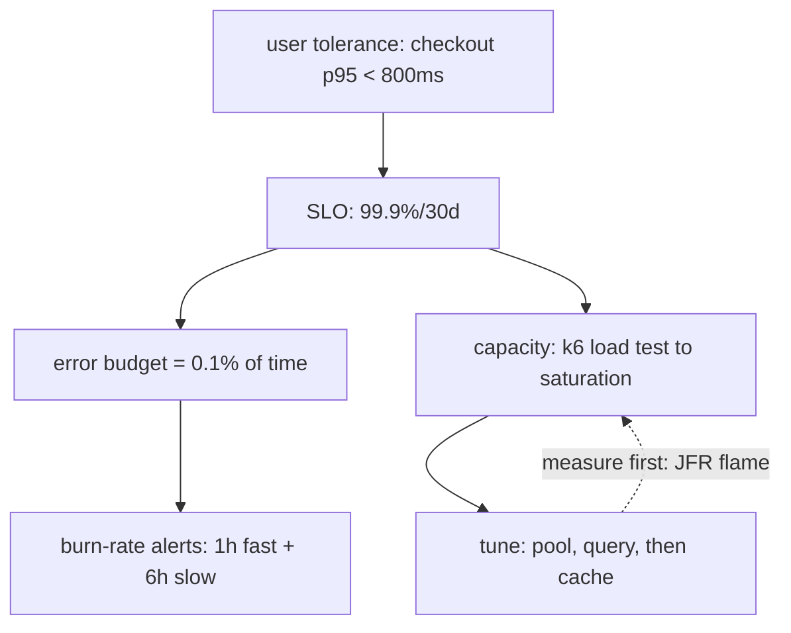

## Why it Matters

"Make it fast" is unmeetable and unfinishable; a percentile budget per endpoint is both. SLOs convert performance from a complaint into a design input, they tell you when to stop, which optimisation is worth doing, and whether a regression actually hurt users or just hurt a dashboard.

## Problems
### System Design Problem: Performance, SLOs, Latency Budgets & Tuning

**Requirements:**
- Functional: Core capabilities for performance, slos, latency budgets & tuning
- Non-functional (SLOs): Latency < 100ms p99, Availability 99.9%, Horizontal scalability

**Constraints:**
- Scale: Handle 10x growth without redesign
- Consistency: Appropriate model for domain (strong/eventual)
- Latency budget: p99 < 100ms for read paths

**API / Interfaces:**
- Primary: REST/gRPC endpoints for core operations
- Internal: Service-to-service contracts
- Events: Domain events for async integration

## Diagram



## Code

```java
// Virtual threads (Boot 3.5, Java 21+): blocking code scales
// spring.threads.virtual.enabled=true
spring.datasource.hikari.maximum-pool-size: 20 # ~ (2*cores)+spindle rule, measure!
management.metrics.distribution.slos.http.server.requests: 50ms,200ms,500ms
// k6: thresholds: { http_req_duration: ['p(95)<500','p(99)<1200'] }
```

## When to use / not

- Checkout/search SLAs with contractual penalties.
- Capacity planning before sale events.
- Regressions: fail build when p99 drifts.

**When NOT:** Tuning before measuring (flame first); single p99 for mixed workloads; load-testing prod data without isolation.


## Trade-offs
| Dimension | This Approach | Alternative | Trade-off Rationale | Decision Rule |
|-----------|---------------|-------------|---------------------|---------------|
| Complexity | [TBD] | [TBD] | [TBD] | [TBD] |
| Operational Burden | [TBD] | [TBD] | [TBD] | [TBD] |
| Latency | [TBD] | [TBD] | [TBD] | [TBD] |
| Consistency | [TBD] | [TBD] | [TBD] | [TBD] |
| Cost at Scale | [TBD] | [TBD] | [TBD] | [TBD] |

## Vs

- **Vs throughput-only:** 10k rps at p99=5s is a failure; latency percentiles + error budget beat raw rps.
- **Vs premature caching:** measure (flame/JFR) → fix query/N+1 → then cache; cache first hides the wound.

## Pitfalls

- Optimizing JSON serialization while N+1 does 400 queries.
- Soak-test skipped → connection/GC leak only at hour 6.
- One global timeout for fast + batch endpoints.


## Pitfalls
1. Underestimating operational complexity (backups, monitoring, upgrades)
2. Ignoring failure modes (network partitions, disk failures, clock drift)
3. Not planning for 10x scale from day one
4. Skipping monitoring/alerting in MVP
5. Premature optimization before measuring
6. Dual-write without transactional outbox
7. Assuming global order in partitioned systems

## Interview q&a

**Q: How do you set an SLO?**
A: From user tolerance (checkout p95<800ms, 99.9%/30d) → error budget → burn-rate alerts (fast 1h + slow 6h).

**Q: Pool sizing?**
A: Start (2×cores)+1 for OLTP, load-test to saturation, watch wait-time metric, not guesswork.

**Q: JFR vs profiler in prod?**
A: JFR (near-zero overhead, always-on) for flame/allocation/lock; async-profiler for deep CPU dives.


## Flashcards (Spaced Repetition)

#flashcard
**Q:** What is the core concept of Performance, SLOs, Latency Budgets & Tuning? :: **A:** [Key algorithm/architecture pattern] #flashcard

#flashcard
**Q:** When do you apply Performance, SLOs, Latency Budgets & Tuning? :: **A:** [Trigger scenarios and context] #flashcard

#flashcard
**Q:** What is the primary trade-off in Performance, SLOs, Latency Budgets & Tuning? :: **A:** [Main tension: e.g., consistency vs latency] #flashcard

#flashcard
**Q:** What breaks first at scale in Performance, SLOs, Latency Budgets & Tuning? :: **A:** [Primary bottleneck: e.g., coordination, hot keys, replication lag] #flashcard

#flashcard
**Q:** How do you handle failures in Performance, SLOs, Latency Budgets & Tuning? :: **A:** [Retry, circuit breaker, fallback, graceful degradation] #flashcard

#flashcard
**Q:** What are the key metrics to monitor for Performance, SLOs, Latency Budgets & Tuning? :: **A:** [RED: rate, errors, duration; USE: utilization, saturation, errors] #flashcard

#flashcard
**Q:** How does Performance, SLOs, Latency Budgets & Tuning scale to 10x? :: **A:** [Sharding, read replicas, async processing, caching layers] #flashcard

#flashcard
**Q:** What is the consistency model for Performance, SLOs, Latency Budgets & Tuning? :: **A:** [Strong/eventual/causal - justify with use case] #flashcard

#flashcard
**Q:** How do you test Performance, SLOs, Latency Budgets & Tuning? :: **A:** [Contract tests, chaos engineering, load tests, fault injection] #flashcard

#flashcard
**Q:** What is the operational cost of Performance, SLOs, Latency Budgets & Tuning? :: **A:** [Team expertise, tooling, on-call burden, migration risk] #flashcard

#flashcard
**Q:** When would you NOT use Performance, SLOs, Latency Budgets & Tuning? :: **A:** [Managed service covers need, simple CRUD, team lacks maturity] #flashcard

#flashcard
**Q:** What is the key design decision in Performance, SLOs, Latency Budgets & Tuning? :: **A:** [The irreversible choice that defines the architecture] #flashcard

#flashcard
**Q:** How do you migrate to Performance, SLOs, Latency Budgets & Tuning? :: **A:** [Strangler fig, dual-write, canary, feature flags] #flashcard

#flashcard
**Q:** What security considerations for Performance, SLOs, Latency Budgets & Tuning? :: **A:** [AuthZ, encryption, audit, secrets management] #flashcard

#flashcard
**Q:** How do you debug Performance, SLOs, Latency Budgets & Tuning in production? :: **A:** [Structured logging, correlation IDs, distributed tracing, SLO alerts] #flashcard


## Practice Tasks (Tasks Plugin)
- [ ] Explain the architecture from memory 📅 {{date:YYYY-MM-DD, +1}}
- [ ] Draw the system diagram without looking 📅 {{date:YYYY-MM-DD, +3}}
- [ ] Answer all Interview Q&A aloud 📅 {{date:YYYY-MM-DD, +7}}
- [ ] Review flashcards (Spaced Repetition) 📅 {{date:YYYY-MM-DD, +1}}

```tasks
not done
path includes Architect/08_NonFunctional-Ops
sort by due
limit 10
```

## Related

- [[02_Observability-OTel-Prometheus]] · [[06_Cost-FinOps]] · [[Architect/03_Architecture-Styles/04_Event-Driven-Architecture.md]]

# Performance, SLOs, Latency Budgets & Tuning

> **Intent:** Convert vague 'fast' into measurable budgets: p50/p95/p99 per endpoint, then spend the budget deliberately (JVM, pool, query).
