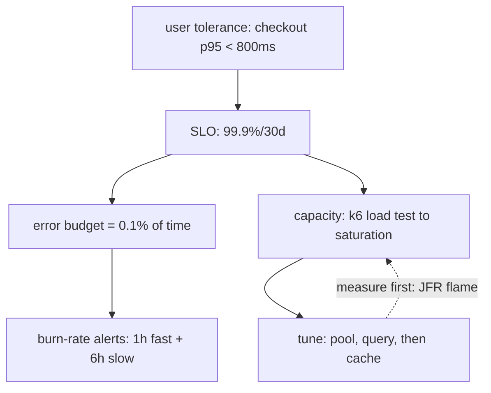

## Why it Matters

"Make it fast" is unmeetable and unfinishable; a percentile budget per endpoint is both. SLOs convert performance from a complaint into a design input, they tell you when to stop, which optimisation is worth doing, and whether a regression actually hurt users or just hurt a dashboard.

## Diagram



## Code

```java
// Virtual threads (Boot 3.5, Java 21+): blocking code scales
// spring.threads.virtual.enabled=true
spring.datasource.hikari.maximum-pool-size: 20 # ~ (2*cores)+spindle rule, measure!
management.metrics.distribution.slos.http.server.requests: 50ms,200ms,500ms
// k6: thresholds: { http_req_duration: ['p(95)<500','p(99)<1200'] }
```

## When to use / not

- Checkout/search SLAs with contractual penalties.
- Capacity planning before sale events.
- Regressions: fail build when p99 drifts.

**When NOT:** Tuning before measuring (flame first); single p99 for mixed workloads; load-testing prod data without isolation.

## Trade-offs

| Pros | Cons |
|---|---|
| Budgets make perf a design input | Percentiles hide bimodal pain (also track max + histogram) |
| Virtual threads kill thread-pool tuning | DB/pool contention moves, doesn't vanish |
| SLOs align eng + product on tradeoffs | Over-tight SLOs burn on-call for no user gain |

## Vs

- **Vs throughput-only:** 10k rps at p99=5s is a failure; latency percentiles + error budget beat raw rps.
- **Vs premature caching:** measure (flame/JFR) → fix query/N+1 → then cache; cache first hides the wound.

## Pitfalls

- Optimizing JSON serialization while N+1 does 400 queries.
- Soak-test skipped → connection/GC leak only at hour 6.
- One global timeout for fast + batch endpoints.

## Interview q&a

**Q: How do you set an SLO?**
A: From user tolerance (checkout p95<800ms, 99.9%/30d) → error budget → burn-rate alerts (fast 1h + slow 6h).

**Q: Pool sizing?**
A: Start (2×cores)+1 for OLTP, load-test to saturation, watch wait-time metric, not guesswork.

**Q: JFR vs profiler in prod?**
A: JFR (near-zero overhead, always-on) for flame/allocation/lock; async-profiler for deep CPU dives.

## Related

- [[02_Observability-OTel-Prometheus]] · [[06_Cost-FinOps]] · [[Architect/03_Architecture-Styles/04_Event-Driven-Architecture.md]]

# Performance, SLOs, Latency Budgets & Tuning

> **Intent:** Convert vague 'fast' into measurable budgets: p50/p95/p99 per endpoint, then spend the budget deliberately (JVM, pool, query).
