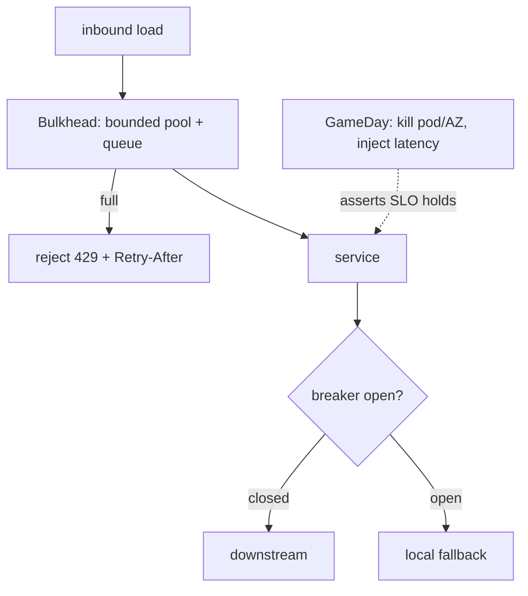

## Why it Matters

Graceful degradation is not something you can declare; it has to be proven under failure. Isolating failure domains and bounding queues is the design, but a GameDay with a hypothesis and a blast radius is the test, the first time a bulkhead matters must not be during an outage.

## Problems
### System Design Problem: Resilience & Chaos, Bulkheads, Backpressure & GameDays

**Requirements:**
- Functional: Core capabilities for resilience & chaos, bulkheads, backpressure & gamedays
- Non-functional (SLOs): Latency < 100ms p99, Availability 99.9%, Horizontal scalability

**Constraints:**
- Scale: Handle 10x growth without redesign
- Consistency: Appropriate model for domain (strong/eventual)
- Latency budget: p99 < 100ms for read paths

**API / Interfaces:**
- Primary: REST/gRPC endpoints for core operations
- Internal: Service-to-service contracts
- Events: Domain events for async integration

## Diagram



## Code

```java
// Bulkhead + backpressure: isolate + bound queues
@Bean TaskExecutor checkoutPool() { // dedicated pool, never shared with batch
 ThreadPoolTaskExecutor t = new ThreadPoolTaskExecutor();
 t.setCorePoolSize(20); t.setMaxPoolSize(50);
 t.setQueueCapacity(100); // bounded: reject fast, don't OOM
 t.setRejectedExecutionHandler(new ThreadPoolExecutor.CallerRunsPolicy());
 return t;
}
// chaos: Chaos Monkey (Spring) / LitmusChaos kill 1 pod, assert p99 + error budget hold
```

## When to use / not

- Payment/checkout depending on flaky PSPs.
- Kafka consumer lag storms.
- Multi-AZ failover confidence.

**When NOT:** Chaos in prod without blast-radius limits; killing pods while deploys are broken; chaos as theater with no hypothesis/assertion.


## Trade-offs
| Dimension | This Approach | Alternative | Trade-off Rationale | Decision Rule |
|-----------|---------------|-------------|---------------------|---------------|
| Complexity | [TBD] | [TBD] | [TBD] | [TBD] |
| Operational Burden | [TBD] | [TBD] | [TBD] | [TBD] |
| Latency | [TBD] | [TBD] | [TBD] | [TBD] |
| Consistency | [TBD] | [TBD] | [TBD] | [TBD] |
| Cost at Scale | [TBD] | [TBD] | [TBD] | [TBD] |

## Vs

- **Vs plain retry:** retries amplify a sick downstream; bulkhead + breaker + shed-load *reduce* load so it recovers.
- **Vs multi-region active-active:** chaos proves zonal resilience cheaply; active-active is the expensive last 0.01%.

## Pitfalls

- Fallback calling the same dead dependency.
- Unlimited retries from gateway during outage (retry storm).
- One shared thread pool for checkout + reports.


## Pitfalls
1. Underestimating operational complexity (backups, monitoring, upgrades)
2. Ignoring failure modes (network partitions, disk failures, clock drift)
3. Not planning for 10x scale from day one
4. Skipping monitoring/alerting in MVP
5. Premature optimization before measuring
6. Dual-write without transactional outbox
7. Assuming global order in partitioned systems

## Interview q&a

**Q: How do you run a safe GameDay?**
A: Hypothesis + steady-state metric + blast radius (1 AZ/1% traffic) + abort button + rollback; run in business hours.

**Q: Backpressure strategies?**
A: Bounded queues + 429/503 + hedged requests + autoscale on queue-depth/lag, not CPU.

**Q: What do you chaos-test first?**
A: Pod kill → node drain → AZ evacuation → dependency latency (toxiproxy +300ms) → clock skew.


## Flashcards (Spaced Repetition)

#flashcard
**Q:** What is the core concept of Resilience & Chaos, Bulkheads, Backpressure & GameDays? :: **A:** [Key algorithm/architecture pattern] #flashcard

#flashcard
**Q:** When do you apply Resilience & Chaos, Bulkheads, Backpressure & GameDays? :: **A:** [Trigger scenarios and context] #flashcard

#flashcard
**Q:** What is the primary trade-off in Resilience & Chaos, Bulkheads, Backpressure & GameDays? :: **A:** [Main tension: e.g., consistency vs latency] #flashcard

#flashcard
**Q:** What breaks first at scale in Resilience & Chaos, Bulkheads, Backpressure & GameDays? :: **A:** [Primary bottleneck: e.g., coordination, hot keys, replication lag] #flashcard

#flashcard
**Q:** How do you handle failures in Resilience & Chaos, Bulkheads, Backpressure & GameDays? :: **A:** [Retry, circuit breaker, fallback, graceful degradation] #flashcard

#flashcard
**Q:** What are the key metrics to monitor for Resilience & Chaos, Bulkheads, Backpressure & GameDays? :: **A:** [RED: rate, errors, duration; USE: utilization, saturation, errors] #flashcard

#flashcard
**Q:** How does Resilience & Chaos, Bulkheads, Backpressure & GameDays scale to 10x? :: **A:** [Sharding, read replicas, async processing, caching layers] #flashcard

#flashcard
**Q:** What is the consistency model for Resilience & Chaos, Bulkheads, Backpressure & GameDays? :: **A:** [Strong/eventual/causal - justify with use case] #flashcard

#flashcard
**Q:** How do you test Resilience & Chaos, Bulkheads, Backpressure & GameDays? :: **A:** [Contract tests, chaos engineering, load tests, fault injection] #flashcard

#flashcard
**Q:** What is the operational cost of Resilience & Chaos, Bulkheads, Backpressure & GameDays? :: **A:** [Team expertise, tooling, on-call burden, migration risk] #flashcard

#flashcard
**Q:** When would you NOT use Resilience & Chaos, Bulkheads, Backpressure & GameDays? :: **A:** [Managed service covers need, simple CRUD, team lacks maturity] #flashcard

#flashcard
**Q:** What is the key design decision in Resilience & Chaos, Bulkheads, Backpressure & GameDays? :: **A:** [The irreversible choice that defines the architecture] #flashcard

#flashcard
**Q:** How do you migrate to Resilience & Chaos, Bulkheads, Backpressure & GameDays? :: **A:** [Strangler fig, dual-write, canary, feature flags] #flashcard

#flashcard
**Q:** What security considerations for Resilience & Chaos, Bulkheads, Backpressure & GameDays? :: **A:** [AuthZ, encryption, audit, secrets management] #flashcard

#flashcard
**Q:** How do you debug Resilience & Chaos, Bulkheads, Backpressure & GameDays in production? :: **A:** [Structured logging, correlation IDs, distributed tracing, SLO alerts] #flashcard


## Practice Tasks (Tasks Plugin)
- [ ] Explain the architecture from memory 📅 {{date:YYYY-MM-DD, +1}}
- [ ] Draw the system diagram without looking 📅 {{date:YYYY-MM-DD, +3}}
- [ ] Answer all Interview Q&A aloud 📅 {{date:YYYY-MM-DD, +7}}
- [ ] Review flashcards (Spaced Repetition) 📅 {{date:YYYY-MM-DD, +1}}

```tasks
not done
path includes Architect/08_NonFunctional-Ops
sort by due
limit 10
```

## Related

- [[02_Resilience-Circuit-Breaker-Retry]] · [[02_Observability-OTel-Prometheus]] · [[05_Cloud-K8s-Deploy-Helm]]

# Resilience & Chaos, Bulkheads, Backpressure & GameDays

> **Intent:** Prove graceful degradation before prod does it for you: isolate failure domains, shed load, and rehearse via chaos experiments.
