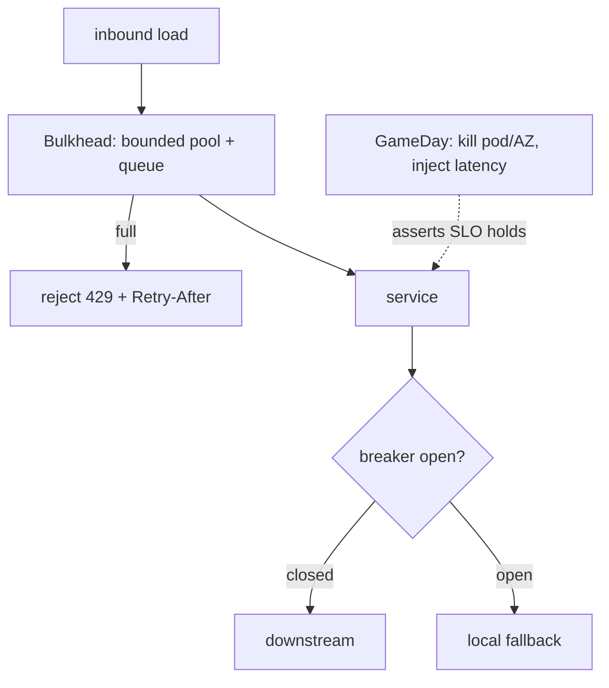

## Why it Matters

Graceful degradation is not something you can declare; it has to be proven under failure. Isolating failure domains and bounding queues is the design, but a GameDay with a hypothesis and a blast radius is the test, the first time a bulkhead matters must not be during an outage.

## Diagram



## Code

```java
// Bulkhead + backpressure: isolate + bound queues
@Bean TaskExecutor checkoutPool() { // dedicated pool, never shared with batch
 ThreadPoolTaskExecutor t = new ThreadPoolTaskExecutor();
 t.setCorePoolSize(20); t.setMaxPoolSize(50);
 t.setQueueCapacity(100); // bounded: reject fast, don't OOM
 t.setRejectedExecutionHandler(new ThreadPoolExecutor.CallerRunsPolicy());
 return t;
}
// chaos: Chaos Monkey (Spring) / LitmusChaos kill 1 pod, assert p99 + error budget hold
```

## When to use / not

- Payment/checkout depending on flaky PSPs.
- Kafka consumer lag storms.
- Multi-AZ failover confidence.

**When NOT:** Chaos in prod without blast-radius limits; killing pods while deploys are broken; chaos as theater with no hypothesis/assertion.

## Trade-offs

| Pros | Cons |
|---|---|
| Failures stay local; UX degrades not dies | Requires load-shed UX + fallback content work |
| GameDays build muscle memory | Needs prod-like env + guardrails or it backfires |
| Backpressure protects data layer | Rejected requests need honest 429 + Retry-After |

## Vs

- **Vs plain retry:** retries amplify a sick downstream; bulkhead + breaker + shed-load *reduce* load so it recovers.
- **Vs multi-region active-active:** chaos proves zonal resilience cheaply; active-active is the expensive last 0.01%.

## Pitfalls

- Fallback calling the same dead dependency.
- Unlimited retries from gateway during outage (retry storm).
- One shared thread pool for checkout + reports.

## Interview q&a

**Q: How do you run a safe GameDay?**
A: Hypothesis + steady-state metric + blast radius (1 AZ/1% traffic) + abort button + rollback; run in business hours.

**Q: Backpressure strategies?**
A: Bounded queues + 429/503 + hedged requests + autoscale on queue-depth/lag, not CPU.

**Q: What do you chaos-test first?**
A: Pod kill → node drain → AZ evacuation → dependency latency (toxiproxy +300ms) → clock skew.

## Related

- [[02_Resilience-Circuit-Breaker-Retry]] · [[02_Observability-OTel-Prometheus]] · [[05_Cloud-K8s-Deploy-Helm]]

# Resilience & Chaos, Bulkheads, Backpressure & GameDays

> **Intent:** Prove graceful degradation before prod does it for you: isolate failure domains, shed load, and rehearse via chaos experiments.
