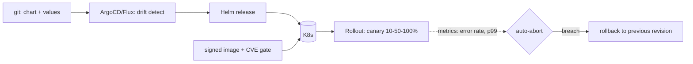

## Why it Matters

Deployment safety is a property of the pipeline, not the deploy button: immutable pinned images, charts as the single source, GitOps for review and drift detection, and progressive rollout that auto-aborts on SLO breach. Once that exists, shipping fast and reverting fast become the same operation.

## Diagram



## Code

```java

## When to use / NOT

- 10+ Spring services needing uniform deploy.
- Regulated envs (audit every release).
- Zero-downtime schema + code co-evolution.

**When NOT:** latest tags; kubectl-apply-from-laptop; DB migration bundled inside rolling pods (race); HPA on CPU only for queue workers.

## Trade-offs

| Pros | Cons |
|---|---|
| Git = audit trail + one-click rollback | Chart sprawl without library charts |
| Canary/blue-green limits blast radius | Progressive delivery controller to operate |
| Probes + budgets stop bad rollouts fast | Image/CVE scanning must gate the pipeline |

## Vs

- **Vs raw kubectl apply:** GitOps (ArgoCD/Flux) drifts-detects + reviews; imperative apply is unreviewed snowflake.
- **Vs blue-green:** canary is cheaper/slower-signal; blue-green doubles capacity for instant flip.

## Pitfalls

- Missing PodDisruptionBudgets → evictions take all replicas.
- No resource requests → noisy-neighbor throttling.
- Secrets in values.yaml (use External Secrets/Vault).

## Interview Q&A

**Q: How do you do zero-downtime DB change?**
A: Expand-migrate-contract: additive migration → deploy tolerant code → backfill → remove old column next release.

**Q: What gates a promotion?**
A: Signed image + CVE scan pass + canary metrics (error-rate, p99) + manual gate for prod.

**Q: HPA metric for consumers?**
A: Kafka lag / queue depth (KEDA ScaledObject), not CPU — idle CPU with 1M lagging messages is still behind.

## Related

- [[02_Observability-OTel-Prometheus]] · [[03_Performance-SLOs]] · [[02_ADRs]]

# Cloud & K8s Deploy — Helm, GitOps & Rollouts

> **Intent:** Ship safely at speed: immutable images → Helm chart → GitOps sync → progressive rollout with automatic rollback on SLO breach.
> Watch: [ByteByteGo — Kubernetes in 6 Minutes](https://www.youtube.com/watch?v=TlHvYWVUZyc)

# values.yaml: image pin + probes + rollout guard

image: { repository: acr.io/checkout, tag: "1.4.2" } # never :latest
resources: { requests: { cpu: 250m, memory: 512Mi }, limits: { memory: 1Gi } }
livenessProbe: { httpGet: { path: /actuator/health/liveness, port: 8080 }, periodSeconds: 10 }
readinessProbe: { httpGet: { path: /actuator/health/readiness, port: 8080 } }

# Argo Rollouts: canary 10% -> 50% -> 100%, auto-abort on p99/error-rate

```