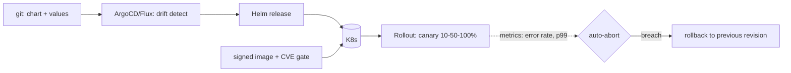

## Why it Matters

Deployment safety is a property of the pipeline, not the deploy button: immutable pinned images, charts as the single source, GitOps for review and drift detection, and progressive rollout that auto-aborts on SLO breach. Once that exists, shipping fast and reverting fast become the same operation.

## Problems
### System Design Problem: Cloud & K8s Deploy, Helm, GitOps & Rollouts

**Requirements:**
- Functional: Core capabilities for cloud & k8s deploy, helm, gitops & rollouts
- Non-functional (SLOs): Latency < 100ms p99, Availability 99.9%, Horizontal scalability

**Constraints:**
- Scale: Handle 10x growth without redesign
- Consistency: Appropriate model for domain (strong/eventual)
- Latency budget: p99 < 100ms for read paths

**API / Interfaces:**
- Primary: REST/gRPC endpoints for core operations
- Internal: Service-to-service contracts
- Events: Domain events for async integration

## Diagram



## Code

```java

## When to use / NOT

- 10+ Spring services needing uniform deploy.
- Regulated envs (audit every release).
- Zero-downtime schema + code co-evolution.

**When NOT:** latest tags; kubectl-apply-from-laptop; DB migration bundled inside rolling pods (race); HPA on CPU only for queue workers.


## Vs

- **Vs raw kubectl apply:** GitOps (ArgoCD/Flux) drifts-detects + reviews; imperative apply is unreviewed snowflake.
- **Vs blue-green:** canary is cheaper/slower-signal; blue-green doubles capacity for instant flip.


## Trade-offs
| Dimension | This Approach | Alternative | Trade-off Rationale | Decision Rule |
|-----------|---------------|-------------|---------------------|---------------|
| Complexity | Not specified | Not specified | Not specified | Not specified |
| Operational Burden | Not specified | Not specified | Not specified | Not specified |
| Latency | Not specified | Not specified | Not specified | Not specified |
| Consistency | Not specified | Not specified | Not specified | Not specified |
| Cost at Scale | Not specified | Not specified | Not specified | Not specified |

## Pitfalls

- Missing PodDisruptionBudgets → evictions take all replicas.
- No resource requests → noisy-neighbor throttling.
- Secrets in values.yaml (use External Secrets/Vault).


## Pitfalls
1. Underestimating operational complexity (backups, monitoring, upgrades)
2. Ignoring failure modes (network partitions, disk failures, clock drift)
3. Not planning for 10x scale from day one
4. Skipping monitoring/alerting in MVP
5. Premature optimization before measuring
6. Dual-write without transactional outbox
7. Assuming global order in partitioned systems

## Interview Q&A

**Q: How do you do zero-downtime DB change?**
A: Expand-migrate-contract: additive migration → deploy tolerant code → backfill → remove old column next release.

**Q: What gates a promotion?**
A: Signed image + CVE scan pass + canary metrics (error-rate, p99) + manual gate for prod.

**Q: HPA metric for consumers?**
A: Kafka lag / queue depth (KEDA ScaledObject), not CPU — idle CPU with 1M lagging messages is still behind.


## Flashcards (Spaced Repetition)

#flashcard
**Q:** What is the core concept of Cloud & K8s Deploy, Helm, GitOps & Rollouts? :: **A:** [Key algorithm/architecture pattern] #flashcard

#flashcard
**Q:** When do you apply Cloud & K8s Deploy, Helm, GitOps & Rollouts? :: **A:** [Trigger scenarios and context] #flashcard

#flashcard
**Q:** What is the primary trade-off in Cloud & K8s Deploy, Helm, GitOps & Rollouts? :: **A:** [Main tension: e.g., consistency vs latency] #flashcard

#flashcard
**Q:** What breaks first at scale in Cloud & K8s Deploy, Helm, GitOps & Rollouts? :: **A:** [Primary bottleneck: e.g., coordination, hot keys, replication lag] #flashcard

#flashcard
**Q:** How do you handle failures in Cloud & K8s Deploy, Helm, GitOps & Rollouts? :: **A:** [Retry, circuit breaker, fallback, graceful degradation] #flashcard

#flashcard
**Q:** What are the key metrics to monitor for Cloud & K8s Deploy, Helm, GitOps & Rollouts? :: **A:** [RED: rate, errors, duration; USE: utilization, saturation, errors] #flashcard

#flashcard
**Q:** How does Cloud & K8s Deploy, Helm, GitOps & Rollouts scale to 10x? :: **A:** [Sharding, read replicas, async processing, caching layers] #flashcard

#flashcard
**Q:** What is the consistency model for Cloud & K8s Deploy, Helm, GitOps & Rollouts? :: **A:** [Strong/eventual/causal - justify with use case] #flashcard

#flashcard
**Q:** How do you test Cloud & K8s Deploy, Helm, GitOps & Rollouts? :: **A:** [Contract tests, chaos engineering, load tests, fault injection] #flashcard

#flashcard
**Q:** What is the operational cost of Cloud & K8s Deploy, Helm, GitOps & Rollouts? :: **A:** [Team expertise, tooling, on-call burden, migration risk] #flashcard

#flashcard
**Q:** When would you NOT use Cloud & K8s Deploy, Helm, GitOps & Rollouts? :: **A:** [Managed service covers need, simple CRUD, team lacks maturity] #flashcard

#flashcard
**Q:** What is the key design decision in Cloud & K8s Deploy, Helm, GitOps & Rollouts? :: **A:** [The irreversible choice that defines the architecture] #flashcard

#flashcard
**Q:** How do you migrate to Cloud & K8s Deploy, Helm, GitOps & Rollouts? :: **A:** [Strangler fig, dual-write, canary, feature flags] #flashcard

#flashcard
**Q:** What security considerations for Cloud & K8s Deploy, Helm, GitOps & Rollouts? :: **A:** [AuthZ, encryption, audit, secrets management] #flashcard

#flashcard
**Q:** How do you debug Cloud & K8s Deploy, Helm, GitOps & Rollouts in production? :: **A:** [Structured logging, correlation IDs, distributed tracing, SLO alerts] #flashcard


## Practice Tasks (Tasks Plugin)
- [ ] Explain the architecture from memory 📅 {{date:YYYY-MM-DD, +1}}
- [ ] Draw the system diagram without looking 📅 {{date:YYYY-MM-DD, +3}}
- [ ] Answer all Interview Q&A aloud 📅 {{date:YYYY-MM-DD, +7}}
- [ ] Review flashcards (Spaced Repetition) 📅 {{date:YYYY-MM-DD, +1}}

```tasks
not done
path includes Architect/08_NonFunctional-Ops
sort by due
limit 10
```

## Related

- 02_Observability-OTel-Prometheus · 03_Performance-SLOs · 02_ADRs

# Cloud & K8s Deploy — Helm, GitOps & Rollouts

> **Intent:** Ship safely at speed: immutable images → Helm chart → GitOps sync → progressive rollout with automatic rollback on SLO breach.
> Watch: [ByteByteGo — Kubernetes in 6 Minutes](https://www.youtube.com/watch?v=TlHvYWVUZyc)

# values.yaml: image pin + probes + rollout guard

image: { repository: acr.io/checkout, tag: "1.4.2" } # never :latest
resources: { requests: { cpu: 250m, memory: 512Mi }, limits: { memory: 1Gi } }
livenessProbe: { httpGet: { path: /actuator/health/liveness, port: 8080 }, periodSeconds: 10 }
readinessProbe: { httpGet: { path: /actuator/health/readiness, port: 8080 } }

# Argo Rollouts: canary 10% -> 50% -> 100%, auto-abort on p99/error-rate

```