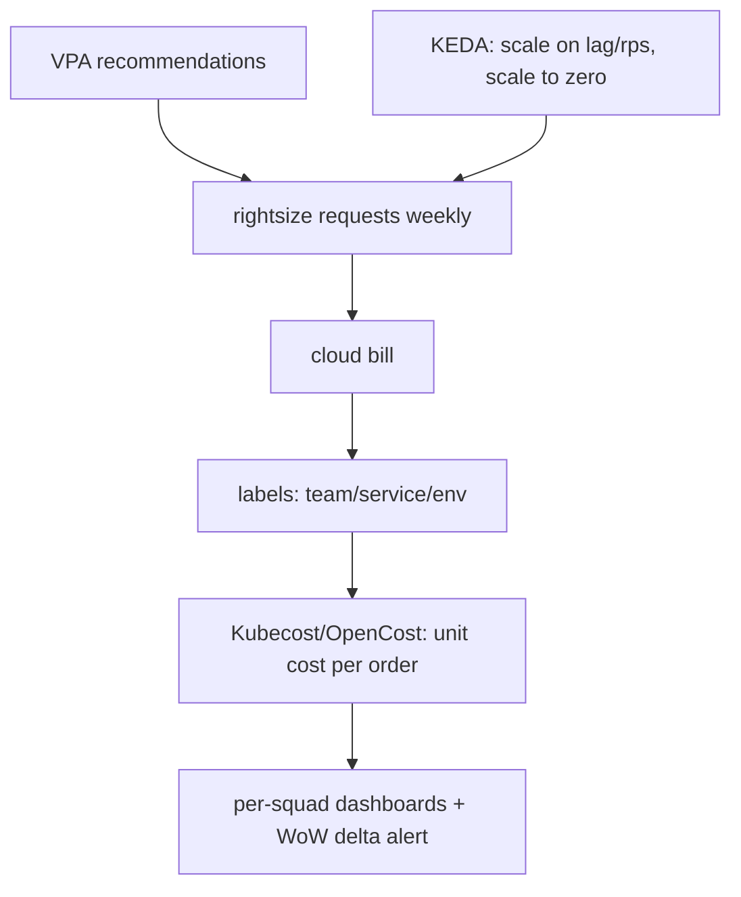

## Why it Matters

Cost behaves like latency: invisible until it is a problem, and then fixed only with measurement. Making it a first-class architecture constraint, unit cost per order, per-namespace attribution, rightsizing loops, turns cloud spend from a quarterly surprise into an engineering signal that competes fairly with SLOs.

## Problems
### System Design Problem: Cost & FinOps, Rightsizing, Autoscaling & Unit Cost

**Requirements:**
- Functional: Core capabilities for cost & finops, rightsizing, autoscaling & unit cost
- Non-functional (SLOs): Latency < 100ms p99, Availability 99.9%, Horizontal scalability

**Constraints:**
- Scale: Handle 10x growth without redesign
- Consistency: Appropriate model for domain (strong/eventual)
- Latency budget: p99 < 100ms for read paths

**API / Interfaces:**
- Primary: REST/gRPC endpoints for core operations
- Internal: Service-to-service contracts
- Events: Domain events for async integration

## Diagram



## Code

```java

## When to use / NOT

- Cloud bill jumps after K8s migration.
- GenAI/batch workloads with spiky GPU spend.
- Chargeback/showback per squad.

**When NOT:** Cutting prod memory until OOMs; savings plans before knowing steady state; optimizing dev envs while prod wastes 60%.


## Vs

- **Vs blind autoscale:** scaling on CPU over-provisions I/O-bound services; scale on business signals (lag, rps, queue).
- **Vs reserved-first:** commit discounts after rightsizing + stable baseline; commit first locks in waste.


## Trade-offs
| Dimension | This Approach | Alternative | Trade-off Rationale | Decision Rule |
|-----------|---------------|-------------|---------------------|---------------|
| Complexity | Not specified | Not specified | Not specified | Not specified |
| Operational Burden | Not specified | Not specified | Not specified | Not specified |
| Latency | Not specified | Not specified | Not specified | Not specified |
| Consistency | Not specified | Not specified | Not specified | Not specified |
| Cost at Scale | Not specified | Not specified | Not specified | Not specified |

## Pitfalls

- No namespace quotas → one team eats the cluster.
- Keeping 90-day Prometheus local retention on SSD.
- Untagged shared RDS/Redis (nobody owns it).


## Pitfalls
1. Underestimating operational complexity (backups, monitoring, upgrades)
2. Ignoring failure modes (network partitions, disk failures, clock drift)
3. Not planning for 10x scale from day one
4. Skipping monitoring/alerting in MVP
5. Premature optimization before measuring
6. Dual-write without transactional outbox
7. Assuming global order in partitioned systems

## Interview Q&A

**Q: First 3 cost wins in K8s?**
A: Right-size requests (VPA), HPA/KEDA everywhere, kill orphan PVs/LBs + stale images; then commitment discounts.

**Q: How do you attribute cost?**
A: Mandatory labels (team/service/env) → Kubecost/OpenCost → per-namespace dashboards + monthly review.

**Q: Perf vs cost tradeoff?**
A: Cheapest fast-enough: meet SLO at p95, not p99-everywhere; over-SLO latency is margin burned.


## Flashcards (Spaced Repetition)

#flashcard
**Q:** What is the core concept of Cost & FinOps, Rightsizing, Autoscaling & Unit Cost? :: **A:** [Key algorithm/architecture pattern] #flashcard

#flashcard
**Q:** When do you apply Cost & FinOps, Rightsizing, Autoscaling & Unit Cost? :: **A:** [Trigger scenarios and context] #flashcard

#flashcard
**Q:** What is the primary trade-off in Cost & FinOps, Rightsizing, Autoscaling & Unit Cost? :: **A:** [Main tension: e.g., consistency vs latency] #flashcard

#flashcard
**Q:** What breaks first at scale in Cost & FinOps, Rightsizing, Autoscaling & Unit Cost? :: **A:** [Primary bottleneck: e.g., coordination, hot keys, replication lag] #flashcard

#flashcard
**Q:** How do you handle failures in Cost & FinOps, Rightsizing, Autoscaling & Unit Cost? :: **A:** [Retry, circuit breaker, fallback, graceful degradation] #flashcard

#flashcard
**Q:** What are the key metrics to monitor for Cost & FinOps, Rightsizing, Autoscaling & Unit Cost? :: **A:** [RED: rate, errors, duration; USE: utilization, saturation, errors] #flashcard

#flashcard
**Q:** How does Cost & FinOps, Rightsizing, Autoscaling & Unit Cost scale to 10x? :: **A:** [Sharding, read replicas, async processing, caching layers] #flashcard

#flashcard
**Q:** What is the consistency model for Cost & FinOps, Rightsizing, Autoscaling & Unit Cost? :: **A:** [Strong/eventual/causal - justify with use case] #flashcard

#flashcard
**Q:** How do you test Cost & FinOps, Rightsizing, Autoscaling & Unit Cost? :: **A:** [Contract tests, chaos engineering, load tests, fault injection] #flashcard

#flashcard
**Q:** What is the operational cost of Cost & FinOps, Rightsizing, Autoscaling & Unit Cost? :: **A:** [Team expertise, tooling, on-call burden, migration risk] #flashcard

#flashcard
**Q:** When would you NOT use Cost & FinOps, Rightsizing, Autoscaling & Unit Cost? :: **A:** [Managed service covers need, simple CRUD, team lacks maturity] #flashcard

#flashcard
**Q:** What is the key design decision in Cost & FinOps, Rightsizing, Autoscaling & Unit Cost? :: **A:** [The irreversible choice that defines the architecture] #flashcard

#flashcard
**Q:** How do you migrate to Cost & FinOps, Rightsizing, Autoscaling & Unit Cost? :: **A:** [Strangler fig, dual-write, canary, feature flags] #flashcard

#flashcard
**Q:** What security considerations for Cost & FinOps, Rightsizing, Autoscaling & Unit Cost? :: **A:** [AuthZ, encryption, audit, secrets management] #flashcard

#flashcard
**Q:** How do you debug Cost & FinOps, Rightsizing, Autoscaling & Unit Cost in production? :: **A:** [Structured logging, correlation IDs, distributed tracing, SLO alerts] #flashcard


## Practice Tasks (Tasks Plugin)
- [ ] Explain the architecture from memory 📅 {{date:YYYY-MM-DD, +1}}
- [ ] Draw the system diagram without looking 📅 {{date:YYYY-MM-DD, +3}}
- [ ] Answer all Interview Q&A aloud 📅 {{date:YYYY-MM-DD, +7}}
- [ ] Review flashcards (Spaced Repetition) 📅 {{date:YYYY-MM-DD, +1}}

```tasks
not done
path includes Architect/08_NonFunctional-Ops
sort by due
limit 10
```

## Related

- 03_Performance-SLOs · 05_Cloud-K8s-Deploy-Helm · 01_C4-Modeling

# Cost & FinOps — Rightsizing, Autoscaling & Unit Cost

> **Intent:** Make cost a design constraint: track cost-per-order/request, attribute it per team, and rightsizing continuously — not quarterly panic.

# KEDA: scale consumers on lag, scale to zero on idle

# HPA on custom metric (http rps) for APIs:

# kubectl autoscale deploy checkout --cpu-percent=70 --min=3 --max=30

# rightsizing loop: VPA recommendations -> adjust requests weekly

# unit metric: cloud_bill / orders -> alert if +15% WoW (Kubecost/OpenCost)

```