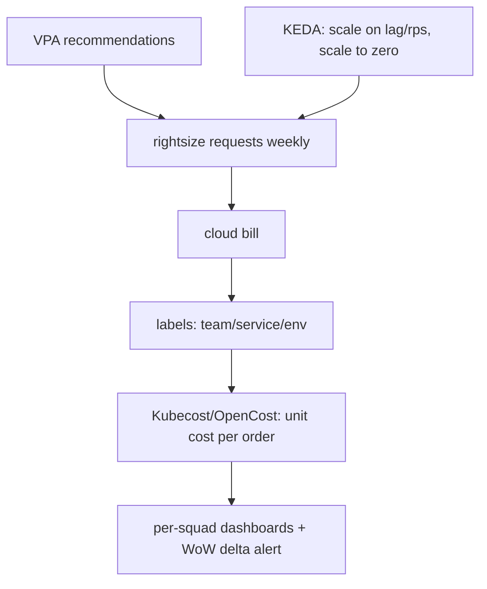

## Why it Matters

Cost behaves like latency: invisible until it is a problem, and then fixed only with measurement. Making it a first-class architecture constraint, unit cost per order, per-namespace attribution, rightsizing loops, turns cloud spend from a quarterly surprise into an engineering signal that competes fairly with SLOs.

## Diagram



## Code

```java

## When to use / NOT

- Cloud bill jumps after K8s migration.
- GenAI/batch workloads with spiky GPU spend.
- Chargeback/showback per squad.

**When NOT:** Cutting prod memory until OOMs; savings plans before knowing steady state; optimizing dev envs while prod wastes 60%.

## Trade-offs

| Pros | Cons |
|---|---|
| Unit cost ties eng decisions to margin | Attribution plumbing (tags/labels) is upfront toil |
| Scale-to-zero kills idle waste | Cold starts need provisioned concurrency budget |
| Spot/preemptible for batch = 60-80% off | Spot needs interruption-tolerant design |

## Vs

- **Vs blind autoscale:** scaling on CPU over-provisions I/O-bound services; scale on business signals (lag, rps, queue).
- **Vs reserved-first:** commit discounts after rightsizing + stable baseline; commit first locks in waste.

## Pitfalls

- No namespace quotas → one team eats the cluster.
- Keeping 90-day Prometheus local retention on SSD.
- Untagged shared RDS/Redis (nobody owns it).

## Interview Q&A

**Q: First 3 cost wins in K8s?**
A: Right-size requests (VPA), HPA/KEDA everywhere, kill orphan PVs/LBs + stale images; then commitment discounts.

**Q: How do you attribute cost?**
A: Mandatory labels (team/service/env) → Kubecost/OpenCost → per-namespace dashboards + monthly review.

**Q: Perf vs cost tradeoff?**
A: Cheapest fast-enough: meet SLO at p95, not p99-everywhere; over-SLO latency is margin burned.

## Related

- [[03_Performance-SLOs]] · [[05_Cloud-K8s-Deploy-Helm]] · [[01_C4-Modeling]]

# Cost & FinOps — Rightsizing, Autoscaling & Unit Cost

> **Intent:** Make cost a design constraint: track cost-per-order/request, attribute it per team, and rightsizing continuously — not quarterly panic.

# KEDA: scale consumers on lag, scale to zero on idle

# HPA on custom metric (http rps) for APIs:

# kubectl autoscale deploy checkout --cpu-percent=70 --min=3 --max=30

# rightsizing loop: VPA recommendations -> adjust requests weekly

# unit metric: cloud_bill / orders -> alert if +15% WoW (Kubecost/OpenCost)

```