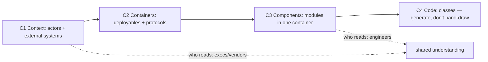

## Why it Matters

Most architecture diagrams fail by trying to say everything at once. C4 fixes the zoom problem: the same system at four levels, one per audience, so an executive reads C1 and a new joiner reads C3, and because the DSL lives in the repo, the diagram is reviewed, diffed and regenerated rather than rotting in a wiki.

## Diagram



## Code

```java
// structurizr DSL: docs as code, CI renders PNG
workspace { model {
 user = person "Shopper"
 shop = softwareSystem "Shop" {
 web = container "Web (Next.js)" { technology "Next.js" }
 api = container "Order API (Boot 3.5)" { technology "Spring Boot" }
 db = container "Postgres" { technology "Postgres 16" }
 user -> web "browses"; web -> api "REST/JSON"; api -> db "JDBC"
 }
}}
```

## When to use / not

- New-joiner onboarding and vendor reviews.
- Design reviews needing shared vocabulary.
- Keeping docs in Structurizr DSL as code.

**When NOT:** C4 for a 2-service CRUD app (overkill); hand-drawn boxes that drift from code; C4-code level maintained manually.

## Trade-offs

| Pros | Cons |
|---|---|
| Right zoom per stakeholder | Level 4 rots fast, generate from code or skip |
| DSL diffable in Git | Needs a champion or diagrams die |
| Forces boundary honesty | Big C2 posters intimidate small teams |

## Vs

- **Vs UML-everything:** UML models classes; C4 models runtime structure + people, execs read C1, devs read C3.
- **Vs arc42:** arc42 is the doc *template*; C4 is the *diagram language* inside it.

## Pitfalls

- 40-box C2 with 8 font sizes (limit 6-9 boxes/view).
- Missing legend/protocols on arrows.
- Private buckets/queues drawn as external systems.

## Interview q&a

**Q: What goes in C2 vs C3?**
A: C2 = deployable containers + protocols; C3 = modules inside one container (controllers/services/repos).

**Q: How do you keep diagrams fresh?**
A: Structurizr DSL in repo + CI check + auto-extract (Spring annotations → components); review in RFC.

**Q: When is C1 enough?**
A: Exec/vendor contexts, external actors + system boundary + money-touching integrations only.

## Related

- [[02_ADRs]] · [[03_Review-Process-RFC]] · [[01_Strategic-DDD]]

# C4 Modeling, Context to Code

> **Intent:** Communicate architecture at 4 zooms: who uses it (C1) → containers (C2) → components (C3) → code (C4); one level per audience.
> Watch: [Simon Brown, Visualising Architecture with C4](https://www.youtube.com/watch?v=x2-rSnhpw0g)
