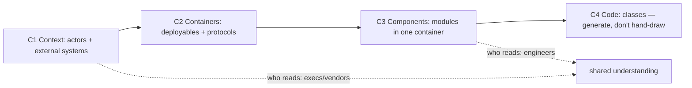

## Why it Matters

Most architecture diagrams fail by trying to say everything at once. C4 fixes the zoom problem: the same system at four levels, one per audience, so an executive reads C1 and a new joiner reads C3, and because the DSL lives in the repo, the diagram is reviewed, diffed and regenerated rather than rotting in a wiki.

## Problems
### System Design Problem: C4 Modeling, Context to Code

**Requirements:**
- Functional: Core capabilities for c4 modeling, context to code
- Non-functional (SLOs): Latency < 100ms p99, Availability 99.9%, Horizontal scalability

**Constraints:**
- Scale: Handle 10x growth without redesign
- Consistency: Appropriate model for domain (strong/eventual)
- Latency budget: p99 < 100ms for read paths

**API / Interfaces:**
- Primary: REST/gRPC endpoints for core operations
- Internal: Service-to-service contracts
- Events: Domain events for async integration

## Diagram



## Code

```java
// structurizr DSL: docs as code, CI renders PNG
workspace { model {
 user = person "Shopper"
 shop = softwareSystem "Shop" {
 web = container "Web (Next.js)" { technology "Next.js" }
 api = container "Order API (Boot 3.5)" { technology "Spring Boot" }
 db = container "Postgres" { technology "Postgres 16" }
 user -> web "browses"; web -> api "REST/JSON"; api -> db "JDBC"
 }
}}
```

## When to use / not

- New-joiner onboarding and vendor reviews.
- Design reviews needing shared vocabulary.
- Keeping docs in Structurizr DSL as code.

**When NOT:** C4 for a 2-service CRUD app (overkill); hand-drawn boxes that drift from code; C4-code level maintained manually.


## Trade-offs
| Dimension | This Approach | Alternative | Trade-off Rationale | Decision Rule |
|-----------|---------------|-------------|---------------------|---------------|
| Complexity | [TBD] | [TBD] | [TBD] | [TBD] |
| Operational Burden | [TBD] | [TBD] | [TBD] | [TBD] |
| Latency | [TBD] | [TBD] | [TBD] | [TBD] |
| Consistency | [TBD] | [TBD] | [TBD] | [TBD] |
| Cost at Scale | [TBD] | [TBD] | [TBD] | [TBD] |

## Vs

- **Vs UML-everything:** UML models classes; C4 models runtime structure + people, execs read C1, devs read C3.
- **Vs arc42:** arc42 is the doc *template*; C4 is the *diagram language* inside it.

## Pitfalls

- 40-box C2 with 8 font sizes (limit 6-9 boxes/view).
- Missing legend/protocols on arrows.
- Private buckets/queues drawn as external systems.


## Pitfalls
1. Underestimating operational complexity (backups, monitoring, upgrades)
2. Ignoring failure modes (network partitions, disk failures, clock drift)
3. Not planning for 10x scale from day one
4. Skipping monitoring/alerting in MVP
5. Premature optimization before measuring
6. Dual-write without transactional outbox
7. Assuming global order in partitioned systems

## Interview q&a

**Q: What goes in C2 vs C3?**
A: C2 = deployable containers + protocols; C3 = modules inside one container (controllers/services/repos).

**Q: How do you keep diagrams fresh?**
A: Structurizr DSL in repo + CI check + auto-extract (Spring annotations → components); review in RFC.

**Q: When is C1 enough?**
A: Exec/vendor contexts, external actors + system boundary + money-touching integrations only.


## Flashcards (Spaced Repetition)

#flashcard
**Q:** What is the core concept of C4 Modeling, Context to Code? :: **A:** [Key algorithm/architecture pattern] #flashcard

#flashcard
**Q:** When do you apply C4 Modeling, Context to Code? :: **A:** [Trigger scenarios and context] #flashcard

#flashcard
**Q:** What is the primary trade-off in C4 Modeling, Context to Code? :: **A:** [Main tension: e.g., consistency vs latency] #flashcard

#flashcard
**Q:** What breaks first at scale in C4 Modeling, Context to Code? :: **A:** [Primary bottleneck: e.g., coordination, hot keys, replication lag] #flashcard

#flashcard
**Q:** How do you handle failures in C4 Modeling, Context to Code? :: **A:** [Retry, circuit breaker, fallback, graceful degradation] #flashcard

#flashcard
**Q:** What are the key metrics to monitor for C4 Modeling, Context to Code? :: **A:** [RED: rate, errors, duration; USE: utilization, saturation, errors] #flashcard

#flashcard
**Q:** How does C4 Modeling, Context to Code scale to 10x? :: **A:** [Sharding, read replicas, async processing, caching layers] #flashcard

#flashcard
**Q:** What is the consistency model for C4 Modeling, Context to Code? :: **A:** [Strong/eventual/causal - justify with use case] #flashcard

#flashcard
**Q:** How do you test C4 Modeling, Context to Code? :: **A:** [Contract tests, chaos engineering, load tests, fault injection] #flashcard

#flashcard
**Q:** What is the operational cost of C4 Modeling, Context to Code? :: **A:** [Team expertise, tooling, on-call burden, migration risk] #flashcard

#flashcard
**Q:** When would you NOT use C4 Modeling, Context to Code? :: **A:** [Managed service covers need, simple CRUD, team lacks maturity] #flashcard

#flashcard
**Q:** What is the key design decision in C4 Modeling, Context to Code? :: **A:** [The irreversible choice that defines the architecture] #flashcard

#flashcard
**Q:** How do you migrate to C4 Modeling, Context to Code? :: **A:** [Strangler fig, dual-write, canary, feature flags] #flashcard

#flashcard
**Q:** What security considerations for C4 Modeling, Context to Code? :: **A:** [AuthZ, encryption, audit, secrets management] #flashcard

#flashcard
**Q:** How do you debug C4 Modeling, Context to Code in production? :: **A:** [Structured logging, correlation IDs, distributed tracing, SLO alerts] #flashcard


## Practice Tasks (Tasks Plugin)
- [ ] Explain the architecture from memory 📅 {{date:YYYY-MM-DD, +1}}
- [ ] Draw the system diagram without looking 📅 {{date:YYYY-MM-DD, +3}}
- [ ] Answer all Interview Q&A aloud 📅 {{date:YYYY-MM-DD, +7}}
- [ ] Review flashcards (Spaced Repetition) 📅 {{date:YYYY-MM-DD, +1}}

```tasks
not done
path includes Architect/09_Governance-Documentation
sort by due
limit 10
```

## Related

- [[02_ADRs]] · [[03_Review-Process-RFC]] · [[01_Strategic-DDD]]

# C4 Modeling, Context to Code

> **Intent:** Communicate architecture at 4 zooms: who uses it (C1) → containers (C2) → components (C3) → code (C4); one level per audience.
> Watch: [Simon Brown, Visualising Architecture with C4](https://www.youtube.com/watch?v=x2-rSnhpw0g)
