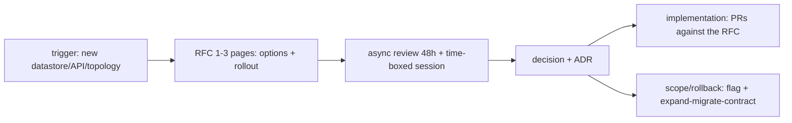

## Why it Matters

Rejecting a direction in code review costs ten times what it costs in a design review, because code review comes after the work. A short written RFC with alternatives, an SLO and a rollback plan is the cheapest risk reduction available, it catches coupling, security and cost mistakes while they are still paragraphs, not pull requests.

## Problems
### System Design Problem: Review Process, RFCs & Design Reviews

**Requirements:**
- Functional: Core capabilities for review process, rfcs & design reviews
- Non-functional (SLOs): Latency < 100ms p99, Availability 99.9%, Horizontal scalability

**Constraints:**
- Scale: Handle 10x growth without redesign
- Consistency: Appropriate model for domain (strong/eventual)
- Latency budget: p99 < 100ms for read paths

**API / Interfaces:**
- Primary: REST/gRPC endpoints for core operations
- Internal: Service-to-service contracts
- Events: Domain events for async integration

## Diagram



## Code

```java

## When to use / NOT

- New service, public API, data-model or topology change.
- Cross-team dependency or migration.
- Any spend/scale/security tradeoff.

**When NOT:** Tiny PRs needing a 10-person council; review-as-rubber-stamp; RFCs with no alternatives or rollout plan.


## Vs

- **Vs PR review:** PR reviews code correctness; RFC reviews *direction* — rejecting direction in PR is 10× costlier.
- **Vs ADRs:** RFC is the debate; ADR is the verdict.


## Trade-offs
| Dimension | This Approach | Alternative | Trade-off Rationale | Decision Rule |
|-----------|---------------|-------------|---------------------|---------------|
| Complexity | Not specified | Not specified | Not specified | Not specified |
| Operational Burden | Not specified | Not specified | Not specified | Not specified |
| Latency | Not specified | Not specified | Not specified | Not specified |
| Consistency | Not specified | Not specified | Not specified | Not specified |
| Cost at Scale | Not specified | Not specified | Not specified | Not specified |

## Pitfalls

- No measurable acceptance (SLO/cost/latency missing).
- Approving without data-migration/rollback section.
- RFC merged but no ADR written.


## Pitfalls
1. Underestimating operational complexity (backups, monitoring, upgrades)
2. Ignoring failure modes (network partitions, disk failures, clock drift)
3. Not planning for 10x scale from day one
4. Skipping monitoring/alerting in MVP
5. Premature optimization before measuring
6. Dual-write without transactional outbox
7. Assuming global order in partitioned systems

## Interview Q&A

**Q: What triggers an RFC?**
A: New datastore/broker, public/partner API, cross-boundary sync call, schema break, infra topology or IAM model change.

**Q: Who must attend?**
A: Author + owning team + one each from affected teams + security/data on call; quorum > titles.

**Q: How do you avoid bike-shedding?**
A: Time-box 45m, pre-read required, decide by deadline (owner decides, dissent recorded), prototype spikes for unknowns.


## Flashcards (Spaced Repetition)

#flashcard
**Q:** What is the core concept of Review Process, RFCs & Design Reviews? :: **A:** Not specified #flashcard

#flashcard
**Q:** When do you apply Review Process, RFCs & Design Reviews? :: **A:** Not specified #flashcard

#flashcard
**Q:** What is the primary trade-off in Review Process, RFCs & Design Reviews? :: **A:** Not specified #flashcard

#flashcard
**Q:** What breaks first at scale in Review Process, RFCs & Design Reviews? :: **A:** Not specified #flashcard

#flashcard
**Q:** How do you handle failures in Review Process, RFCs & Design Reviews? :: **A:** Not specified #flashcard

#flashcard
**Q:** What are the key metrics to monitor for Review Process, RFCs & Design Reviews? :: **A:** Not specified #flashcard

#flashcard
**Q:** How does Review Process, RFCs & Design Reviews scale to 10x? :: **A:** Not specified #flashcard

#flashcard
**Q:** What is the consistency model for Review Process, RFCs & Design Reviews? :: **A:** Not specified #flashcard

#flashcard
**Q:** How do you test Review Process, RFCs & Design Reviews? :: **A:** Not specified #flashcard

#flashcard
**Q:** What is the operational cost of Review Process, RFCs & Design Reviews? :: **A:** Not specified #flashcard

#flashcard
**Q:** When would you NOT use Review Process, RFCs & Design Reviews? :: **A:** Not specified #flashcard

#flashcard
**Q:** What is the key design decision in Review Process, RFCs & Design Reviews? :: **A:** Not specified #flashcard

#flashcard
**Q:** How do you migrate to Review Process, RFCs & Design Reviews? :: **A:** Not specified #flashcard

#flashcard
**Q:** What security considerations for Review Process, RFCs & Design Reviews? :: **A:** Not specified #flashcard

#flashcard
**Q:** How do you debug Review Process, RFCs & Design Reviews in production? :: **A:** Not specified #flashcard


## Practice Tasks (Tasks Plugin)
- [ ] Explain the architecture from memory 📅 {{date:YYYY-MM-DD, +1}}
- [ ] Draw the system diagram without looking 📅 {{date:YYYY-MM-DD, +3}}
- [ ] Answer all Interview Q&A aloud 📅 {{date:YYYY-MM-DD, +7}}
- [ ] Review flashcards (Spaced Repetition) 📅 {{date:YYYY-MM-DD, +1}}

```tasks
not done
path includes Architect/09_Governance-Documentation
sort by due
limit 10
```

## Related

- 02_ADRs · 01_C4-Modeling · 04_TOGAF-iSAQB-Primer

# Review Process — RFCs & Design Reviews

> **Intent:** De-risk big changes cheaply: written proposal → async comments → time-boxed review → decision + ADR; code is the last step.

# RFC template (1-3 pages)

# 1. Problem + goals/non-goals 2. Options (≥2, with tradeoffs)

# 3. Proposal (C4-C2 diagram + API sketch + data impact)

# 4. NFRs: perf budget, SLO, cost, security, observability

# 5. Rollout: expand-migrate-contract, feature flag, rollback

# 6. Open questions + decision deadline + owners

```