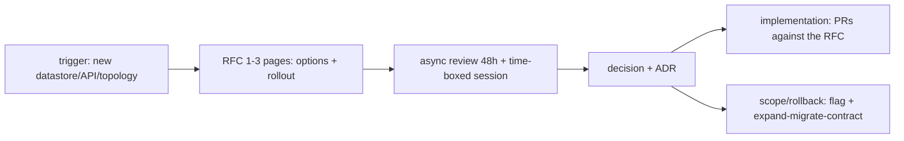

## Why it Matters

Rejecting a direction in code review costs ten times what it costs in a design review, because code review comes after the work. A short written RFC with alternatives, an SLO and a rollback plan is the cheapest risk reduction available, it catches coupling, security and cost mistakes while they are still paragraphs, not pull requests.

## Diagram



## Code

```java

## When to use / NOT

- New service, public API, data-model or topology change.
- Cross-team dependency or migration.
- Any spend/scale/security tradeoff.

**When NOT:** Tiny PRs needing a 10-person council; review-as-rubber-stamp; RFCs with no alternatives or rollout plan.

## Trade-offs

| Pros | Cons |
|---|---|
| Catches coupling/security/cost early | Async latency (SLA: 48h first pass) |
| Async = inclusive across zones | Review fatigue without triage/lanes |
| Paper trail for audits | Heavyweight authors avoid writing |

## Vs

- **Vs PR review:** PR reviews code correctness; RFC reviews *direction* — rejecting direction in PR is 10× costlier.
- **Vs ADRs:** RFC is the debate; ADR is the verdict.

## Pitfalls

- No measurable acceptance (SLO/cost/latency missing).
- Approving without data-migration/rollback section.
- RFC merged but no ADR written.

## Interview Q&A

**Q: What triggers an RFC?**
A: New datastore/broker, public/partner API, cross-boundary sync call, schema break, infra topology or IAM model change.

**Q: Who must attend?**
A: Author + owning team + one each from affected teams + security/data on call; quorum > titles.

**Q: How do you avoid bike-shedding?**
A: Time-box 45m, pre-read required, decide by deadline (owner decides, dissent recorded), prototype spikes for unknowns.

## Related

- [[02_ADRs]] · [[01_C4-Modeling]] · [[04_TOGAF-iSAQB-Primer]]

# Review Process — RFCs & Design Reviews

> **Intent:** De-risk big changes cheaply: written proposal → async comments → time-boxed review → decision + ADR; code is the last step.

# RFC template (1-3 pages)

# 1. Problem + goals/non-goals 2. Options (≥2, with tradeoffs)

# 3. Proposal (C4-C2 diagram + API sketch + data impact)

# 4. NFRs: perf budget, SLO, cost, security, observability

# 5. Rollout: expand-migrate-contract, feature flag, rollback

# 6. Open questions + decision deadline + owners

```