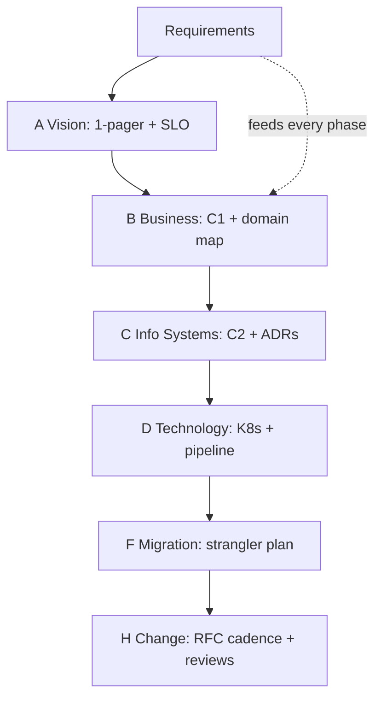

## Why it Matters

You will rarely apply TOGAF literally, but its vocabulary shows up in every enterprise interview and every audit conversation. Borrowing the useful skeleton, a repository, a principles catalogue, a repeatable ADM slice, gives just enough governance to be credible in a bank without burying a startup in ceremony.

## Problems
### System Design Problem: TOGAF & iSAQB Primer, What to Borrow

**Requirements:**
- Functional: Core capabilities for togaf & isaqb primer, what to borrow
- Non-functional (SLOs): Latency < 100ms p99, Availability 99.9%, Horizontal scalability

**Constraints:**
- Scale: Handle 10x growth without redesign
- Consistency: Appropriate model for domain (strong/eventual)
- Latency budget: p99 < 100ms for read paths

**API / Interfaces:**
- Primary: REST/gRPC endpoints for core operations
- Internal: Service-to-service contracts
- Events: Domain events for async integration

## Diagram



## Code

```java
// Minimal ADM slice for a Spring shop:
// A Vision: 1-pager (drivers, scope, success SLO)
// B Business: C1 context + domain map (DDD strategic)
// C InfoSys: C2 containers + ADRs // D Tech: K8s runtime + pipeline
// E-H: migration plan (strangler) + governance (RFC cadence) + review
// Deliverable: C4 + ADR log + principle list — that's 80% of TOGAF value
```

## When to use / not

- Enterprise roles interviews (banks, gov).
- Portfolio with 50+ systems needing catalog discipline.
- CPSA-Foundation exam prep.

**When NOT:** Full ADM for a startup MVP; memorizing metamodel for interviews instead of tradeoffs; buying a tool before a practice.


## Trade-offs
| Dimension | This Approach | Alternative | Trade-off Rationale | Decision Rule |
|-----------|---------------|-------------|---------------------|---------------|
| Complexity | [TBD] | [TBD] | [TBD] | [TBD] |
| Operational Burden | [TBD] | [TBD] | [TBD] | [TBD] |
| Latency | [TBD] | [TBD] | [TBD] | [TBD] |
| Consistency | [TBD] | [TBD] | [TBD] | [TBD] |
| Cost at Scale | [TBD] | [TBD] | [TBD] | [TBD] |

## Vs

- **Vs C4/DDD:** TOGAF governs the *portfolio lifecycle*; C4 draws it, DDD carves it, complementary, not rivals.
- **Vs agile 'no docs':** borrow principles + repository + compliance reviews; skip 200-page templates.

## Pitfalls

- Quoting framework instead of answering the tradeoff.
- Architecture repository nobody can find (put it in Git).
- Governance as gatekeeping (review SLA + appeal path).


## Pitfalls
1. Underestimating operational complexity (backups, monitoring, upgrades)
2. Ignoring failure modes (network partitions, disk failures, clock drift)
3. Not planning for 10x scale from day one
4. Skipping monitoring/alerting in MVP
5. Premature optimization before measuring
6. Dual-write without transactional outbox
7. Assuming global order in partitioned systems

## Interview q&a

**Q: Name the ADM phases in one breath?**
A: Preliminary → A Vision → B Business → C Info Systems → D Technology → E Opportunities → F Migration → G Implementation → H Change (+ Requirements hub).

**Q: What iSAQB topics matter most?**
A: Quality attributes/scenarios, views/viewpoints, patterns, documentation (arc42/C4), evaluation (ATAM lite).

**Q: How do you sell this to a startup?**
A: Principles + C4 + ADRs + RFC lane = 'TOGAF-lite'; add catalog/compliance only when portfolio pain appears.


## Flashcards (Spaced Repetition)

#flashcard
**Q:** What is the core concept of TOGAF & iSAQB Primer, What to Borrow? :: **A:** [Key algorithm/architecture pattern] #flashcard

#flashcard
**Q:** When do you apply TOGAF & iSAQB Primer, What to Borrow? :: **A:** [Trigger scenarios and context] #flashcard

#flashcard
**Q:** What is the primary trade-off in TOGAF & iSAQB Primer, What to Borrow? :: **A:** [Main tension: e.g., consistency vs latency] #flashcard

#flashcard
**Q:** What breaks first at scale in TOGAF & iSAQB Primer, What to Borrow? :: **A:** [Primary bottleneck: e.g., coordination, hot keys, replication lag] #flashcard

#flashcard
**Q:** How do you handle failures in TOGAF & iSAQB Primer, What to Borrow? :: **A:** [Retry, circuit breaker, fallback, graceful degradation] #flashcard

#flashcard
**Q:** What are the key metrics to monitor for TOGAF & iSAQB Primer, What to Borrow? :: **A:** [RED: rate, errors, duration; USE: utilization, saturation, errors] #flashcard

#flashcard
**Q:** How does TOGAF & iSAQB Primer, What to Borrow scale to 10x? :: **A:** [Sharding, read replicas, async processing, caching layers] #flashcard

#flashcard
**Q:** What is the consistency model for TOGAF & iSAQB Primer, What to Borrow? :: **A:** [Strong/eventual/causal - justify with use case] #flashcard

#flashcard
**Q:** How do you test TOGAF & iSAQB Primer, What to Borrow? :: **A:** [Contract tests, chaos engineering, load tests, fault injection] #flashcard

#flashcard
**Q:** What is the operational cost of TOGAF & iSAQB Primer, What to Borrow? :: **A:** [Team expertise, tooling, on-call burden, migration risk] #flashcard

#flashcard
**Q:** When would you NOT use TOGAF & iSAQB Primer, What to Borrow? :: **A:** [Managed service covers need, simple CRUD, team lacks maturity] #flashcard

#flashcard
**Q:** What is the key design decision in TOGAF & iSAQB Primer, What to Borrow? :: **A:** [The irreversible choice that defines the architecture] #flashcard

#flashcard
**Q:** How do you migrate to TOGAF & iSAQB Primer, What to Borrow? :: **A:** [Strangler fig, dual-write, canary, feature flags] #flashcard

#flashcard
**Q:** What security considerations for TOGAF & iSAQB Primer, What to Borrow? :: **A:** [AuthZ, encryption, audit, secrets management] #flashcard

#flashcard
**Q:** How do you debug TOGAF & iSAQB Primer, What to Borrow in production? :: **A:** [Structured logging, correlation IDs, distributed tracing, SLO alerts] #flashcard


## Practice Tasks (Tasks Plugin)
- [ ] Explain the architecture from memory 📅 {{date:YYYY-MM-DD, +1}}
- [ ] Draw the system diagram without looking 📅 {{date:YYYY-MM-DD, +3}}
- [ ] Answer all Interview Q&A aloud 📅 {{date:YYYY-MM-DD, +7}}
- [ ] Review flashcards (Spaced Repetition) 📅 {{date:YYYY-MM-DD, +1}}

```tasks
not done
path includes Architect/09_Governance-Documentation
sort by due
limit 10
```

## Related

- [[01_C4-Modeling]] · [[03_Review-Process-RFC]] · [[02_Requirements-Quality-Attributes/Fitness-Functions]]

# TOGAF & ISAQB Primer, What to Borrow

> **Intent:** Borrow the vocabulary (ADM phases, viewpoints, governance) without the bureaucracy: use just enough ceremony for your risk level.
